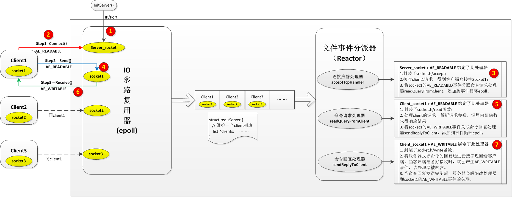
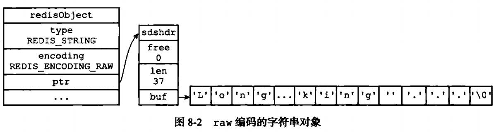
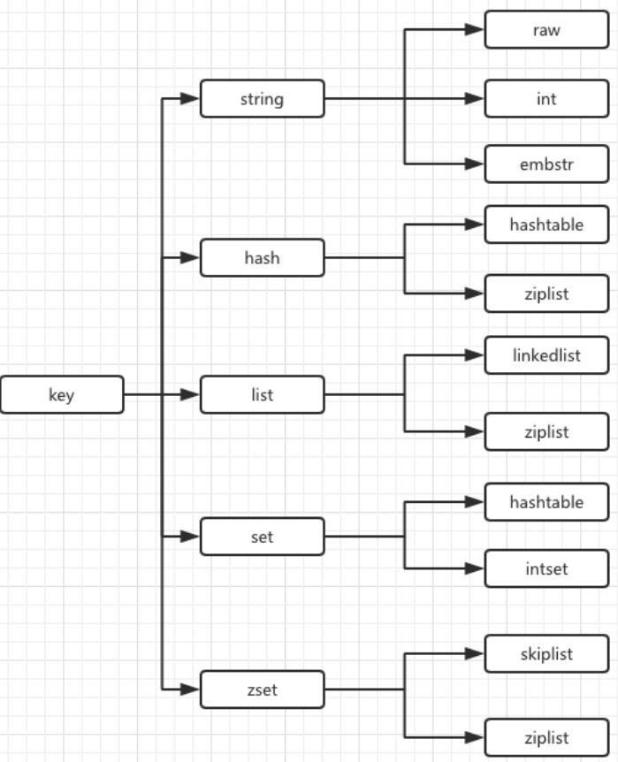

# redis源码阅读

## 网络模型

* 单线程
  单线程指的是**网络请求模块**使用了一个线程，其他模块用了多个线程。
  用单线程的原因：CPU不是Redis的瓶颈。

* redis为什么那么快（QPS 100w+）？
  * 纯内存，基础数据结构做了优化，好多操作的时间复杂度都是o(1)。
  * 数据结构简单，对数据操作也简单，专门设计的。
  * 采用单线程，避免了不必要的上下文切换和竞争条件。
  * IO多路复用，非阻塞IO（epoll+reactor文件事件处理器）。

* 一次完成的网络请求
  文件事件的处理器：基于reactor模式开发了自己的网络事件处理器。

  * **第一步：listen**
    在initServer()中，服务器根据配置中配置的ip/port等参数，创建监听的server_socket。
    server_socket的AE_READABLE事件绑定处理器acceptTcpHandler后,添加到事件循环epoll。
    
    默认init的时候创建了1000个监听socket。
    
  * **第二步：accept**
    有client连接(connect)到来，epoll的AE_READABLE事件被触发，acceptTcpHandler被调用。
    acceptTcpHandler封装了socket.h/accept函数，接收client请求，得到客户端套接字socket_1，
    并将socket_1的AE_READABLD事件关联命令请求处理器readQueryFromClient，添加到事件循环epoll。
  
* **第三步：read**
    client请求到来，会触发socket_1上的READABLE事件，readQueryFromClient事件处理器被触发，readQueryFromClient函数封装了socket.h/read函数，处理client的请求，解析请求参数，得到响应结果，并将socket_1的AE_WRITABLE事件关联命令回复处理器sendReplyToClient，添加到事件循环epoll。
    
  * **第四步：write**
    client准备好读取响应时，会触发socket_1上的WRITABLE事件，sendReplyToClient事件处理器被调用。sendReplyToClient封装了socket.h/write函数，此处理器负责将服务器执行命令的回复通过套接字返回给客户端。当命令回复发送完毕后，服务器会解除sendReplyToClient和socket_1的AE_WRITABLE事件的关联。
  
  

## 数据结构

* redis数据结构 = 内部数据结构 + 外部数据结构。

  ```c
  struct redisServer {
  	redisDb *db;     // 保存服务器中所有的redis数据库，从0开始编号
      dict *commands;  // 命令表
      aeEventLoop *el; // 事件循环
      list *clients;   // 保存所有客户端状态的链表
      ... ...
  }
  struct redisDb {
     dict *dict;   // 数据库键空间，保存数据库中所有的键值对
     ... ...
  }
  // dict的key都是sds字符串
  // dict的value是指向redisobject的指针。
  
  typedef struct redisObject {
      // 类型（外部类型 通过type命令看键对应的外部类型）
      // string, hash, list, set, zset）
      unsigned type:4;    
      // 编码（内部类型，通过object命令看键对应的类型）
      // raw, int, embstr, hashtable, ziplist, linkedlist, intset）
      unsigned encoding:4;
      unsigned lru:REDIS_LRU_BITS;     // 对象最后一次被访问的时间
      int refcount;                    // 引用计数
      void *ptr;                       // 指向实际值的指针
  } robj;

  // redis.h
  // 对象类型
  #define REDIS_STRING 0
  #define REDIS_LIST 1
  #define REDIS_SET 2
  #define REDIS_ZSET 3
  #define REDIS_HASH 4
  
  // 对象编码
  #define REDIS_ENCODING_RAW 0     /* Raw representation */
  #define REDIS_ENCODING_INT 1     /* Encoded as integer */
  #define REDIS_ENCODING_HT 2      /* Encoded as hash table */
  #define REDIS_ENCODING_ZIPMAP 3  /* Encoded as zipmap */
  #define REDIS_ENCODING_LINKEDLIST 4 /* Encoded as regular linked list */
  #define REDIS_ENCODING_ZIPLIST 5 /* Encoded as ziplist */
  #define REDIS_ENCODING_INTSET 6  /* Encoded as intset */
  #define REDIS_ENCODING_SKIPLIST 7  /* Encoded as skiplist */
  #define REDIS_ENCODING_EMBSTR 8  /* Embedded sds string encoding */
  ```
  


* 各种对象和底层编码的对应关系

  * redisObject 类型、编码方式、ptr对应关系 示意图
  
  




**基本数据结构参考链接** http://redisbook.com/


# redis集群的三种架构

* 参考链接

  https://blog.csdn.net/q649381130/article/details/79931791


# redis-cluster


## redis哈希槽

​		从redis 3.0之后版本支持redis-cluster集群，**Redis-Cluster采用无中心结构，每个节点保存数据和整个集群状态,每个节点都和其他所有节点连接**。

其结构特点：

* 所有的redis节点彼此互联(PING-PONG机制),内部使用二进制协议优化传输速度和带宽。

* 节点的fail是通过集群中超过半数的节点检测失效时才生效。

* 客户端与redis节点直连,不需要中间proxy层.客户端不需要连接集群所有节点,连接集群中任何一个可用节点即可。

* redis-cluster把所有的物理节点映射到[0-16383]slot上（不一定是平均分配）,cluster 负责维护node<->slot<->value。

* Redis集群预分好16384个桶，当需要在 Redis 集群中放置一个 key-value 时，根据 CRC16(key) mod 16384的值，决定将一个key放到哪个桶中。

  参考： https://blog.csdn.net/z15732621582/article/details/79121213

## 一致性哈希

* 参考

  7分钟视频 https://www.bilibili.com/video/av25184175

  参考：https://www.jianshu.com/p/735a3d4789fc

* **一致性哈希和哈希槽的区别和联系？**

  ​        Redis 集群并没有直接使用一致性哈希，而是使用了哈希槽 `（slot）` 的概念，Redis 没有直接使用哈希算法 hash()，而是使用了`crc16`校验算法。槽位其实就是一个个的空间的单位。其实哈希槽的本质和一致性哈希算法非常相似，不同点就是对于**哈希空间**的定义。一致性哈希的空间是一个圆环，节点分布是基于圆环的，无法很好的控制数据分布，可能会产生数据倾斜问题。而 Redis 的槽位空间是自定义分配的，类似于Windows盘分区的概念。这种分区是可以自定义大小，自定义位置的。Redis 集群包含了 `16384` 个哈希槽，每个 Key 经过计算后会落在一个具体的槽位上，而槽位具体在哪个机器上是用户自己根据自己机器的情况配置的，机器硬盘小的可以分配少一点槽位，硬盘大的可以分配多一点。如果节点硬盘都差不多则可以平均分配。所以哈希槽这种概念很好地解决了一致性哈希的弊端。

* redis-cluster搭建

  https://blog.csdn.net/fst438060684/article/details/80712433

