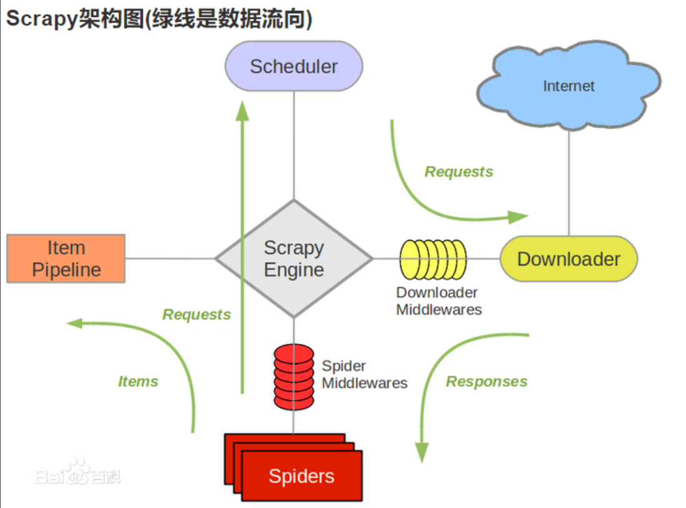
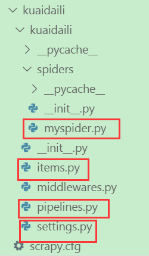

[TOC]

# scrapy框架学习笔记

## 网络爬虫及分类  

* 爬虫是一个模拟人类请求网站信息并提取有价值数据的程序。  
* 爬虫分类：  
  通用爬虫：爬取所有内容，如通用搜索引擎。  
  聚焦爬虫：面向特定需求的爬虫，只提取对自己有价值的信息。  

## python写爬虫程序的优势  

　　代码简洁，开发效率高，支持的模块、框架多（http请求模块，xml/html解析模块、scrapy框架等等）。

## 环境搭建  

* 安装python3  
* 安装vscode  
* 虚拟环境（virtualenv/virtualenvwrapper）  
* 安装scrapy --pip install scrapy  

## 基本网络常识

* **http / https**

  * http协议：超文本传输协议， 80端口。
  * https协议：http协议的加密版本，在http协议下加入了ssl层，443端口。

* **url：统一资源定位符**
  格式：协议://用户名:密码@子域名.域名.顶级域名:端口号/目录/文件名.文件后缀?参数=值#标志

* **http请求方法**（一共8种）

  * GET：只是从服务器下载数据，并不会对服务器产生影响，一般要用get请求。  
  * POST：向服务器发送数据（提交表单，上传文件等），可能会导致服务器上新资源建立或已有资源修改。  
  * 其他：HEAD/PUT/DELETE/CONNECT/OPTIONS/TRACE/PATCH  
* **常用请求参数**

  * User-Agent：浏览器名称，可伪造。
  * Referer：表明当前请求是从哪个url过来的，也就是上一页的url。
  * Cookie：http协议是无状态的，也就是同一个人发送两次请求，服务器是不知道这两个请求是否来自同一个人，因此这时候就用cookie来标识。应用场景如用户自动登录。
* **常见响应状态码**

  * 2xx -- 成功  
     200：服务器正常返回数据。

  * 3xx -- 重定向  
     301：永久重定向，如输入"www.jingdong.com" 会重定向到 "www.jd.com"。  
     302：临时重定向，比如访问一个需要登录的页面的时候，而此时没有登录，就会重定向到登录页面。  

  * 4xx -- 客户端错误，请求语法错误  
     400：url错误，请求的url在服务器上找不到。  
     403：服务器拒绝访问，权限不够。  
     404: 服务器无法根据客户端的请求找到资源（网页）  

  * 5xx -- 服务器错误  
     500：服务器内部错误。（服务器的问题）  

## urllib库

* 简单静态页面抓取可以用python3自带的网络请求库，如urllib。在python3中urllib库所有和网络请求相关的方法都被集到了urllib.request模块下边了，用法示例：

```python
    from urllib import request
    resp = request.urlopen('https://www.baidu.com')
    print(type(resp))          # <class 'http.client.HTTPResponse'> 类文件句柄对象
    # print(resp.read(10))
    # print(resp.read())
    # print(resp.readline())
    print(resp.readlines())  # 返回多行存到list中
```

## scrapy框架

* **概述**  
    Scrapy是Python开发的一个快速、高层次的屏幕抓取和web抓取框架，用于抓取web站点并从页面中提取结构化的数据。  
    Scrapy用途广泛，可以用于数据挖掘、监测和自动化测试。大批量抓取静态网页时效率非常高。  

* **框架**: scrapy组件及架构如下图：  

    

  * spider（产出Request，处理Response）
  * Pipeline：管道，爬虫产生的item数据，做过滤和持久化。
  * Downloader：下载器，接收引擎传递过来的请求，下载，最终将响应结果交给spider爬虫文件。
  * Scheduler：调度器，将Request存储在任务队列中，引擎会从任务队列中提取任务交给下载器。调度器中不存在任何request了，整个程序会停止。
  * Scrapy Engine：scrapy引擎，负责信号和数据的传递，发号施令，起协调作用。
  * Spider Middlewares（Spider中间件）：可以自定义request请求和过滤Response响应。
  * Downloader Middlewares（下载中间件）：自定义下载组件（请求任务和响应结果都会经过下载中间件）代理中间件，如cookies中间件，User-Agent中间件，selenium中间件。

* **中文学习网站**
    <https://scrapy-chs.readthedocs.io/zh_CN/1.0/intro/overview.html>

* **知识点**
    1. 熟悉scrapy的架构和运行流程。
    2. 熟悉scrapy shell和scrapy selectors的使用
    3. 使用scrapy进行网站爬取
       创建scrapy项目（scrapy startproject xxx）
       定义提取的结构化数据（Item类）
       编写爬取网站的spider并提取出结构化数据（xpath、正则等）

* **robots协议**

    也叫爬虫协议、机器人协议，通常写在服务器的robots.txt文件中，用来限定爬虫程序可以爬取的内容范围，  
    告知爬虫本网站哪些网页不希望你进行爬取收录。在Scrapy启动后，会访问网站的robots.txt 文件，然后决定该网站的爬取范围。  
    如果网站不希望我们爬取我们仍要访问，就将ROBOTSTXT_OBEY设置为False，不遵守爬虫协议。  

* **Item Pipeline**

    当item在spider中被收集后，它将被传递到item pipeline，这些item pipeline组件按定义的顺序（优先级0-1000）处理item。基本应用有：  

  * 验证item中某些字段；  
  * 查重并丢弃（url请求去重在调度器里实现的，数据去重在管道实现）；  
  * 爬取结果保存到文件或数据库等；  

* **xpath语法**
    参考：<https://www.w3school.com.cn/xpath/xpath_syntax.asp>

* **scrapy shell**
    常用语模拟代码发送请求，调试代码。

    ```shell
    > scrapy shell "https://www.baidu.com/"     # 启动scrapy shell
    > item_list = response.xpath("//a[@class='mnav']/text()").extract()
    > for i in item_list:
    >     print(i)
    > print(response.head)      # 响应头
    > print(response.body)      # 响应体
    ```

* **selector响应器**
     使用Selector对象提取结构化数据效果和response.xpath()这种快捷方式查询一样，基本方法有4个：

  * xpath(): 传入xpath表达式，返回表达式对应的所有节点的selector list列表。
  * css(): 传入css表达式，返回表达式对应的所有节点的selector list列表。
  * extract(): 序列化该节点为unicode字符串的list。
  * re(): 根据正则表达式提取，返回unicode字符串的list。

    ```python
    import scrapy
    from scrapy.selector import Selector
    # 通过scrapy的response构建Selector对象
    selector = Selector(response=response)
    title = selector.xpath('//a[@class="titlelnk"]/text()').extract()
    print(title)
    ```

# 搭建scrapy项目

## 案例1：抓取快代理网站前N页的代理ip信息

* 第一步：创建scrapy工程**

  **$ scrapy startproject kuaidaili**
  工程目录：

  

* **第二步：写item.py文件，定义要提取的结构化数据**

```python
import scrapy
class KuaidailiItem(scrapy.Item):
    # define the fields for your item here like:
    # name = scrapy.Field()
    # pass
    # 定义要提取的结构化数据, 此类可以通过dict()强转成python词典
    # 提取快代理网站的匿名代理信息：ip，port，位置
    ip = scrapy.Field()
    port = scrapy.Field()
    position = scrapy.Field()
```

* **第三步：写爬虫文件**

  创建名称为kuaidaili的爬虫文件,并限制在www.kuaidaili.com域下爬取  
    **$ cd kuaidaili/kuaidaili/spiders**  
    **$ scrapy genspider myspider "kuaidaili.com"**  

  * 手动修改start_urls(可选),导入Item类，查看网页源码，确定xpath（推荐安装Chrome的xpath helper）  
  * 使用yield生成器，解析出item（递交给pipline处理）、产生后续的Request（递交给spider抓取）  

  ```python
    # -*- coding: utf-8 -*-
    import scrapy
    from kuaidaili.items import KuaidailiItem
    class MyspiderSpider(scrapy.Spider):
        # 爬虫名称
        name = 'myspider'
        allowed_domains = ['kuaidaili.com']
        # start_urls = ['http://kuaidaili.com/']
        # 拼接url
        # 抓取快代理的免费代理ip，通过start_urls获取带抓取的第一个url
        base_url = "https://www.kuaidaili.com/free/inha/"
        offset = 1
        start_urls = [base_url + str(offset)]
        # 可重写该父类该方法，返回一个可迭代的初始抓取列表
        # 默认是通过start_urls生成一个可迭代的待抓取Request对象列表
        # 这些Request对象默认使用get方法抓取，回调函数是parse（抓取请求发出去后，返回结果用parse函数处理）
        # def start_request(self):
        #
        def parse(self, response):
            item = KuaidailiItem()
            #
            node_list = response.xpath("//div[@id='list']/table/tbody/tr")
            #
            for node in node_list:
                item['ip'] = node.xpath("./td[@data-title='IP']/text()").extract()[0]
                item['port'] = node.xpath("./td[@data-title='PORT']/text()").extract()[0]
                item['position'] = node.xpath("./td[@data-title='位置']/text()").extract()[0]
                #
                # yield 的重要性：
                # 1. 再次调用时还能回到上次返回的位置继续执行代码, 如果用return，
                #    函数就直接退出了再次调用会从头开始执行。
                # 2.对于大批量的数据，yield比一次性返回items更节省内存
                #
                # spider产生item，经由引擎递交给pipeline处理
                yield item
            #
            # spider产生下一个Request抓取请求，经由引擎递交给scheduler处理
            # 注意：这里可以通过拼接url找到下一页链接，也可以通过提取xpath找到下一页的链接
            self.offset += 1
            if self.offset < 30:
                yield scrapy.Request(self.base_url + str(self.offset), callback=self.parse)
  ```

* **第四步：写管道文件 pipeline.py**

    所有item会共用一个管道，数据持久化和其他处理（item过滤/去重等）  

  ```python
  # -*- coding: utf-8 -*-
  import json
  class KuaidailiPipeline(object):
      # 创建管道时，只执行一次（可选实现，用于参数初始化）
      def __init__(self):
          pass
      # 开启爬虫时，只执行一次，可以替代__init__进行参数初始化（可选实现）
      def open_spider(self, spider):
          self.__file = open('data.json', 'w')
      # spider抛出item时，scrapy引擎都会通知pipiline调用此函数处理（必须返回item对象，否则item被丢弃）
      # spider是爬虫对象，如获取爬虫名：spider.name
      # ensure_ascii=False，禁用ascii，支持中文
      # dict() 将item类强转成python的字典
      def process_item(self, item, spider):
          self.__file.write(json.dumps(dict(item), ensure_ascii=False) + ',\n')
          return item
      # 爬虫关闭时，只执行一次（可选实现）
      def close_spider(self, spider):
          self.__file.close()
  ```

* **第五步：编写setting.py文件**

  * 不遵守爬虫协议

    **ROBOTSTXT_OBEY = False**

  * 开启pipiline，进行结构化数据(Item类)的持久化

   可以设置多个pipline依次处理，优先级0-1000，越小优先级越高，越优先处理。

   ```shell
    ITEM_PIPELINES = {
        'Teacher.pipelines.kuaidailiPipeline': 300,
    }
   ```

  * 其他配置，如header、user-agent等

* **第六步：启动爬虫**

```shell
  > cd kuaidaili/kuaidaili/spiders
  > scrapy crawl myspider(爬虫名称)
```

## 案例2：图片抓取和分类

和案例1的区别：

* 继承自ImagesPipeline管道，并重写父类的两个方法；  
* 在settings.py中设置图片的存取路径：**IMAGES_STORE = "d:\imageData"**  
* 代码实现  
  待结构化数据 **items.py**

  ```python
  # -*- coding: utf-8 -*-

  import scrapy

  class ImagesrenameItem(scrapy.Item):
      # define the fields for your item here like:
      # name = scrapy.Field()
      # pass
      imgurl = scrapy.Field()
      imgname = scrapy.Field()
  ```

* 爬虫类 **ImgsRename.py**

  ```python
  # -*- coding: utf-8 -*-
  import scrapy
  from ImagesRename.items import ImagesrenameItem

  class ImgsrenameSpider(scrapy.Spider):
      name = 'ImgsRename'
      allowed_domains = ['lab.scrapyd.cn']
      start_urls = ['http://lab.scrapyd.cn/archives/55.html',
                    'http://lab.scrapyd.cn/archives/57.html',
                    ]

      def parse(self, response):
          # 实例化item
          item = ImagesrenameItem()
          # 注意imgurls是一个集合也就是多张图片
          item['imgurl'] = response.css(".post img::attr(src)").extract()
          # 抓取文章标题作为图集名称
          item['imgname'] = response.css(".post-title a::text").extract_first()
          yield item
  ```

* 管道类 **pipelines.py**

  ```python
  # -*- coding: utf-8 -*-
  import re
  from scrapy.pipelines.images import ImagesPipeline
  from scrapy import Request

  # 继承自图片管道类ImagesPipeline，图片会自动保存到配置文件设置的路径IMAGES_STORE中
  class ImagesrenamePipeline(ImagesPipeline):

      def get_media_requests(self, item, info):
          # 循环每一张图片地址下载，若传过来的不是集合则无需循环直接yield
          for image_url in item['imgurl']:
              # item里面的数据是从spider获取，然后通过item传递给下面方法：file_path
              yield Request(image_url, meta={'name': item['imgname']})

      # 重命名，若不重写这函数，图片名为哈希(md5)
      def file_path(self, request, response=None, info=None):

          # 提取url前面名称作为图片名。
          image_guid = request.url.split('/')[-1]
          # 接收上面item传递过来的图片名称
          name = request.meta['name']
          # 过滤windows字符串，不经过这么一个步骤，你会发现有乱码或无法下载
          name = re.sub(r'[？\\*|“<>:/]', '', name)
          # 分文件夹存储的关键：{0}对应着name；{1}对应着image_guid
          filename = u'{0}/{1}'.format(name, image_guid)
          return filename
  ```

## 思考

scrapy用于**大批量的抓取静态页面**,非常高效。   
问题：如何抓取动态页面？  
​   网络抓包？  
​   selenium + chrome（PhantomJS）模拟浏览器？
