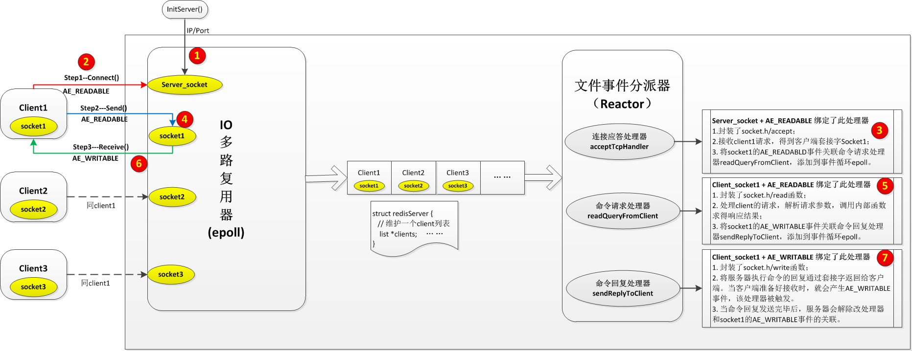
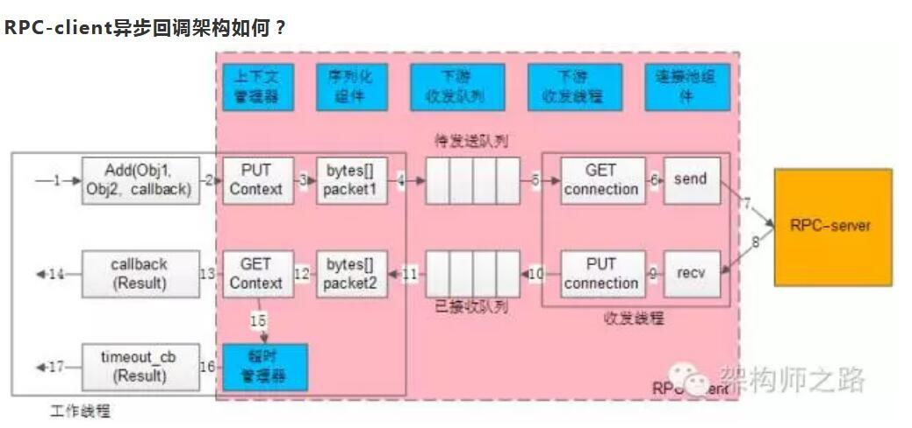

[toc]

# 参考资料

* 看书_学习目录下： Linux网络编程（epoll、epoll反应堆、心跳、线程池）

  

# 什么是IO多路复用

linux一切皆文件，文件分为：  

* 普通文件：
* 设备文件：由字节序列而构成的信息载体。管道、网络、终端设备等。

对设备文件的一次read操作返回的数据可能少于要求的数据量，即使没有到达文件尾端，这不是一个错误，应当继续读该设备。同样的，对设备文件的一次write操作，也可能少于指定的输出字节数，也不是错误，需要继续写余下的数据。（注：readn和writen系统函数用于按需读、写指定的n个字节）。

一个线程，从一个描述符读数据然后又写入另一个描述符时，可以使用下边的阻塞IO模式:

```c
while((n = read(fd1, buf, buf_size)) > 0) {
    if (write(fd2, buf, n) != n) {
        perror("write failed");
    }
}
```

但是，如果这个线程要操作两个描述符，又将如何呢？

* 如果仍使用这种阻塞的方式？那么就会长时间阻塞到一个描述符上，另一个描述符不能及时得到处理。
* 如果开一个子进程？需要通过信号通知机制，在一个进程结束时通知另一个进程，使得进程结束（复杂）。
* 如果开两个线程？需要处理线程间的同步（复杂）。
* 如果将两个描述符都设置成非阻塞的？主线程需要不断的轮询检测两个描述符的可读写状态，浪费cpu时间。

如果一个线程要同时操作多个描述符呢？。。。

**比较好的解决方案就是：IO多路复用。**

**基本思路** ：准备一张描述符的列表，然后调用一个函数，直到这些描述符中的一个已经准备好进行IO时，该函数才返回，然后通知线程哪些描述符已经准备就绪。IO多路复用就是一个线程，通过记录跟踪每一个文件描述符的状态（内核监视文件描述符集合的状态并通知线程），来同时管理多个I/O流。基本实现：select、poll、epoll。

select、poll：实现了异步通知机制，但是内核并不主动告诉我们描述符的状态，需要我们遍历查询。原因是每个进程只有一个信号，如果同时对几个描述符进行异步IO，那么在进程接收到该信号时并不知道这一信号对应于哪个文件描述符。
epoll通过将准备就绪的文件描述符排到集合的前边同时返回就绪文件描述符的个数，巧妙地告诉了我们哪些描述准备就绪了。

# select/poll/epoll的区别
## select
* 实现原理：
  将待监听的fd的集合（1024位的bitmap）拷贝到内核态，内核帮我们监听，如果至少有一个fd有数据到来了，内核会把有数据的fd置位，同时将select函数返回；select函数是个阻塞函数，没有数据到来会一直阻塞（可设置超时时间）。然后用户程序遍历判断哪个fd被设置了(有数据)，再进行处理。

* 优点：
  把fd集合考到内核态，内核帮我们监视哪个fd有数据到来，高效。

* 缺点：

  * fd的bitmap有1024的限制（可调整，但终究有上限）。
  * 每次循环都要给fd集合重新赋值，因为被内核修改了。
  * 每次fd集合从用户态拷贝到内核态拷贝过程有很大开销。
  * 并不知道哪个fd有数据，需要o(n)的复杂度去遍历。

* 主要API

  ```c
  #include <sys/select.h>
  int select(int nfds, fd_set *readfds, fd_set *writefds,fd_set *exceptfds, struct timeval *timeout);
  void FD_CLR(int fd, fd_set *set);     // 将一个给定的文件描述符从集合bitmap中删除
  int  FD_ISSET(int fd, fd_set *set);   // 检查集合bitmap中指定的文件描述符是否可以读写
  void FD_SET(int fd, fd_set *set);     // 将一个给定的文件描述符加入集合bitmap中
  void FD_ZERO(fd_set *set);            // 清空集合bitmap
  truct timeval {time_t tv_sec; time_t tv_usec;};     // 精确到um
  ```


* 代码示例

  ```c
  #include <stdio.h>
  #include <sys/types.h>
  #include <sys/socket.h>
  #include <netinet/in.h>
  #include <wait.h>
  #include <signal.h>
  #include <errno.h>
  #include <sys/select.h>
  #include <sys/time.h>
  #include <unistd.h>

  #define MAXBUF 256

  void child_process(void)
  {
      sleep(2);
      char msg[MAXBUF];
      struct sockaddr_in addr = {0};
      int n, sockfd, num = 1;
      srandom(getpid());
      /* Create socket and connect to server */
      sockfd = socket(AF_INET, SOCK_STREAM, 0);
      addr.sin_family = AF_INET;
      addr.sin_port = htons(2000);
      addr.sin_addr.s_addr = inet_addr("127.0.0.1");
      // 客户端发送TCP连接请求
      int ret = connect(sockfd, (struct sockaddr *)&addr, sizeof(addr));
      if (ret == -1) {
          perror("connect failed");
          return;
      }

      printf("child { %d} connected \n", getpid());
      while (1) {
          int sl = (random() % 10) + 1;
          num++;
          sleep(sl);
          sprintf(msg, "Test message %d from client %d", num, getpid());
          n = write(sockfd, msg, strlen(msg));    /* Send message */
      }
  }

  int main()
  {
      char buffer[MAXBUF];
      int fds[5];
      struct sockaddr_in addr;
      struct sockaddr_in client;
      int addrlen, n, i, max = 0;
      int sockfd, commfd;
      fd_set rset;
      for (i = 0; i < 5; i++) {
          if (fork() == 0) {      // 子进程
              child_process();
              exit(0);
          }
      }

      sockfd = socket(AF_INET, SOCK_STREAM, 0); // 创建流式套接字
      memset(&addr, 0, sizeof(addr));
      addr.sin_family = AF_INET;
      addr.sin_port = htons(2000);
      addr.sin_addr.s_addr = INADDR_ANY;
      bind(sockfd, (struct sockaddr *)&addr, sizeof(addr)); // 绑定到指定ip和端口号（服务器）
      listen(sockfd, 5);      // 将套接字设置为监听状态

      for (i = 0; i < 5; i++) {
          memset(&client, 0, sizeof(client));
          addrlen = sizeof(client);
          // 监听客户端请求（阻塞的等待直到有客户端请求到来）
          // 返回一个已连接的客户端套接字，保存了客户端的ip和端口信息
          fds[i] = accept(sockfd, (struct sockaddr *)&client, &addrlen); 
          if (fds[i] > max) {
              max = fds[i];         // 统计描述符的最大值
          }       
      }

      while (1)
      {
          FD_ZERO(&rset);              // select监听事件集合清空
          for (i = 0; i < 5; i++) {
              FD_SET(fds[i], &rset);    // 每次循环都需要重置监听事件的集合
          }

          puts("round again");
          select(max + 1, &rset, NULL, NULL, NULL);

          for (i = 0; i < 5; i++) {
              if (FD_ISSET(fds[i], &rset)) {
                  memset(buffer, 0, MAXBUF);
                  read(fds[i], buffer, MAXBUF);   // 遍历查看哪个套接字有数据来了
                  puts(buffer);
              }
          }
      }
      return 0;
  }
  ```

  

## poll
* 实现原理
  把fd结构体的数组（pollfds{fd，event, revent}）拷贝到内核态，不是bitmap。
  poll也是阻塞函数（可设置超时时间）。
  内核给只给revent置位，不修改其他，所以每次循环pollfds可以重用。

* 相比select的改进

  * 没有最大文件描述符数量的限制（数组没有数量限制）。
  * 每次循环不需要给pollfds重新赋值，只需要恢复下revent。

* 主要API

  ```c
  #include <poll.h>
  int poll(struct pollfd *fds, nfds_t nfds, int timeout);
  struct pollfd {
     int   fd;         // 文件描述符
     short events;     // 关心的事件类型 
     short revents;    // 就绪的事件类型 POLLIN、POLLOUT、POLLERR等
  };
  struct timespec {long tv_sec;  long tv_nsec;};   // 精确到nm
  ```

* 代码示例：

  ```c
      for (i = 0; i < 5; i++) {
          memset(&client, 0, sizeof(client));
          addrlen = sizeof(client);
          pollfds[i].fd = accept(sockfd, (struct sockaddr *)&client, &addrlen);
          pollfds[i].events = POLLIN;     // 监听读取事件
      }

      sleep(1);
      while (1)
      {
          puts("round again");
          poll(pollfds, 5, 50000);

          for (i = 0; i < 5; i++) {       // 遍历查找哪个套接字准备就绪
              if (pollfds[i].revents & POLLIN) {
                  pollfds[i].revents = 0;           // 只需要给本次就绪的套接字重新置位
                  memset(buffer, 0, MAXBUF);
                  read(pollfds[i].fd, buffer, MAXBUF);
                  puts(buffer);
              }
          }
      }
  ```

  


## epoll
* 实现原理

epfd是在用户态和内核态共享的一块内存，避免了从用户态到内核态的数据拷贝了。同样是内核监听哪个fd有数据到来。巧妙的实现置位：有数据的fd重排到前边，同时用返回值表示就绪状态的fd个数。取前n个描述符就可以了，操作复杂度o(1)的，不需要整体遍历了。epoll解决了select和poll的不足。

epoll一个很大的优势就是将所有的文件描述符都存放在内核中，所以epoll_wait不需要每次调用时重新拷贝一遍所有的文件描述符到内核态。对于每个文件描述符，经常会有插入、删除和查找的操作发生，因此需要一种插入，查找和删除效率都不错的数据结构来存放这些文件描述符，那么**红黑树**当然是不二的人选。

* 主要API

  ```C
  #include <sys/epoll.h>
  int epoll_create(int size); // 创建内核事件表;
  // 添加、移除、修改文件描述符(EPOLL_CTL_ADD/EPOLL_CTL_DEL/EPOLL_CTL_MOD)
  int epoll_ctl(int epfd,int op,int fd,struct epoll_event* event); 
  int epoll_wait(int epfd,struct epoll_event*events,int max,int timeout); // 返回就绪文件描述符
  ```

* 代码示例

  ```c
      struct epoll_event events[5];
      int epfd = epoll_create(10);
      ...... 
      for (i = 0; i < 5; i++) {
          static struct epoll_event ev;
          memset(&client, 0, sizeof(client));
          addrlen = sizeof(client);
          ev.data.fd = accept(sockfd, (struct sockaddr *)&client, &addrlen);
          ev.events = EPOLLIN;       // 监听读取事件
          epoll_ctl(epfd, EPOLL_CTL_ADD, ev.data.fd, &ev);
      }

      while (1)
      {
          puts("round again");
          nfds = epoll_wait(epfd, events, 5, 10000);

          for (i = 0; i < nfds; i++) {           // nfds个套接字均为就绪状态
              memset(buffer, 0, MAXBUF);
              read(events[i].data.fd, buffer, MAXBUF);
              puts(buffer);
          }
      }
  ```

  

## IO多路复用的案例

redis
完全基于内存，数据结构和操作也简单，redis中的数据结构是专门进行设计的；
采用单线程，避免了不必要的上下文切换和竞争条件，不用考虑加锁释放锁和死锁的问题；

# libevent

libevent是一个c语言的，基于事件驱动的开源的网络库，封装了各种平台上最高效的IO多路复用（如linux上的epoll的事件处理系统调用），支持跨平台。使用是链接动态库即可（-levent）。

常用api https://www.jianshu.com/p/8ea60a8d3abb

# epoll + reactor + rpc

* epoll

  IO多路复用，基于事件通知机制（epoll_wait）。由一个非阻塞的线程来接收所有的IO请求，然后派发这些请求至相关的工作线程进行处理。

* reactor（时间处理器）

  将请求放到**无锁队列**中，处理线程循环来请求任务。

  

参考：https://blog.csdn.net/pistolove/article/details/53152708

* redis就是epoll+reactor模型的典型案

  

* rpc  
  * rpc：远程过程调用。
  * rpc框架解决的问题：“像调用本地函数一样调用远端的函数（服务）”。  屏蔽client端和server端屏蔽RPC调用过程中的序列化，网络传输等技术细节。
  * 序列化：把“对象”转化为二进制字节流。protobuffer是一种采用二进制协议的序列化方案。
  * rpc同步调用：在得到结果之前，一直处于阻塞状态，会一直占用一个工作线程。同步RPC-client的核心组件是序列化组件、连接池组件。它通过连接池来实现负载均衡与故障转移，通过阻塞的收发来实现超时处理。
  * 连接池：和RPC-server建立N个tcp长连接，即所谓的连接“池”。作用包括：负载均衡、故障转移、发送超时等。
  * rpc异步调用：核心组件是序列化组件、连接池组件、收发队列、收发线程、上下文管理器、超时管理器。它通过“请求id”来关联请求包-响应包-回调函数，用上下文管理器来管理上下文，用超时管理器中的timer触发超时回调，推进业务流程的超时处理。
  * 上下文管理器：由于请求包的发送，响应包的回调都是异步的，甚至不在同一个工作线程中完成，需要一个组件来记录一个请求的上下文，把请求-响应-回调等一些信息匹配起来。通过“请求id”来实现请求-响应-回调的串联。
  * rpc框架
    
  * rpc同步调用
    
  * rpc异步调用
    

# 高性能并发系统（epoll + reactor +线程池）

* cpu（nm级处理能力）：通过多线程、多进程、线程池提高多核并发计算的能力。-- 计算密集型
* 内存（um级处理能力）：
* IO（ms级处理能力）：IO多路复用。-- IO密集型

## epoll 和 epoll反应堆的区别

* epoll 模型处理流程

  服务器 --- 监听 --- cfd(连接) ----可读 ---- epoll返回 ---- read --- 小写转大写 --- write ---- epoll继续监听。

* epoll 反应堆模型
  服务器 --- 监听 --- cfd(连接) ---- 可读 ---- epoll返回 ---- read -- cfd从epoll红黑树上摘下 --- 设置监听cfd写事件， 操作(回调函数) --- 加入epoll红黑树 -- 等待epoll_wait 写事件返回 --- 调用回调函数回写客户端 -- cfd从树上摘下 ----- 设置监听cfd读事件， 操作(回调函数) --- 加入epoll红黑树 -- epoll继续监听。

## socket实现C/S模型

## epoll

libevent在linux系统上对网络高并发服务器实现的封装：  
epoll边沿触发 + 非阻塞IO + reactor（回调机制-函数指针/结构体指针）。  
回调的实现是通过给*ptr传值，实现上epoll_wait监听到的活跃的socket会主动调用ptr中设置的回调函数。 

```c++ 
struct epoll_event {
			__uint32_t events; /* Epoll events */
			epoll_data_t data; /* User data variable */
		};


typedef union epoll_data {
			void *ptr;
			int fd;
			uint32_t u32;
			uint64_t u64;
		} epoll_data_t;

// ptr指向myevent_s类型的指针。
struct myevent_s {
    int fd;                                                 //要监听的文件描述符
    int events;                                             //对应的监听事件
    void *arg;                                              //泛型参数
    void (*call_back)(int fd, int events, void *arg);       //回调函数
    int status;                                             //是否在监听:1->在红黑树上(监听), 0->不在(不监听)
    char buf[BUFLEN];
    int len;
    long last_active;                                       //记录每次加入红黑树 g_efd 的时间值
};


```


# 几个基本概念

* 并发与并行：
* 同步与异步：
* 阻塞与非阻塞：
* 线程与进程的区别：


