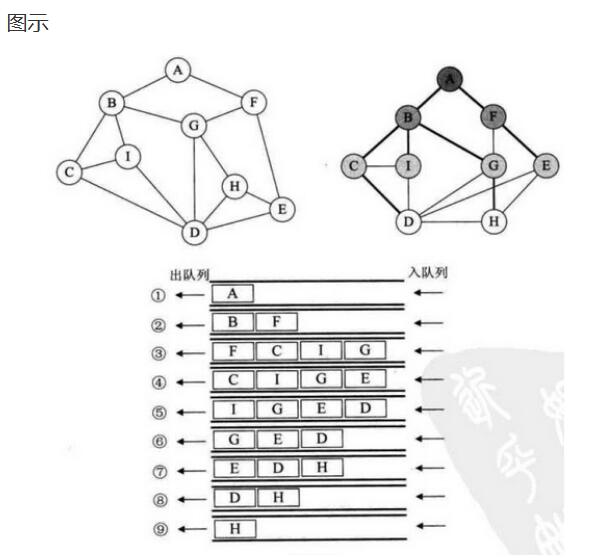

[TOC]

# 链表、树、图的区别

* **线性表（如链表）**：每个数据元素只有一个直接前驱和一个直接后继。
* **树形结构**：数据元素之间有明显的层次关系，并且每一层上的数据元素可能和下一层中多个元素（即其孩子结点）相关，但只能和上一层中一个元素（即其双亲结点）相关。
* **图形结构**：结点之间的关系可以是任意的，图中任意两个数据元素之间都可能相关。

# 图的表示方法

如何描述节点集合和边？
* 邻接列表
  
* 邻接矩阵
  

# 图的分类

* 有向图
* 无向图
* 有权的图叫做网

# 图遍历

* BFS（广度优先搜索）：一层一层的走。走完当前层，就找当前层每个节点的下一层。。。队列实现Queue（先进先出）
  

  ```python
  '''
  BFS 图的广度优先遍历算法
  思路描述：
  1. 任选一个节点作为遍历的起始点，这里选择A，A入队列(放入队列同时加入可见集合）；
  2. A出队列，同时把与A相邻且不在可见集合里的的节点放入队列(放入队列同时加入可见集合）；
  3. 依次从对头取出一个节点，执行2, 直到队列为空；

  说明: 这里主要针对无向图的简单实现，如果是有向图，队列为空后，还需要回访问集合seen查看是否有未访问的节点，然后从新的节点继续遍历。

  预备知识：
  python中的列表list既可以作为队列Queue用，也可以作为栈Stack用。
  （1）用作队列时：
      队尾插入 list.append()
      队首取出 list.pop(0)
      队列长度 len(list)
  （2）用作栈时：
      压栈 list.append()
      出栈 list.pop()
      判空 len(list) == 0
  '''

  # 用一个词典保存图的节点和边，类似邻接表
  # graph.keys()  -- 表示所有的节点
  # graph["A"]  -- 表示与节点A相邻的节点
  graph = {
      "A": ["B", "F"],
      "B": ["A", "C", "I", "G"],
      "C": ["B", "D", "I"],
      "D": ["C", "E", "H", "I"],
      "E": ["D", "F", "H"],
      "F": ["A", "E", "G"],
      "G": ["B", "D", "F", "H"],
      "H": ["D", "E", "G"],
      "I": ["B", "C", "D"]
  }

  def BFS(start_node):
      Queue = []
      seen = set()         # 已经被访问过的集合
      Queue.append(start_node)     # 起始点入队列
      seen.add(start_node)
      while (len(Queue) > 0):
          node = Queue.pop(0)
          print(node)
          for n in graph[node]:
              if n not in seen:
                  Queue.append(n)
                  seen.add(n)

  if __name__ == "__main__":
      BFS("A")
  ```

  ​

* DFS（深度优先搜索）：一条路一直走到底。走到底，继续回溯邻接节点继续走到底。。。栈实现Stack（后进先出）

  

  ```python
  '''
  DFS 图的深度优先遍历算法（一条路走到黑）
  思路描述：
  1. 任选一个节点作为遍历的起始点，这里选择A，A压栈(压栈同时加入可见集合）；
  2. A出栈，同时把与A相邻且不在可见集合里的的节点压栈(压栈同时加入可见集合）；
  3. 依次从栈顶取出一个节点，执行2, 直到栈为空；
  每次压栈的节点一定是当前节点的相邻节点，优先弹出的也是当前节点的相邻节点，
  可以保证一直在访问相邻节点，直到相邻节点被访问完毕，
  然后再弹栈的就是依次向前回溯这条访问路径上未被访问的节点的相邻的节点。
  实现上，和BFS的唯一区别就是把队列换成了栈！

  这个例子中，从A开始依次遍历邻接节点A-B-C-D-E-F-G-H;
  H没有未被访问的邻接节点了，开始回溯；
  G没有未被访问的邻节点，F没有被访问的邻节点... 直到D，有一个未被访问的邻节点；
  继续回溯，直到所有节点都没有未被访问的邻节点（栈空）。

  说明: 这里主要针对无向图的简单实现，如果是有向图，栈为空后，还需要回访问集合seen查看是否有未访问的节点，然后从新的节点继续遍历。

  预备知识：
  python中的列表list既可以作为队列Queue用，也可以作为栈Stack用。
  （1）用作队列时：
      队尾插入 list.append()
      队首取出 list.pop(0)
      队列长度 len(list)
  （2）用作栈时：
      压栈 list.append()
      出栈 list.pop()
      判空 len(list) == 0
  '''

  # 用一个词典保存图的节点和边，类似邻接表
  # graph.keys()  -- 表示所有的节点
  # graph["A"]  -- 表示与节点A相邻的节点
  graph = {
      "A": ["F", "B"],
      "B": ["A", "C", "I", "G"],
      "C": ["B", "D", "I"],
      "D": ["C", "E", "H", "I"],
      "E": ["D", "F", "H"],
      "F": ["A", "E", "G"],
      "G": ["B", "D", "F", "H"],
      "H": ["D", "E", "G"],
      "I": ["B", "C", "D"]
  }

  def DFS(start_node):
      Stack = []
      seen = set()         # 已经被访问过的集合
      Stack.append(start_node)     # 起始点入队列
      seen.add(start_node)
      while (len(Stack) > 0):
          node = Stack.pop()
          print(node)
          for n in graph[node]:
              if n not in seen:
                  Stack.append(n)
                  seen.add(n)

  if __name__ == "__main__":
      DFS("A")
  ```

  ​

# 计算最小路径

* 无权图计算最小路径

  ```python
  '''
  对于无权图，可以通过BFS广度优先遍历寻找最短路径。
  像雷达一样，一层一层进行寻找目标点。当找到目标点后进行回溯。从而找到最佳路径。
  也就是说每走一步都要找到到达该点的最短的路径，最终得到到达所有点的最短路径。
  以下parent词典就是保存父子级对应关系，用于回溯的。

  思路：
  记录广度优先遍历过程中，每个节点的父节点信息。
  '''

  graph = {
      "A": ["B", "C"],
      "B": ["A", "C", "D"],
      "C": ["A", "B", "D", "E"],
      "D": ["B", "C", "E", "F"],
      "E": ["C", "D"],
      "F": ["D"]
  }

  def BFS_shortest(start_node):
      Queue = []
      seen = set()
      parent = {start_node: None}
      Queue.append(start_node)
      seen.add(start_node)
      while(len(Queue) > 0):
          node = Queue.pop(0)
          for n in graph[node]:
              if n not in seen:
                  Queue.append(n)
                  seen.add(n)
                  parent[n] = node
      return parent

  if __name__ == "__main__":
      parent = BFS_shortest("A")
      for key in parent:
          print(key, parent[key])

      # parent = {'A': None, 'B': 'A', 'C': 'A', 'D': 'B', 'E': 'C', 'F': 'D'}
      # 例如：计算到达E的最短路径：
      '''
      E的父节点C
      C的父节点A
      A的父节点None
      所以到达E的最短路径为：A-C-E
      '''
  ```

  ​

* 有权图计算最小路径

  

  ```python
  import heapq
  import math
  '''
  Dijkstra（狄克斯特拉）算法使用了广度优先搜索解决赋权有向图或者无向图的单源最短路径问题。
  B站学习视频 https://www.bilibili.com/video/av25829980

  Dijkstra的大致思想就是，根据初始点，挨个的把离初始点最近的顶点一个一个找到并加入集合，
  集合中所有的顶点的dis[i]都是该点到初始点最短路径长度，
  然后以该顶点为中心(过渡顶点)，最终找到源点到其余顶点的最短路。

  基础知识：
  python优先级队列：
  和c++中stl类似，通过堆实现优先级队列，引入模块 import heapq

  priorityQueue = []  # 自定义一个list，把list转为堆结构
  heapq.heappush(priorityQueue, (weight, node))  # 插入一个元组，权重值/节点
  pair = heapq.heappop(priorityQueue)       # 优先弹出权重值最大的元组

  priorityQueue = []
  heapq.heappush(priorityQueue, (7, 'A'))
  heapq.heappush(priorityQueue, (3, 'B'))
  heapq.heappush(priorityQueue, (5, 'B'))
  while (len(priorityQueue) > 0):
      pair = heapq.heappop(priorityQueue)
      print(pair)       # 弹出次序为：(3, 'B') (5, 'B') (7, 'A')

  '''

  # 赋权无向图
  # 所有的顶点 graph.keys()
  # 和顶点A相邻的节点 graph["A"].keys()
  # 顶点A到顶点B的距离 graph["A"]["B"]
  graph = {
      "A": {"B": 5, "C": 1},
      "B": {"A": 5, "C": 2, "D": 1},
      "C": {"A": 1, "B": 2, "D": 4, "E": 8},
      "D": {"B": 1, "C": 4, "E": 3, "F": 6},
      "E": {"C": 8, "D": 3},
      "F": {"D": 6}
  }

  def init_distance(start_node):
      distance = {}
      for node in graph.keys():
          distance[node] = math.inf
      distance[start_node] = 0
      return distance

  def dijkstra(start_node):
      priorityQueue = []
      heapq.heappush(priorityQueue, (0, start_node))        # 使用优先级队列，每次最先出队列的都是队列里距离值最小的
      seen = set()
      parent = {start_node: None}
      distance = init_distance(start_node)

      while (len(priorityQueue) > 0):
          pair = heapq.heappop(priorityQueue)
          dist = pair[0]
          node = pair[1]
          seen.add(node)      # 出队列的时候才被标记位已访问，BFS是入队列就被标记

          nodes = graph[node].keys()
          for n in nodes:
              if n not in seen:
                  if dist + graph[node][n] < distance[n]: 
                      heapq.heappush(priorityQueue, (dist + graph[node][n], n))
                      parent[n] = node
                      distance[n] = dist + graph[node][n]
      return parent, distance

  if __name__ == "__main__":
      parent, distance = dijkstra('A')
      print("node\tparent\tdistance")
      for node in graph.keys():
          print(node + '\t' + str(parent[node]) + '\t' + str(distance[node]))

      '''
      node    parent  distance
      A       None    0
      B       C       3
      C       A       1
      D       B       4
      E       D       7
      F       D       10
      '''
      # 计算到F的最短路径
      # F <- D <-B <- C <- A <- None
      # 路径值 = 1 + 3 + 4 + 10 = 18 
  ```

  ​