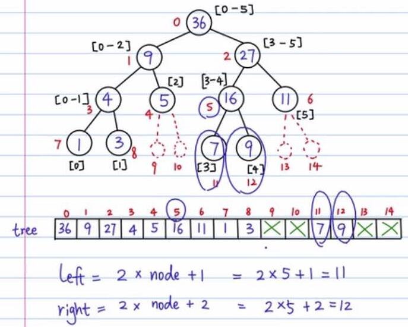

[TOC]

# 二叉树

**基本思想**：递归

# 二叉树遍历

* 先序：根-左子树-右子树

* 后序：左子树-右子树-根

* 中序：左子树-根-右子树

* 树节点结构：

  ```c++
  #include <stdio.h>
  #include <stdlib.h>

  typedef struct BINode
  {
      char ch;
      struct BINode * lchild;
      struct BINode * rchild;
  }BiNode;
  ```

* 递归遍历：

  ```c++
  #include <stdio.h>
  #include <stdlib.h>

  typedef struct BINode
  {

      char ch;
      struct BINode * lchild;
      struct BINode * rchild;

  }BiNode;

  // 递归 - 后序遍历二叉树(先序遍历和中序遍历类似的)
  void postRecursion(BiNode *root) {
      if(root == NULL) {
          return;
      }
      // 先遍历左节点
      postRecursion(root->lchild);
      // 再遍历右节点
      postRecursion(root->rchild);
      // 再遍历根节点
      printf("%c ", root->ch);

  }

  void creatTree() {

    	 // 说明：这里创建树用的是静态内存分配，实际应用中可能更常见的是用动态内存分配malloc、new
       BiNode nodeA = {'A', NULL, NULL};
       BiNode nodeB = {'B', NULL, NULL};
       BiNode nodeC = {'C', NULL, NULL};
       BiNode nodeD = {'D', NULL, NULL};
       BiNode nodeE = {'E', NULL, NULL};
       BiNode nodeF = {'F', NULL, NULL};
       BiNode nodeG = {'G', NULL, NULL};
       BiNode nodeH = {'H', NULL, NULL};

       nodeA.lchild = &nodeB;
       nodeA.rchild = &nodeF;
       nodeB.rchild = &nodeC;
       nodeC.lchild = &nodeD;
       nodeC.rchild = &nodeE;
       nodeF.rchild = &nodeG;
       nodeG.lchild = &nodeH;

       postRecursion(&nodeA);  

  }

  int main(){

      creatTree();
      system("pause");
      return 0;

  }
  ```

# 计算叶子节点个数

```c++
  int num=0;
  void CaculateLeafNum(BiNode *root) {
      if (root == NULL) {
          return;
      }
      if(root->lchild == NULL && root->rchild == NULL) {
          num++;
      }
      // 计算左子树的叶子节点
      CaculateLeafNum(root->lchild);
      // 计算右子树的叶子节点
      CaculateLeafNum(root->rchild);
  }
```

# 计算二叉树的高度

```c++
int Height(BiNode *root) {

    if(root == NULL) {
        return 0;
    }

    int rheight = Height(root->lchild);
    int lheight = Height(root->rchild);

    return lheight > rheight ? lheight + 1 : rheight + 1;
}
```

# 二叉树的拷贝和释放

```c++
BiNode *CopyBiTree(BiNode *root) {

    if(root == NULL) {
        return NULL;
    }
    // 拷贝左子树
    BiNode *newlchild = CopyBiTree(root->lchild);
    // 拷贝右子树
    BiNode *newrchild = CopyBiTree(root->rchild);
    // 拷贝当前节点
    BiNode *newroot = (BiNode *)malloc(sizeof(BiNode));
    newroot->lchild = newlchild;
    newroot->rchild = newrchild;
    newroot->ch = root->ch;
    return newroot;

}

void DestroyBiTree(BiNode *root) {

    if(root == NULL) {
        return;
    }
    // 释放左子树
    DestroyBiTree(root->lchild);
    // 释放右子树
    DestroyBiTree(root->rchild);
    // 释放根节点
    free(root);

}
```

# 遍历树的各条路径

```c++
// 先根遍历树的各路径
// 应用：计算各路径和为给定sum的路径。
void allPath(BiNode *root, vector<int>& v) {
    if (!root) {
        return;
    }
    v.push_back(root->val);
    if (root->left == NULL && root->right == NULL) {
        // 打印路径，同时清空vector
        for (auto it = v.begin(); it != v.end(); it++) {
            cout << *it << " ";
        }
        cout << endl;
    }
    allPath(root->left, v);
    allPath(root->right, v);
    v.pop_back();     // 遍历完节点的左右子树，弹出，和push_back呼应，很关键。。。
}
```


# 二叉树的非递归遍历

* 广度优先遍历BFS（队列实现）

  广度优先遍历，也可以称为层次优先遍历，从上到下，先把每一层遍历完之后再遍历一下一层。

* 深度优先遍历DFS（栈实现）

  按照一条路径走到底，再回溯，找到一个未遍历的邻节点，继续一直走到底。

  **特别说明：**由于c++ STL中实现了队列和栈，所以这里用c++实现，以下代码思路适用于普通树。

  **二叉树的遍历方式分为**：先序，后序，中序。

  **普通树遍历方式分为**：深度优先、广度优先。

  二叉树是普通树的特例，也可以用BFS/DFS非递归方式遍历。深度遍历和二叉树的先根遍历基本上是一样的，只是先根遍历有左右之分（针对二叉树的术语）。

  （图的BFS/DFS更复杂些，需要定义一个访问数组，标识当前哪些元素被访问过，见相关笔记。）

  ```c++
  #include <iostream>
  #include <cstdlib>
  #include <queue>
  #include <stack>

  using namespace std;

  // 二叉树节点结构
  struct BiNode
  {
      char ch;
      BiNode* lchild;
      BiNode* rchild;
  };

  // 创建一个节点
  BiNode* createNode(char data) {
      BiNode* node = new BiNode;
      node->ch = data;
      node->lchild = NULL;
      node->rchild = NULL;
      return node;
  }

  // 创建一棵树
  BiNode *creatTree() {

       BiNode *nodeA = createNode('A');
       BiNode *nodeB = createNode('B');
       BiNode *nodeC = createNode('C');
       BiNode *nodeD = createNode('D');
       BiNode *nodeE = createNode('E');
       BiNode *nodeF = createNode('F');
       BiNode *nodeG = createNode('G');
       BiNode *nodeH = createNode('H');

       nodeA->lchild = nodeB;
       nodeA->rchild = nodeF;
       nodeB->rchild = nodeC;
       nodeC->lchild = nodeD;
       nodeC->rchild = nodeE;
       nodeF->rchild = nodeG;
       nodeG->lchild = nodeH;

       return nodeA;
  }

  // 广度优先遍历(Breadth-FirstSearch)
  /*
  基本思路：
  父节点入队列，
  父节点（队首）出队列，同时将其子节点（队尾）入队列，
  依次循环直到队列为空。
  */
  void BFS(BiNode *root) {
      queue<BiNode *> myQueue;

      if (root != NULL) {
          myQueue.push(root);
      }
      while (!myQueue.empty()) {
          BiNode *node = myQueue.front();
          myQueue.pop();
          cout << node->ch << " ";
          if (node->lchild) { myQueue.push(node->lchild); }
          if (node->rchild) { myQueue.push(node->rchild); }
      } 
  }

  // 深度优先遍历
  /*
  基本思路：
  父节点压栈，
  父节点出栈，同时将其子节点压栈，（下次再弹出栈的一定是相邻的子节点, 一条路走到黑）
  依次循环直到栈为空。
  */
  void DFS(BiNode *root) {
      stack<BiNode *> myStack;

      if (root != NULL) {
          myStack.push(root);
      }
      while (!myStack.empty()) {
          BiNode *node = myStack.top();
          myStack.pop();
          cout << node->ch << " ";
          if (node->lchild) { myStack.push(node->lchild); }
          if (node->rchild) { myStack.push(node->rchild); }
      }
  }

  int main(){
      BiNode *root = creatTree();
    	BFS(root); cout << endl;
      DFS(root); cout << endl;
      system("pause");
      return 0;
  }
  ```

# 如何确定一棵树

* 如何确定一棵树

  * 中序+先序 可以确定一棵树
  * 中序+后序 可以确定一棵树

  技巧：必须带中序遍历！！！

* 根据先序遍历和中序遍历确定一棵树？
  先序：ADEBCF
  中序：DEACFB
  思路：
  根据先序遍历可知根节点A,根据中序结果，可知根的左子树DE，右子树CFB；
  左子树：先序是DE,中序是DE =>E是D的右子树；
  右子树：先序BCF，中序CFB =>B是根节点，F是C的右边节点
  ==> 后序：EDFCBA

# 如何创建一棵树

```c++
// 先序创建一棵树，ABD##E##C##，#代表空节点
Bitree CreateBitree(Bitree T)//先序创建一颗二叉树
{
  char  e;
  scanf_s("%c", &e);
  fflush(stdin);

  if (e != '#'){
    //判断当前输入的字符
    T = (Bitree)malloc(sizeof(Tree)); //分配存贮空间
    T->data = e;
    T->lchild = NULL;
    T->rchild = NULL;
    T->lchild = CreateBitree(T->lchild); //递归创建左孩子节点值
    T->rchild = CreateBitree(T->rchild);   //递归创建右孩子节点值
 }

 return T;
}
```

# 线段树

【题目】给定一个数组arr，数组可能非常大。在程序运行过程中，你可能要频繁的做query和update操作： query(arr, L, R) 表示计算数组arr中，从下标L到下标R之间的所有数字的和。 update(arr, i, val) 表示要把arr[i]中的数字改成val。

一般，树的操作方式：递归；树的时间复杂度：o(logN)。

定义数组：arr[5] = [1, 3, 5, 7, 9, 11]   



```c
#include <stdio.h>
#include <stdlib.h>
#include <assert.h>

// 创建线段树
// tree[] 线段树，除部分叶子节点外，可认为是满二叉树，可以用数组表示
// node 线段树的节点index
// arr[] start/end  线段树节点node对应的统计区间
void build_tree(int arr[], int tree[], int node, int start, int end) {
    if (start == end) {                  // 递归出口
        tree[node] = arr[start];
    } else {
        int mid = (start + end) / 2;
        int left_node = 2 * node + 1;
        int right_node = 2 * node + 2; // 满二叉树用数组表示，计算节点node的左右节点

        // 根据数组区间，递归创建左右子树
        build_tree(arr, tree, left_node, start, mid);
        build_tree(arr, tree, right_node, mid+1, end);
        tree[node] = tree[left_node] + tree[right_node];
    }
}

// 计算任意区间之和
// arr[start, end]  ==> tree[node]
int query_tree(int arr[], int tree[], int node, int start, int end, int L, int R) {
    if (R < start || L > end) {   // 不在区间内
        return 0;
    } else if (L <= start &&  R >= end) {    // 区间覆盖了[L, R]
        return tree[node];
    } else {
        // 递归计算左右子树在[L, R]区间上的累计和
        int mid = (start + end) / 2;
        int left_node = 2 * node + 1;
        int right_node = 2 * node + 2;
        int sum_left = query_tree(arr, tree, left_node, start, mid, L, R);
        int sum_right = query_tree(arr, tree, right_node, mid+1, end, L, R);
        return sum_left + sum_right;
    }
}

// 修改数组中下标为index的值
void update_tree(int arr[], int tree[], int node, int start, int end, int idx, int val) {
    assert(idx >= start && idx <= end);
    if (start == end && start == idx) {    // 聚焦到了指定点 
        arr[idx] = val;
        tree[node] = val;
    } else {
        int mid = (start + end) / 2;
        int left_node = 2 * node + 1;
        int right_node = 2 * node + 2;
        // 递归修改左子树或者右子树，然后当前根节点=左和+右和
        if (idx >= start && idx <= mid) {
            update_tree(arr, tree, left_node, start, mid, idx, val);
        } else {
            update_tree(arr, tree, right_node, mid+1, end, idx, val);
        }
        tree[node] = tree[left_node] + tree[right_node];
    }
}

int main() 
{
    int arr[] = {1, 3, 5, 7, 9, 11};
    int size = 6;
    int tree[1000] = {0};
    build_tree(arr, tree, 0, 0, size-1); 

    int sum = query_tree(arr, tree, 0, 0, size-1, 2, 4);
    printf("sum = %d\n", sum);

    update_tree(arr, tree, 0, 0, size-1, 4, 6);
    for(int i = 0; i < 15; i++) {
        printf("tree[%d]=%d\n", i, tree[i]);
    }

    system("pause");
    return 0;
}
```


# 附 c++代码实现

```c++
#include <iostream>
#include <cstdlib>
#include <vector>
#include <iterator>
#include <queue>
#include <stack>

using namespace std;

// 树的节点
struct BiNode {
    int val;
    BiNode* left;
    BiNode* right;

    BiNode(int _val): val(_val), left(nullptr), right(nullptr) {
    }
};

// 创建树
BiNode* createTree() {
    BiNode* root = new BiNode(10);
    BiNode* n8 = new BiNode(8);
    BiNode* n9 = new BiNode(9);
    BiNode* n3 = new BiNode(3);
    BiNode* n5 = new BiNode(5);
    BiNode* n10 = new BiNode(10);
    BiNode* n7 = new BiNode(7);

    root->left = n8;
    root->right = n9;
    n8->left = n3;
    n8->right = n5;
    n5->left = n7;
    n9->right = n10;

    return root;
}

// 树的中序遍历
void inOrderPrint(BiNode* root) {
    if (root == nullptr) {
        return;
    }

    inOrderPrint(root->left);
    cout << root->val << " ";
    inOrderPrint(root->right);
}

// 计算叶子节点数
void countLeaf(BiNode* root, int& count) {
    if (root == nullptr) {
        return;
    }

    if (root->left == nullptr && root->right == nullptr) {
        count++;
    } else {
        countLeaf(root->left, count);
        countLeaf(root->right, count);
    }  
}

// 计算树的高度
int treeHeight(BiNode* root) {
    if (root == nullptr) {
        return 0;
    }

    int l = treeHeight(root->left);
    int r = treeHeight(root->right);
    return max<int>(l, r) + 1;
}

// 树的拷贝
BiNode* copyTree(BiNode* root) {
    if (root == nullptr) {
        return nullptr;
    }

    BiNode* newroot = new BiNode(root->val);
    newroot->left = copyTree(root->left);
    newroot->right = copyTree(root->right);
    return newroot;
}

// 树的销毁
void destroyTree(BiNode* root) {
    if (root == nullptr) {
        return;
    }

    destroyTree(root->left);
    destroyTree(root->right);
    delete root;
}

// 计算树的各种路径
// 通过前序遍历的方式访问到某一结点时，把该结点添加到路径上。遇到叶子节点就打印所有结果，并把当前节点弹出。
void allPath(BiNode* root, vector<int> & v, int& index) {
    cout << index++ << "... ..." << endl;
    if (root == nullptr) {
        return;
    }

    v.push_back(root->val);
    // cout << "root->val= " << root->val << endl;

    if (root->left == nullptr && root->right == nullptr) {
        cout << "output " << root->val  << "-----"<< endl; 
        std::copy(v.begin(), v.end(), ostream_iterator<int>(cout, " "));
        cout << endl;
    }
    
    allPath(root->left, v, index);
    allPath(root->right, v, index);
    // cout << "pop back= " << v.back() << endl;
    v.pop_back();  // 当一个节点的左右子树都处理完了（其实是叶子节点），需要把这个节点弹出来，返回到其上一层的父节点。
}

// 树的宽度优先搜索（BFS）
// 通过队列实现
// 类似于层次遍历
void BFS(BiNode* root) {
    if (root == nullptr) {
        return;
    }
    queue<BiNode* > q;
    q.push(root);
    while(!q.empty()) {
        BiNode* node = q.front();
        cout << node->val << endl;
        if (node->left) {
            q.push(node->left);
        }
        if (node->right) {
            q.push(node->right);
        }
        q.pop();
    }
}

// 树的深度优先遍历（DFS）
// 通过栈实现
// 类似前序遍历（如栈的时候先push右节点，再push左节点）
void DFS(BiNode* root) {
    if (root == nullptr) {
        return;
    }

    stack<BiNode* > s;
    s.push(root);

    while(!s.empty()) {
        BiNode *node = s.top();
        cout << node->val << endl;
        s.pop();

        if (node->right) {
            s.push(node->right);
        }
        if (node->left) {
            s.push(node->left);
        }
    }
}

/*
二叉搜索树（BST = Binary Search Tree）的操作：

插入节点：
1.如果是空树，直接插入；
2.树不空，按二叉搜索树的性质查找插入位置，插入新节点；如果已有该值则不插入。

查找节点：
1. 如果是空树，直接返回；
2. 如果不是空树，
   val大于当前节点，则找它的右子树；
   val小于当前节点，则找它的左子树；
   依次重述上述过程，直到找到或者为nullptr。

删除节点：
首先查找元素是否在二叉搜索树中，如果不存在，则返回, 否则要删除的结点可能分下面四种情况：
a. 要删除的结点无孩子结点-->直接删除该结点;
b. 要删除的结点只有左孩子结点-->删除该结点且使被删除节点的双亲结点left指向被删除节点的左孩子结点
c. 要删除的结点只有右孩子结点-->删除该结点且使被删除节点的双亲结点left指向被删除节点的右孩子结点
d. 要删除的结点有左、右孩子结点-->在它的右子树中寻找中序下的第一个结点(val最小)，用它的值填补到被删除节点中，在来处理该结点的删除问题
*/
// 向二叉搜索树插入数据
BiNode* BSTInsert(BiNode* root, int val) {
    if (root == nullptr) {
        // 如果根节点为空，直接插入并返回
        BiNode* root = new BiNode(val);
        return root;
    } else {
        BiNode* node = root;  // 当前节点
        while(node) {
            // 如果待插入值小于当前节点的值，则向左走。
            if (val < node->val) {
                if (node->left == nullptr) {
                    node->left = new BiNode(val);
                    break;
                }
                node = node->left;
            } 
            // 如果待插入值大于当前节点的值，则向右走
            else if (val > node->val) {
                if (node->right == nullptr) {
                    node->right = new BiNode(val);
                    break;
                }
                node = node->right;
            } else {
                // 找到，直接返回
                cout << "has set this val " << val << endl;
                break;
            }
        } 
        return root; 
    }
}

// 二叉搜索树的查找
BiNode* BSTSearch(BiNode* root, int val) {
    if (root == nullptr) {
        return nullptr;
    } else {
        BiNode* node = root;
        BiNode* res = nullptr;
        while (node) {
            if (val == node->val) {
                res = node;
                break;
            } else if (val > node->val) {
                if (node->right != nullptr) {
                    node = node->right;
                    continue;
                } else {
                    break;
                }
            } else {
                if (node->left != nullptr) {
                    node = node->left;
                    continue;
                } else {
                    break;
                }
            }
        }
        return res;    
    }
}

// 查找数中是否存在某个val
// 三种方法： 递归、BFS、DFS

// 1. 递归  -- 查找数中是否存在某个val
void findPath1(BiNode* root, int data, bool &finish) {
    // 任何一条路径下finish为true了，说明已找到，之后的所有路径全部直接return
    if (root == nullptr || finish == true) {
        return;
    }

    if (root->val == data) {
        finish = true;
        return;
    }

    findPath1(root->left, data, finish);
    findPath1(root->right, data, finish);
}

// 2. 广度优先遍历BFS -- 查找数中是否存在某个val
bool findPath2(BiNode* root, int data) {
    if (root == nullptr) {
        return false;
    }
    queue<BiNode*> _queue;
    _queue.push(root);

    while (!_queue.empty()) {
        BiNode* node = _queue.front();
        if (node->val == data) {
            cout << "find..." << node->val << endl;
            return true;
        }
        cout << node->val <<  " ";
        _queue.pop();
        if (node->left) {
            _queue.push(node->left);
        }
        if (node->right) {
            _queue.push(node->right);
        }
    }
    return false;
}

// 3. 深度优先遍历DFS -- 查找数中是否存在某个val
bool findPath3(BiNode* root, int data) {
    if (root == nullptr) {
        return false;
    }
    stack<BiNode*> _stack;
    _stack.push(root);

    while (!_stack.empty()) {
        BiNode* node = _stack.top();
        if (node->val == data) {
            cout << "find val..." << node->val << endl;
            return true;
        }
        cout << node->val << " ";
        _stack.pop();
        if (node->left) {
            _stack.push(node->left);
        }
        if (node->right) {
            _stack.push(node->right);
        }
    }
    return false; 
}

// 二叉树原地转链表 leetcode-114
// 问题的本质就是将所有节点的左孩子置为空
void Tree2List(BiNode* root) {
    if (root == nullptr || (root->left == nullptr && root->right == nullptr)) {
        return;
    }
    if (root->left == nullptr && root->right != nullptr) {
        // 如果没有左孩子，直接递归处理下一个节点
        Tree2List(root->right);
    } else if (root->left != nullptr && root->right == nullptr) {
        // 如果有左孩子，没有右孩子，将左节点置空，然后递归处理下一个节点
        root->right = root->left;
        root->left = nullptr;
        Tree2List(root->right);
    } else {
        // 根既有左孩子，又有右孩子，遍历到根左节点的最右边那个节点node
        // 将根的左孩子置空，将根的右节点挂到node处，递归处理下一个节点
        BiNode* node = root->left;
        while (node->right) {
            node = node->right;
        }
        node->right = root->right;
        root->right = root->left;
        root->left = nullptr;
        Tree2List(root->right);
    }
}

int main() 
{
    BiNode *root = nullptr;
    root = BSTInsert(root, 9);
    root = BSTInsert(root, 8);
    root = BSTInsert(root, 50);
    root = BSTInsert(root, 99);
    root = BSTInsert(root, 29);
    root = BSTInsert(root, 3);
    inOrderPrint(root);

    BiNode* node = BSTSearch(root, 9);
    if (node) {
        cout << "find val=" << node->val << endl;
    }

    system("pause");
    return 0;
}
```

