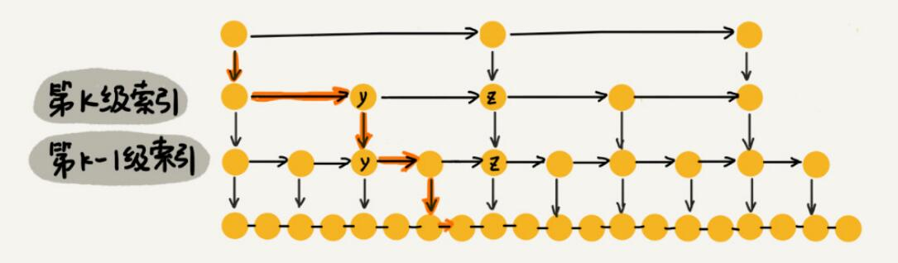
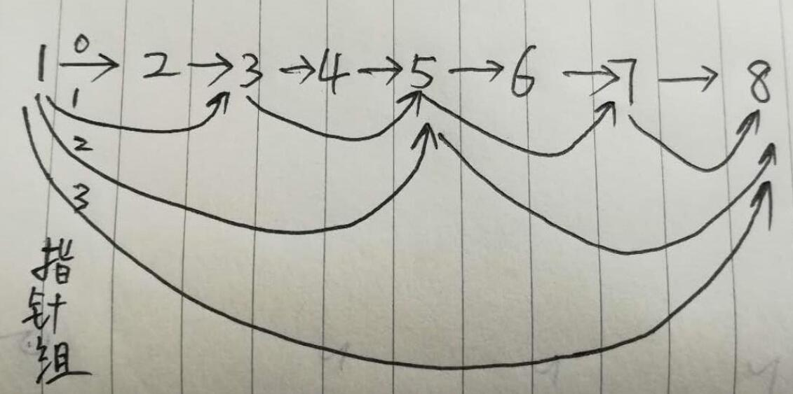

# 链表
结构体变量和结构体变量通过指针连接形成变量。
结构体包括数据域、指针域。

# 单链表基本操作
动态创建一个链表：动态内存申请+模块化设计。

## 定义节点数据结构

```c
typedef struct student {
    char name[20];
    int score;
}Student;         // 数据域结构体

struct Node {
    Student data;
    struct Node* next;    // 链表节点
};
```

## 创建链表
创建一个表头代表整个链表，链表头不包含有效的数据域（空头链表）。

```c
// 创建一个空头链表
struct Node* createList() {
    // 比较常用的是空头链表，链表头节点不存数据。
    // 它永远固定在链表的首位，作为链表的头部，代表整个链表，方便之后的索引
    struct Node* headNode = (struct Node*)malloc(sizeof(struct Node));
    // headNode->data =   // 可以不赋值，总之无效
    headNode->next = NULL;
    return headNode;
}
```

## 创建链表节点

```c
// 创建一个节点
struct Node* createNode(Student data) {
    struct Node* newNode = (struct Node*)malloc(sizeof(struct Node));
    newNode->data = data;
    newNode->next = NULL;
    return newNode;
}
```

## 插入节点

```c
// 插入一个节点（头部插入）
struct Node* insertByHead(struct Node* head, Student data) {
    struct Node* newNode = createNode(data);
    newNode->next = head->next;
    head->next = newNode;
    return head;
}
```

## 删除节点

```c
// 删除一个节点（删除等于给定值的第一个节点）
struct Node* deleteByPos(struct Node* head, int score) {
    // 定义两个指针，分别指向即将删除的节点以及前驱节点
    struct Node* delposPre = head;
    struct Node* delpos = head->next;
  	// 链表为空
    if (delpos == NULL) {
        printf("list is null.\n");
        return head;
    }
   	// 位置查找
    while (delpos->data.score != score) {
        delposPre = delpos;
        delpos = delpos->next;
        if (delpos == NULL) {
            printf("cannot find node for delete.\n");
            return head;
        }
    }
    delposPre->next = delpos->next;
    free(delpos);
    return head;
}
```

## 遍历链表

```c
// 遍历链表
void printList(struct Node* head) {
    struct Node* pos = head->next;
    printf("name\tage\n");
    while (pos != NULL) {
        printf("%s\t%d\n", pos->data.name, pos->data.score);
        pos = pos->next;
    }
    printf("\n");
}
```

## 测试程序

```c
int main() {

    printf("input information for a student => name score\n");
    struct Node* list = createList();
    while (1)
    {
        Student st;
        setbuf(stdin, NULL);        // 清空标准输入的缓存
        scanf("%s %d", st.name, &st.score);
        insertByHead(list, st);
        printf("continue? (Y/N)\n");
        setbuf(stdin, NULL);
        int choice = getchar();
        if (choice == 'N' || choice == 'n') {
            break;
        }
    }
    printList(list);
    deleteByPos(list, 100);       // 删除第一个100分的记录
    printList(list);
  
    system("pause");
    return 0;
}
```

# 其他
C语言和C++结构体的差异：
1. C++中的结构体和类一样，可以有函数(自定义函数，构造函数、析构函数、this指针)、可以自定义访问权限(public/protected/private)、可以继承。

2. 用法上的区别：

   在C语言中，使用typedef定义别名, 或者定义时带上struct，显示指明是结构体。

   ```c
   1. typedef struct Complex{
       int real;
       int imag;
      }COMPLEX;
      
   定义 => COMPLEX com = {2, 3};  // COMPLEX 是 struct Complex 的别名, 定义时赋值可以用{}

   struct Complex{

       int real;
       int imag;

   };
   定义 => struct Complex com = {2, 3};   // 这里必须带struct
   ```

   C++中和类(class)的用法一样，比较简单。

   ```c++
   struct Complex{

       int real;
       int imag;

   };

   定义 => Complex com = {2, 3};  // 可以不带struct
   ```

# 扩展：LRU缓存淘汰算法

1. 基本思路：最近最不常用的key从缓存中清除。  

2. 实现思路（利用双向链表实现，插入删除的时间复杂度是O(1)）：  

   1. 如果此数据已经在链表中了，通过遍历得到这个数据节点，并将其从原来的位置删除，然后再插入到链表头部。  

   2. 如果此数据不在缓存链表中，可以分两种情况。  

      a. 如果此时缓存未满，则将此节点直接插入到链表的头部；  

      b. 如果此时缓存已满，则链表尾部节点删除，将新的数据插入到链表头部；  

3. 优化：  

   这时，虽然插入删除的时间复杂度是o(1),但是查找节点的时间复杂度是o(n)，可以采用哈希表记录每个数据的位置，将访问的时间复杂度降低到o(1)。  

* 小结：  
  * 链表：插入删除的时间复杂度是o(1)，查找的时间复杂度是o(n)。（优化访问效率->跳表）
  * 数组：根据下标随机访问的时间复杂度是o(1)。插入删除需要移动大量元素。
  * 哈希：根据key值随机访问的时间复杂度是o(1)。（存在hash冲突的情况下是线性复杂度）。

# 扩展：跳表

参考： https://www.jianshu.com/p/84faf961ae80

* 数据结构

  跳表可以把单向链表查找的时间复杂o(N)度降低到o(logN)。分析：假如链表中有 n 个元素，我们每两个节点建立一个索引，那么第 1 级索引的结点个数就是 n/2 ，第二级就是 n/4，第三级就是 n/8, 依次类推，也就是说**第 k 级索引的结点个数为 n/(2^k)。**这个遍历查找和树结构很类似，每层m （常数）个结点，所以时间复杂度为o(logN)。（和二叉查找树、有序数组的二分查找时间复杂度相同）。

  

* 数据结构

  数据域 + 指针数组。

  