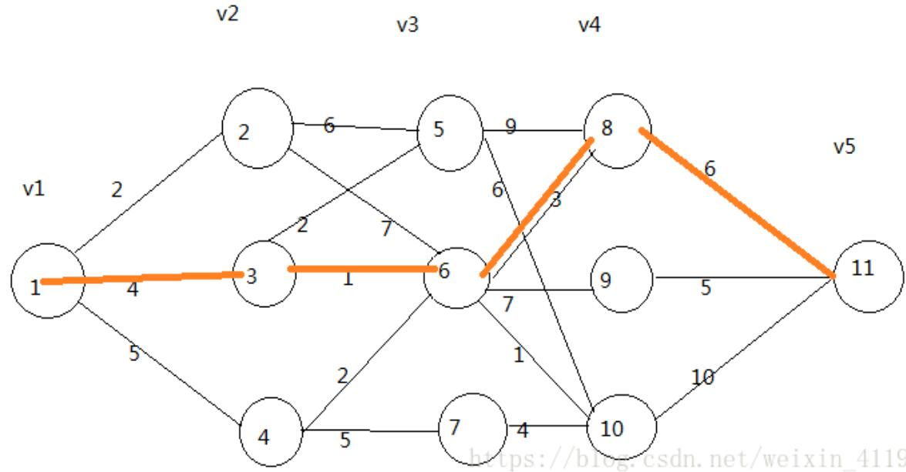

[toc]


# 动态规划

## 动态规划 vs 递归

* 动态规划的基本思想：  

  将待求解的问题分解为若干个子问题（阶段），按顺序求解子阶段，前一子问题的解，为后一子问题的求解提供了有用的信息。在求解任一子问题时，列出各种可能的局部解，通过决策保留那些有可能达到最优的局部解，丢弃其他局部解。依次解决各子问题，最后一个子问题就是初始问题的解。由于动态规划解决的问题多数有重叠子问题这个特点，为减少重复计算，对每一个子问题只解一次，将其不同阶段的不同状态保存在一个二维数组中。

* 能采用动态规划求解的问题的一般要具有3个性质：  

  * **最优化原理**：如果问题的最优解所包含的子问题的解也是最优的，就称该问题具有最优子结构，即满足最优化原理。
  * **无后效性**：即某阶段状态一旦确定，就不受这个状态以后决策的影响。也就是说，某状态以后的过程不会影响以前的状态，只与当前状态有关。
  * **有重叠子问题**：即子问题之间是不独立的，一个子问题在下一阶段决策中可能被多次使用到。（该性质并不是动态规划适用的必要条件，但是如果没有这条性质，动态规划算法同其他算法相比就不具备优势）


* 解决重叠子问题的最优解有两种方法：  
  * **动态规划：**自底向上，迭代（iteration）的方式，对每一个子问题只解一次，将其不同阶段的不同状态保存在一个数组中，时间复杂度是线性的。
  * **递归：**自顶向下，递归（recursion）的方式，通过函数调用自身实现，每个重叠子问题都会重复求解，时间复杂度接近指数级，如果n太大，还可能由于递归次数太多导致函数堆栈溢出程序崩溃。

举例说明：  

```c++
// 递归求解斐波那契数列
int recursion_fib(int n) {
    if (n <= 1) {
        return 1;
    }
    return recursion_fib(n-1) + recursion_fib(n-2);  // 每次调用都会重复计算子问题
}

// 动态规划(迭代)求解斐波那契数列
int dynamic_fib(int n) {
    int a[n+1] = {0};
    a[0] = 1;
    a[1] = 1;
    for(int i=2; i<=n; i++) {
        a[i] = a[i-1] + a[i-2];
    }
    return a[n];
}
```

##  动态规划 vs 线性规划

* 动态规划：（Dynamic programming，DP），常用于解决重叠子问题的最优解。适用于求解**以时间划分阶段**的动态过程的优化问题，


* 线性规划：（Linear Programming，LP），目标函数和约束条件都是线性的最优化问题。
* 非线性规划：（Nonlinear Programming）是具有非线性约束条件或目标函数的数学规划。

## 动态规划 vs 贪心算法

* 举例说明：**多段图**的最短路径问题。

  * **贪心算法：**在对问题求解时，总是做出在当前看来是最好的选择。也就是说，不从整体最优上加以考虑，他所做出的是在某种意义上的**局部最优解**。贪心算法不是对所有问题都能得到整体最优解，**关键是贪心策略的选择**，选择的贪心策略必须具备无后效性，即某个状态以前的过程不会影响以后的状态，只与当前状态有关。（**特别说明：这里求解分段图的最短路径选用的贪心策略是错误的，局部最优不能保证全局最优；但是计算有权图的最优路径经典算法Dijkstra算法就是用的贪心算法，具体的见图相关的笔记**）
  * **动态规划：** 全局最优解。

  

  **贪心算法的求解过程：**    

  v1到v2， 1-->2 最短，路径为2；  

  v2到v3，2-->5最短，路径为6；   

  v3到v4，5-->10最短，路径为6；  

  v4到v5，10--11最短，路径为10；  

  最短路径为1-2-5-10-11，路径长度为24，显然部署全局的最短路径，用贪心算法解决是错误的。  

  **动态规划的求解过程：**  

  分成若干子问题，采用自底向上的方法求最优解，最开始求解源s到第2段顶点集中每一个顶点的最短路径。这是最简单的子问题，最优值就等于边长。然后求解s到第3段顶点集中的每一个顶点的最优值，依此循环，直至求解s到t的最短路径值。  

  **子问题1：**s到v2中每个顶点的最短距离（最简单的子问题）：

  顶点2：(s-->2)=2， // 最短路径为2   

  顶点3：**(s-->3)=4**，  // 最短路径为4  

  顶点4： (s-->4)=5，  // 最短路径为5  

  **子问题2：**s到v3每个顶点的最短距离：  

  顶点5：用到上一个子问题中计算出来的到顶点2、3的最优解。(s-->2-->5)=2+6=8 , (s-->3-->5)=4+2=6, 最短路径 s-->5=6。舍弃非最优解。  

  顶点6：(s-->2-->6)=2+7=9, **(s-->3-->6)=4+1=5**, (s-->4-->6)=5+2=7,最短路径 (s-->6)=5。舍弃非最优解。  

  顶点7：(s-->4-->7)=5+5=10, 最短路径(s-->7)=10。舍弃非最优解。  

  **子问题3：**s到v4每个顶点的最短距离：  

  顶点8：用到上一个子问题中计算出来的到顶点5、6的最优解。(s-->5-->8)=6+9=15, **(s-->6-->8)=5+3=8**, 最短路径(s-->8)=8,舍弃非最优解。  

  顶点9：(s-->6-->9)=5+7=13，最短路径(s-->9)=13。  

  顶点10：(s-->5-->10)=6+6=12, (s-->6-->10)=5+1=6, (s-->7-->10)=10+4=14, 最短路径(s-->10)=6。  

  **子问题4：**s到v5的最短路径（问题的最终解）：  

  顶点11：用到上一个子问题中计算出来的到顶点8、9、10的最优解。**(s-->8-->11)=8+6=14**, (s-->9-->11)=13+5=18, (s-->10-->11)=6+10=16, 最短路径(s-->11)=14。  

## 动态规划案例分析

```c++
/*
动态规划问题：

关键词：
(1) 问题模型
(2) 确定上一个状态，如何达到当前状态(写状态转移方程)：
    -- 达到当前状态有几种可能？ 选与不选？跳一级台阶还是两级？选重复的歌还是不重复的？
(4) 确定初始条件，填二维数组

********************************************
1. 横轴代表执行活动的时间，红色数字代表收益值，所选活动在时间上不能有冲突，
比如，执行1号活动，收益是5元，但是选了1号活动，2、3、5号活动就不能执行了。
问题：如何选择活动，可以挣得更多的钱？

思路分析：
(1) 问题模型：dp[j] -> 执行前j个活动权重和最大值（1，2，3...j）。
(2) 确定上一个状态，如何达到当前状态(写状态转移方程)：
    1. 不选择活动j，则dp[j] = dp[j-1]
    2. 选择了活动j,则dp[j] = dp[pre(j)] + w(j)
    最优解即为二者中最大值。

pre(j) 表示和活动j不冲突的最大任务编号。
pre(8) = 5
pre(7) = 3
pre(6) = 2
pre(5) = 0
pre(4) = 1
pre(3) = 0
pre(2) = 0
pre(1) = 0

(3) 初始条件
    dp[0] = w(0)

********************************************
2. 有一个数组，从中选出不相邻的元素，使得所有元素的和最大。
数组 arr = {1, 2, 4, 1, 7, 8, 3}

思路分析：
(1) 问题模型：dp[j] -> 从前j个元素中选择，是的元素的和最大（1，2，3...j）。
(2) 确定上一个状态，如何达到当前状态(写状态转移方程)：
    1. 选择元素j，如果选择了元素j，就不能选j-1，因为不能相邻 => dp(j) = dp(j-2) + arr[j]
    2. 不选择元素j => dp(j) = dp(j-1)
    最优解是二者最大值 => max(dp(j-2) + arr[j], dp(j-1))
(3) 初始条件：
    f(0) = arr[0]
    f(1) = max(arr[0], arr[1])

********************************************
3. 给定一个数组，从中取出n个元素，使得其和等于给定值，如果有符合条件的序列，则返回true，否则返回false。
给定数组 arr = {3, 34, 4, 12, 5, 2};
判断：是否可以从中取出n个元素使得其值等于S=9？
答案：因为4+5=9,所以返回true。

思路分析：
(1) 问题模型 f(j,S) -> 选取第j个元素时，求和剩余数S
(2) 确定上一个状态，如何达到当前状态(写状态转移方程)：
    1. 不选择j => 上一个状态 f(j-1, S)
    2. 选择j  => 上一个状态 f(j-1, S-arr[j])
(4) 确定初始条件，填二维数组

递归结束条件：
(1) S=0了, 说明选元素完毕，返回true
(2) j=0, 这个如果arr[0]==S, 则返回true
(3) 任何时候如果j大于S，就一定不用选j了，只走分支2

********************************************
4. 一只青蛙，一次可以跳1级台阶，也可以跳2级台阶，
问：这只青蛙跳上一个n级的台阶共有多少种跳法？

思路分析：
(1) 问题模型 dp(j) -> 跳上前j级台阶有dp(j)种跳法。
(2) 确定上一个状态，如何达到当前状态(写状态转移方程)：
    1. 跳了1级台阶到达该状态： 一共有 dp(j-1)种跳法
    2. 条了两级台阶达到该转台： 一共有dp(j-2)种跳法
    总跳法是二者之和
(4) 确定初始条件，填二维数组
    dp(1) = 1;
    dp(2) = 2;

********************************************
5. 一个机器人位于m*n的网格的左上角，机器人每次只能向下或者向右移动一步。
问：机器人到达右下角有多少种不同的路径？

思路分析：
(1) 问题模型 dp[i][j] -> 表示机器人到达i、j坐标点时有多少种不同路径。
(2) 确定上一个状态，如何达到当前状态(写状态转移方程)：
    只能是从左边或者上边到达：
    1. 从(i-1,j)过来的，一共有dp[i-1][j]种走法。
    2. 从(i, j-1)过来的，一共有dp[i][j-1]种走法。
    总路径为二者之和。
(4) 确定初始条件，填二维数组
    dp[0, ] = 1   // 只能是一直向右走这一种走法
    dp[, 0] = 1   // 只能是一直向下走这一种走法

********************************************
6. 有一个m*n的网格，请找出一条从左上角到右下角的路径，使得路径上的数字之和最小。
说明：每次只能向下或者向右移动一步。

(1) 问题模型 dp[i][j] -> 移动到i,j坐标格的最优路径。
(2) 确定上一个状态，如何达到当前状态(写状态转移方程)：
    达到dp[i][j]这个状态有两种可能：
    1. 从(i-1,j)过来的，最优路径为dp[i-1][j]+w(i,j)
    2. 从(i, j-1)过来的，最优路径为dp[i][j-1]+w(i,j)
    最优路径为这两种的最优者 min(dp[i-1][j], dp[i][j-1])+w(i,j)
(4) 确定初始条件，填二维数组
    dp[0, j] = dp[0, j-1] + arr[0][j]     // 只有一种走法，一直向右走
    dp[i, 0] = dp[i-1, 0] + arr[i][0]     // 只有一种走法，一直向下走 

********************************************
7. 给定单词word1和word2，计算出将word1转换成word2所使用的最少操作数，
你可以对一个单词进行下边三种操作：插入一个字符，删除一个字符，替换一个字符。

示例：
输入: word1 = "horse", word2 = "ros"
输出: 3
解释: 
horse -> rorse (将 'h' 替换为 'r')
rorse -> rose (删除 'r')
rose -> ros (删除 'e')

思路分析：
参考： https://www.jianshu.com/p/92389f09fba5
(1) 问题模型 dp[i][j] -> 当字符串word1的长度为i，word2的长度为j时，将word1转换为word2所使用的操作次数。
(2) 确定上一个状态，如何达到当前状态(写状态转移方程)：
    一步操作只能是增删改一个字符, 达到这种状态有以下几种可能
    1. 如果word1[i] 与 word2[j] 相等，这个时候不需要进行任何操作，显然有 dp[i][j] = dp[i-1] [j-1]。
    2. 如果word1[i] 与 word2 [j] 不相等,则需要调整：
        a. 删除一个字符到达的该状态， dp[i][j] = dp[i-1][j] + 1
        b. 插入一个字符到达的该状态，dp[i][j] = dp[i][j-1] + 1 
        c. 替换一个字符到达的该状态，dp[i][j] = dp[i-1][j-1] + 1
    最少的操作步骤为四者取最小值 min(dp[i-1] [j-1]，dp[i] [j-1]，dp[[i-1] [j]]) + 1;
(4) 确定初始条件，填二维数组

********************************************
8. 01背包问题
有n个物品，它们有各自的重量和价值，现有给定容量的背包，如何让背包里装入的物品具有最大的价值总和？
举例：
物品的价值 value[5] = {6, 3, 5, 4, 6}
物品的体积 weight[5] = {2, 2, 6, 5, 4}
背包的容量 10
结果 => 物品最大价值15

思路分析：
(1) 问题模型 dp[i][j] -> 表示装入物品i时，背包的重量j时的最大价值
(2) 确定上一个状态，如何达到当前状态(写状态转移方程)：
    1. 选择物品i -> dp[i][j] = dp[i-1][j - weight(i)] + value(i)
    2. 不选择物品i -> dp[i][j] = dp[i-1][j]
    最大价值是二者的最大值
    max(dp[i-1][j], dp[i-1][j - weight(i)] + value(i))
(4) 确定初始条件，填二维数组

********************************************
9. 音乐列表问题
音乐播放器里有N首歌，我想听L首歌，但需要满足两个条件：
一个是每首歌必须播放1次，第二个是两首重复的歌中间至少有k首其他的歌。
问：一共有多少种可能的组合？

思路分析：
(1) 问题模型 dp[i][j] -> 选取的歌曲列表中有i首歌，其中有j首不同的歌曲时，可能的组合情况数。
(2) 上一个状态：
    1. 加入的第i首歌和之前是重复的，则上一个状态 -> dp[i-1][j]
    2. 加入的第i首歌是一首新歌，则上一个状态 -> dp[i-1][j-1]
(3) 如何达到这个状态（写状态转移方程）？
    1. 如果加入的第i首歌是一首新歌，说明之前的i-1首歌中有j-1首不同的歌曲，当前有N-(j-1)首歌可选。
       可能的组合数-> dp[i-1][j-1]*(N-(j-1))
    2. 如果加入的第i首歌是一首重复的歌，说明之前的i-1首歌已经有了j首不同的歌曲，由于有k的限制，分两种情况：
       如果j小于k，则不能加入重复的歌曲了
       如果j大于k，可选择的重复歌曲有(j-k)种, 可能的组合数再加上 -> dp[i-1][j]*(j-k)

*/
```

代码示例：

```c++
#include <iostream>
#include <cstdlib>
#include <string>

using namespace std;

// 案例1：如何选择活动，可以挣得更多的钱
int opt_task() {
    int pre[8] = {0, 0, 0, 1, 0, 2, 3, 5};   // 与当前活动不冲突的上一个活动编号
    int w[8] = {5, 1, 8, 4, 6, 3, 2, 4};     // 活动的价值
   
    int opt[8];
    // 确定初始值
    opt[0] = w[0];

    // 根据状态转移方程填数组
    for (int i=1; i<8; i++) {
        opt[i] = max<int>(opt[i-1], opt[pre[i]] + w[i]);
    }
    return opt[7];
}

// 案例2：从一个数组中找出不相邻的元素，使得元素的和最大
int max_sum() {
    int arr[7] = {1, 2, 4, 1, 7, 8, 3};

    int maxSum[7];
    // 确定初始条件
    maxSum[0] = 1;
    maxSum[1] = max<int>(arr[0], arr[1]);

    // 根据状态转移方程填数组
    for(int i=2; i<7; i++) {
        maxSum[i] = max<int>(maxSum[i-2]+arr[i], maxSum[i-1]);
    }
    return maxSum[6];
}

// 案例3：给定一个数组，如果有子序列等于给定值则返回true，否则返回false
// 递归实现
bool subset(int index, int sum) {
    int arr[6] = {3, 34, 4, 12, 5, 2};
    if (sum == 0) {
        return true;
    } else if (index == 0) {
        return (arr[index] == sum);
    } else if (arr[index] > sum) {
        return subset(index-1, sum);
    } else {
        bool a = subset(index-1, sum - arr[index]);
        bool b = subset(index-1, sum);
        return (a || b);
    }
}

// 案例3：给定一个数组，如果有子序列等于给定值则返回true，否则返回false
// 二维动态规划
bool dynamic_subset(int sum) {
    int arr[7] = {3, 34, 4, 12, 5, 2};
    // 二维数组行表示求和数，0~S，当sum=0时取值为true，也就是第0列为true；
    // 二维数组的列表示待选取元素的数组arr[0]~arr[5]
    int subSet[7][sum+1] = {false};
    for(int i=0; i<7; i++) {
        subSet[i][0] = true;      // sum=0时，全部为true
    }

    for(int j=0; j<sum+1; j++) {
        subSet[0][j] = false;
    }
    subSet[0][arr[0]] = true;      // arr[i]==sum, 返回为true

    for(int m=1; m<sizeof(arr)/sizeof(int); m++) {
        for(int s=1; s<sum+1; s++) {
            if (arr[m]>s) {
                subSet[m][s] = subSet[m-1][s];
            } else {
                bool a = subSet[m-1][s-arr[m]];
                bool b = subSet[m-1][s];
                subSet[m][s] = a || b ;
            }
        }
    }
    return subSet[sizeof(arr)/sizeof(int)-1][sum];
}

// 案例4：一只青蛙，一次可以跳1级台阶，也可以跳2级台阶，
// 问，这只青蛙跳上n级台阶有多少种跳法。
int jump(int n) {
    int a[n+1] = {0};
    a[0] = 0;
    a[1] = 1;
    
    for(int i=2; i<=n; i++) {
        a[i] = a[i-1] + a[i-2];
    }
    return a[n];

}

// 案例5：一个机器人位于m*n的网格的左上角，机器人每次只能向下或者向右移动一步。
// 问：机器人到达右下角有多少种不同的路径？
int maxstep(int m, int n) {
    if (m < 0 || n < 0) {
        return 0;
    }
    int dp[m+1][n+1];

    // 二维数组初始化条件
    for(int i=0; i<m+1; i++) {
        dp[i][0] = 1;          // 第一列只有一种走法，就是直着走
    }
    for(int j=0; j<n+1; j++) {
        dp[0][j] = 1;         // 第一行只有一种走法，就是直着走
    }

    // 根据状态转移方程填充二维数组
    for(int i=1; i<m+1; i++) {
        for (int j=1; j<n+1; j++) {
            dp[i][j] = dp[i-1][j] + dp[i][j-1];
        }
    }
    return dp[m][n];
}

// 案例6：有一个m*n的网格，请找出一条从左上角到右下角的路径，使得路径上的数字之和最小。
// 说明：每次只能向下或者向右移动一步。
int maxstepV(int m=3, int n=3) {
    int arr[m][n] = {{1, 3, 1}, {1, 5, 1}, {4, 2, 1}};
    int dp[m][n];
    // 初始化
    dp[0][0] = arr[0][0];
    // 初始化最左边的列
    for(int i = 1; i < m; i++){
      dp[i][0] = dp[i-1][0] + arr[i][0];
    }
    // 初始化最上边的行
    for(int i = 1; i < n; i++){
      dp[0][i] = dp[0][i-1] + arr[0][i];
    }
        // 推导出 dp[m-1][n-1]
    for (int i = 1; i < m; i++) {
        for (int j = 1; j < n; j++) {
            dp[i][j] = min(dp[i-1][j], dp[i][j-1]) + arr[i][j];
        }
    }
    return dp[m-1][n-1];
}

// 案例7：给定单词word1和word2，计算出将word1转换成word2所使用的最少操作数，
// 你可以对一个单词进行下边三种操作：插入一个字符，删除一个字符，替换一个字符。
int min_words(string word1, string word2) {
    int n1 = word1.length();
    int n2 = word2.length();
    // cout << "n1=" << n1 << "n2=" << n2 << endl;
    int dp[n1+1][n2+1] = {0};

    // dp[0][0...n2]的初始值
    for (int j = 1; j <= n2; j++) {
        dp[0][j] = dp[0][j - 1] + 1;
    }
        
    // dp[0...n1][0] 的初始值
    for (int i = 1; i <= n1; i++) {
        dp[i][0] = dp[i - 1][0] + 1;
    }
        
    // 通过公式推出 dp[n1][n2]
    for (int i = 1; i <= n1; i++) {
        for (int j = 1; j <= n2; j++) {
            // 如果 word1[i] 与 word2[j] 相等。第 i 个字符对应下标是 i-1
            if (word1.at(i - 1) == word2.at(j-1)){
                dp[i][j] = dp[i - 1][j - 1];
            }else {
               dp[i][j] = min(min(dp[i - 1][j - 1], dp[i][j - 1]), dp[i - 1][j]) + 1;
            }         
        }
    }
    return dp[n1][n2]; 
}

// 案例8 01背包问题：
// 有n个物品，它们有各自的重量和价值，现有给定容量的背包，如何让背包里装入的物品具有最大的价值总和？
int Knapsack() {
    int value[5] = {6, 3, 5, 4, 6};           // 物品的价值
    int weight[5] = {2, 2, 6, 5, 4};          // 物品的重量
    int capacity = 10;                        // 背包的容量

    // 二维数组的行列都加1，初始化第一行(0物品)第一列(0容量)都是0
    int dp[5+1][capacity+1];

    for (int i=0; i<=5; i++) {
        dp[i][0] = 0;     // 初始化第一行为0，没有物品时，价值都是0 
    }

    for(int j=0; j<=capacity; j++) {
        dp[0][j] = 0;    // 初始化第一列为0，没有背包容量时，价值为0
    }

    for (int i=1; i<=5; i++) {
        for (int j=1; j<=capacity; j++) {
            if (j < weight[i]) {
                dp[i][j] = dp[i-1][j];  // 背包容量小于当前物品体积时，当前物品不可选
            } else {
                dp[i][j] = max<int>(dp[i-1][j-weight[i]] + value[i], dp[i-1][j]);
            }
        }
    }
    return dp[5-1][capacity-1];

}

// 案例9 音乐列表问题：
// 音乐播放器里有N首歌，我想听L首歌，但需要满足两个条件：
// 一个是每首歌必须播放1次，第二个是两首重复的歌中间至少有k首其他的歌。
// 问：一共有多少种可能的组合？
int music_list(int L, int N, int K) {
    int dp[L+1][N+1];
    dp[0][0] = 1;
    for(int i=1; i<=L; i++) {         // 选取i首歌
        for (int j=1; j<=N; j++) {    // 有j首是重复的
            if (j < K ) {             // 不能再加入重复的歌了
                dp[i][j] = dp[i-1][j-1] * (N-(j-1));
            } else {
                dp[i][j] = dp[i-1][j-1] * (N -(j-1)) + dp[i-1][j] * (j - K);
            }
        }
    }
    return dp[L][N];
}


int main() {
    cout << "opt_task=" << opt_task() << endl;
    cout << "max_sum=" << max_sum() << endl;
    cout << "subset9=" << subset(6, 9) << endl;
    cout << "subset13=" << subset(6, 13) << endl;

    cout << "dynamic_subset9=" << dynamic_subset(9) << endl;
    cout << "dynamic_subset13=" << dynamic_subset(13) << endl;

    cout << "jump10=" << jump(10) << endl;

    cout << "maxstep(3,5)=" << maxstep(3,5) << endl;

    cout << "music_list=" << music_list(5, 10, 2) << endl;

    cout << "Knapsack=" << Knapsack() << endl;
    
    cout << "maxstepV=" << maxstepV() << endl;

    cout << "min_words=" << min_words("horse", "ros") << endl;
    system("pause");
    return 0;
}
```

# 思考

  01背包问题的算法优化。
  https://www.jianshu.com/p/125553c9f526


# 动态规划处理数组问题

* 获取不相邻的元素，使总和最大（leetcode-198）

  * 打劫家舍

    你是一个专业的小偷，计划偷窃沿街的房屋。每间房内都藏有一定的现金，影响你偷窃的唯一制约因素就是相邻的房屋装有相互连通的防盗系统，如果两间相邻的房屋在同一晚上被小偷闯入，系统会自动报警。给定一个代表每个房屋存放金额的非负整数数组，计算你在不触动警报装置的情况下，能够偷窃到的最高金额。

  * 输入: [2,7,9,3,1]

    输出: 12   

    解释: 偷窃 1 号房屋 (金额 = 2), 偷窃 3 号房屋 (金额 = 9)，接着偷窃 5 号房屋 (金额 = 1)。偷窃到的最高金额 = 2 + 9 + 1 = 12 。

  

  * 解题思路：

  * * 模型：dp[i] 选完第i件物品时，偷盗的最大金额；

    * 达到状态dp[i] 有两种路径：

      没有选第i件：最大价值是dp[i-1] 

      选了第i件：这时i-1是不能选的，最大价值是dp[i-2] + nums[i]

      状态转移方程：dp[i] = max(dp[i-1], dp[i-2] + nums[i])

```c++
class Solution198 {
public:
    int rob(vector<int>& nums) {
        if (nums.size() == 0) {
            return 0;
        } else if (nums.size() == 1) {
            return nums[0];
        } else if (nums.size() == 2) {
            return max<int>(nums[0], nums[1]);
        }

        vector<int> dp(nums.size(), 0);
        dp[0] = nums[0];
        dp[1] = max<int>(nums[0], nums[1]);

        for (int i=2; i<nums.size(); i++) {
            dp[i] = max<int>(dp[i-1], dp[i-2]+nums[i]);
        }
        return dp[nums.size()-1];
    }
};
```

* 最大和的连续子段（leetcode-53）

  * 给定一个整数数组 nums ，找到一个具有最大和的连续子数组（子数组最少包含一个元素），返回其最大和。

  * 输入: [-2,1,-3,4,-1,2,1,-5,4]

    输出: 6。解释: 连续子数组 [4,-1,2,1] 的和最大，为 6。

  

  解题思路：

  * 模型：dp[i]表示前i个元素最大和连续子序列；

  * i-1达到状态i有两种路径： **一定选i的情况下，求当前的最优解**

    选择了i-1 最大和为 dp[i-1] + nums[i]

    没有选择i-1 最大和为 nums[i]

  * 状态转移方程： dp[i] = max(dp[i-1] + nums[i], nums[i])
  * 最终解 = max { dp[0], dp[1], ... dp[n]}

```c++
class Solution53 {
public:
    int maxSubArray(vector<int>& nums) {
        if (nums.size() == 0) {
            return 0;
        } else if (nums.size() ==  1) {
            return nums[0];
        }
        vector<int> dp(nums.size(), 0);
        dp[0] = nums[0];
        int maxd = dp[0];
        for(int i=1; i<nums.size(); i++) {
            dp[i] = max<int>(dp[i-1]+nums[i], nums[i]);
            if (dp[i] > maxd) {
                maxd = dp[i];
            }
        }
        return maxd;
    }
};
```

* 和等于给定值子序列中的最少元素个数（leetcode-322）

  * 找零钱

    给定不同面额的硬币 coins 和一个总金额 amount。编写一个函数来计算可以凑成总金额所需的最少的硬币个数。如果没有任何一种硬币组合能组成总金额，返回 -1。

  

  * 输入: coins = [1, 2, 5], amount = 11

    输出: 3 

    解释: 11 = 5 + 5 + 1

  

  * 思路：

    此题用暴力枚举+减枝 会超时。

    如果所有硬币都是倍数的关系，可以用贪心算法，优先选最大面值。此处也不适用。

  

  动态规划 解题思路：

  * 模型：dp[i] 表示凑够钱数i需要的最少硬币数量。

  * 到达状态dp[i]有三条路径：**i一定是从下边这几个状态转换过来的**

    dp[i-1] 再加上一个面值1的钱数； dp[i] = dp[i-1] + 1

    dp[i-2] 再加上一个面值2的钱数； dp[i] = dp[i-2] + 1

    dp[i-5] 再加上一个面值5的钱数； dp[i] = dp[i-5] + 1

  

  * 其中 dp[i-1] dp[i-2] dp[i-5] 不一定能凑成，不能凑成就是 -1

  ```c++
  class Solution322 {
  public:
      int coinChange(vector<int>& coins, int amount) {
        vector<int> dp(amount+1, -1);
        dp[0] = 0;
        for(int i=1; i<amount+1;i++) {
            int cnt = 10000;
            // 尝试所有的硬币
            for(int j=0; j<coins.size();j++) {
                // 当前待凑的硬币i小于任何一个硬币  -- continue
                // 再加上一个硬币j也凑不出来  -- continue
                if (i<coins[j] || dp[i-coins[j]] == -1) {
                    continue;
                }
                cnt = min<int>(cnt, dp[i-coins[j]] + 1);
            }
            if (cnt < 10000) {
                dp[i] = cnt; 
            }
        } 
        return dp[amount];
    }
  };
  ```

* 最长上升子序列（leetcode-300）

  * 最长上升子序列

    给定一个无序的整数数组，找到其中最长上升子序列的长度。

  

  * 输入: [10,9,2,5,3,7,101,18]

    输出: 4 

    解释: 最长的上升子序列是 [2,3,7,101]，它的长度是 4。

  

  * 思路分析：

    暴力枚举（回溯）计算所有的子序列，取符合条件的最大长度。会超出时间限制。

  

  动态规划：

  * 模型 dp[i] 表示前i个元素中最长升序子序列。

  * 到达状态dp[i],需要从前边找k个位置找到比它小的位置，

    max{ dp[i-k1] + 1 , dp[i-k2] + 1 , dp[i-k3] + 1 ...}   **一定选i的情况下上升序列有哪些，舍去非最优解**

    其中 j = i-k1, i-k2... 表示j比i小的且 dp[j] 小于dp[i] 位置。

  * 最终结果为 dp[i] 的最大值。

  ```c++
  class Solution300 {
  public:
      int lengthOfLIS(vector<int>& nums) {
          if (nums.size() <= 1) {
              return nums.size();
          }
          vector<int> dp(nums.size(), 1);
          int res = 1;
          for(int i=1; i<nums.size(); i++) {
              int maxdpi = 1;
              for(int j=0; j<i; j++) {
                  if (nums[j] < nums[i]) {
                      maxdpi = max<int>(maxdpi, dp[j]+1);
                  }
              }
              dp[i] = maxdpi;
              if (dp[i] > res) {
                  res = dp[i];
              }
          }
          return res;
      }
  };
  ```

  

  