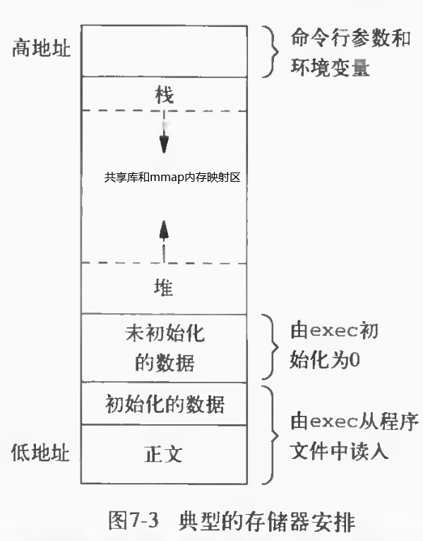
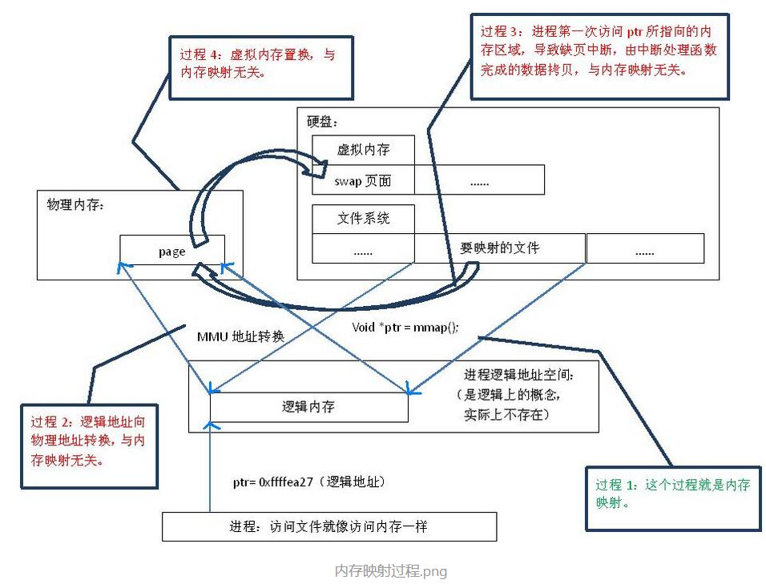

[toc]

# 预备知识：操作系统内存管理

* 问题引入

  对于用户或者进程而言，虚拟内存是一个完整的内存，用户可以随意使用该“内存”，假设为4G，那么对于用户来说就有4G的空间可以使用，即使实际内存只有2G甚至1G。那么这是如何实现的呢？   
  为什么32位机器的内存为4GB？  
  32位系统32根总线，在内存中如果按1个字节分配1个地址，那么最大能分配内存就是约：2^32 = 4 * 2^10 * 2^10 * 2^10 = 4 * 1024* 1024 * 1024 B = 4GB   

  ---- 分段、分页机制 和 换入换出。

* 内存交换

  * 分页机制：程序被分成一个个4kB大小的页，物理内存被分成一个个4kB大小的页框。操作系统维护一个 页/页框 的映射表（页表用于将虚拟地址映射到物理内存）。
  * 分段机制：程序被分成代码段，数据段，堆栈段。操作系统维护一个 段号/段长/内存基址 的映射表（用于将虚拟地址映射到物理内存）。
  * 段页机制：以上二者的结合。

* 页面置换算法（和缓存淘汰算法类似）
  * LRU: 淘汰 "最长时间未被访问的"。
  * LFU: 淘汰 "最近访问频率最小的"。

* 程序执行过程中换入换出逻辑

  ```c
  if(数据在物理内存中) {
      虚拟地址转换成物理地址
      读数据
  } else {
      if(数据在磁盘中) {
          if(物理内存还有空闲) {
              把数据从磁盘中读到物理内存
              虚拟地址转换成物理地址
              读数据
          } else {
              把物理内存中某页的数据存入磁盘
              把要读的数据从磁盘读到该页的物理内存中
              虚拟地址转换成物理地址
              读数据
          }
      } else {
          报错
      }
  }
  ```

* 进程虚拟内存空间
  
  **说明**：以下均以32位系统为例，64位系统上，虚拟内存大小远远大于4G了~~~

  在32位系统中，物理内存的寻址范围2^32(4G)。
linux进程虚拟地址空间是4G，用户和内核态按照3:1配比，3G的用户虚拟地址空间映射到3G的物理内存，1G的内核虚拟空间映射到4G的物理内存。
  
多任务操作系统中的每一个进程都有4G的连续虚拟内存块（其中3G是独享、私有的），虚拟地址到物理地址转换过程有操作系统和CPU共同完成(操作系统为CPU设置好页表，CPU通过MMU单元进行地址转换)。
  
  程序的虚拟内存空间如下：
  
  


 * * 正文段：cpu执行的机器指令部分，只读、共享。

   * 初始化数据段：需要明确赋初值的静态（全局）变量。

   * 非初始化数据段（bbs）：未赋值的静态（全局）变量。程序执行之前，内核将此处的数据初始化为0或者NULL。

   * 栈：局部、临时变量、函数参数、函数调用时存储函数返回地址和调用者的环境信息等。

   * mmap映射区：通过linux系统调用mmap()将文件内容直接映射到内存。内存映射是一种方便高效的文件I/O方式，所以它被用来加载动态库。

   * 堆：运行时内存分配（malloc/calloc/realloc）。 
   * 堆和栈的区别：栈空间作为一个严格后进先出的数据结构，可用空间永远都是一块连续的区域；栈空间的默认大小只有几M的空间，生长方式是向下的，也就是向着内存地址减小的方向消耗空间；

# 预备知识：多进程和多线程

* 多进程

  * 如何判断自己是父进程还是子进程？

    fork函数被调用一次，会返回两次，子进程中返回0，父进程返回新的进程ID。

  * 父子进程的资源怎么分配？

    父子进程使用相同的代码段。

    父进程的数据段和堆栈段，系统会复制一份给子进程。

    这时父子进程不共享任何数据了，各进程有各自私有的虚拟内存空间。

    事实上，大多数unix并没有真正做copy，fork时，只是各自分配了虚拟内存空间，但是物理空间上两个进程的数据段和堆栈段都还是共享着的，当有一个进程修改了某个数据时，这时两个进程之间的数据才有了区 别，系统就将有区别的“页”（4KB）从物理上也（写时复制技术）。

  * exec系列函数 ？

    一个进程一旦调用exec类函数，它本身就“死亡”了，系统把代码段替换成新的程序的代码，废弃原有的数据段和堆栈段，并为新程序分配新的数据段与堆栈段，唯一留下的，就是进程号，也就是说，对系统而言，还是同一个进程，不过已经是另一个程序了。不过exec类函数中有的还允许继承环境变量之类的信息，这个通过exec系列函数中的一部分函数的参数可以得到。

  * 两种场景：
    1.  一个父进程希望复制自己，使父子进程同时执行不同的代码段。如网络服务进程----父进程不断等待客户端的服务请求，当请求到达时，父进程调用fork，使子进程处理此请求。
    2. 一个进程要执行一个不同的程序。如shell，这种情况下父进程fork返回后立即调用exec。（fork+exe组合 = spawn）

* 进程和线程的区别？

  * 进程：进程是资源的分配和调度的最小单位，进程拥有自己独立的虚拟地址空间。

  * 线程：线程是cpu调度的最小单位，它可与同属一个进程的其他线程共享进程拥有的全部资源。

  * 联系：线程是进程的一部分，一个线程只能属于一个进程，一个进程可以包含多个线程（至少一个）。

  * 区别：

    根本区别：进程是操作系统资源分配的基本单位，而线程是任务调度和执行的基本单位

    在开销方面：每个进程都有独立的代码和数据空间（程序上下文），程序之间的切换会有较大的开销；线程可以看做轻量级的进程，同一类线程共享代码和数据空间，每个线程都有自己独立的运行栈和程序计数器（PC），线程之间切换的开销小。

* 线程同步和进程间通信？
  

进程的通信机制主要有：管道、有名管道、消息队列、内存映射、共享内存、信号、信号量、套接字。

线程同步：临界区（Critical Section）、互斥量（Mutex）（锁）、信号量（Semaphore）、事件（Event）四种方式。

https://www.jianshu.com/p/ec4ca6235a77


# 内存映射 mmap

通过mmap函数将磁盘文件的数据映射到内存，用户修改内存就能修改磁盘文件（数据实际存储在磁盘上）。

**（1）有血缘关系的进程间通信**：因为**子进程和父进程永远共享的有两个部分，第一是文件描述符，第二就是内存映射区**。所以只需要父进程先用open()函数打开一个文件得到fd，再利用mmap（）函数创建一个内存映射区，然后fork()一个子进程出来，子进程就可以直接通过mmap()返回的内存映射区首地址对共享部分进行读写了，相当于就是有血缘关系的进程间通信机制。

**（2）没有血缘关系的进程间通信**：还是让一个进程先通过open()函数打开一个文件得到fd，再利用mmap()创建一个内存映射区并得到首地址ptr，然后另外一个无血缘关系的进程通过打开这个文件得到fd1，也利用mmap()函数将fd1传参进去，就会得到那个进程创建的内存映射区首地址ptr1了，这样两个互不相关的进程通过 ptr 和 ptr1 各自进行读写即可。**（因为这两个内存映射区指向的磁盘存储区都是同一个）**。


参考： https://www.jianshu.com/p/da998d55ea36




1. 执行系统调用mmap，将磁盘文件映射到进程的逻辑（虚拟）地址空间，返回逻辑地址空间指针ptr。
2. 通过ptr访问文件内容时，操作系统将逻辑地址转换为物理内存的地址，查找页表（地址映射表），产生缺页中断，从磁盘拷贝该页（4KB）到物理内存。
3. 拷贝数据时如果发现物理内存不够，则通过虚拟内存机制（swap）将暂时不用的物理页面交换到磁盘上。


# 两个小问题

* 计算机操作乘除法会比较浪费时间，但是位操作比较省时。

  ```c
  a / 2^n <==> a >> n
  a % n   <==> a && (2^n-1)
  ```

* 分页机制下，以下哪个程序效率更高？

  ```c
  int a[1000000][200];
  // 情况1：按行读取
  for(int i=0;i<1000000;i++) {
  	for(int j=0;j<200;j++) {
  		a[i][j]=0;
  	}
  }
  // 情况2：按列操作
  for(int i=0;i<200;i++) {
  	for(int j=0;j<1000000;j++) {
  		a[j][i]=0;
  	}
  }
  
  // 分析：内存不足的情况下，会涉及进程数据的换入换出，情况1效率更高。数组是按行优先存储的，情况1对a是顺序访问的，局部性更好，更不容易发生缺页（换页次数少），效率更高。
  
  
  // 扩展： 问以下循环哪个效率更高？
  // 第1种
  for(i=0;i<10;i++) {
      for(j=0;j<500;j++) {
      	doSomthing();  
      }
  }
  // 第2种   
  for(i=0;i<500;i++) {
      for(j=0;j<10;j++) {
      	doSomthing();
      }
  }
  
  // 验证方式：1.转换为汇编语言，看指令数多少。2.执行下打印下时间。
  // 一种解释：两者效率一样。编译器优化后就是 for(int i=0; i<5000; i++) {doSomthing();} 所以效率一样。
  // 一种解释: 第1种效率高。在多重循环中，如果有可能，应当将最长的循环放在最内层，最短的循环放在最外层，以减少CPU跨切循环层的次数。
  // 一种解释：第2种效率高。通过cache命中率和操作系统分页机制解释。
  ```

  
