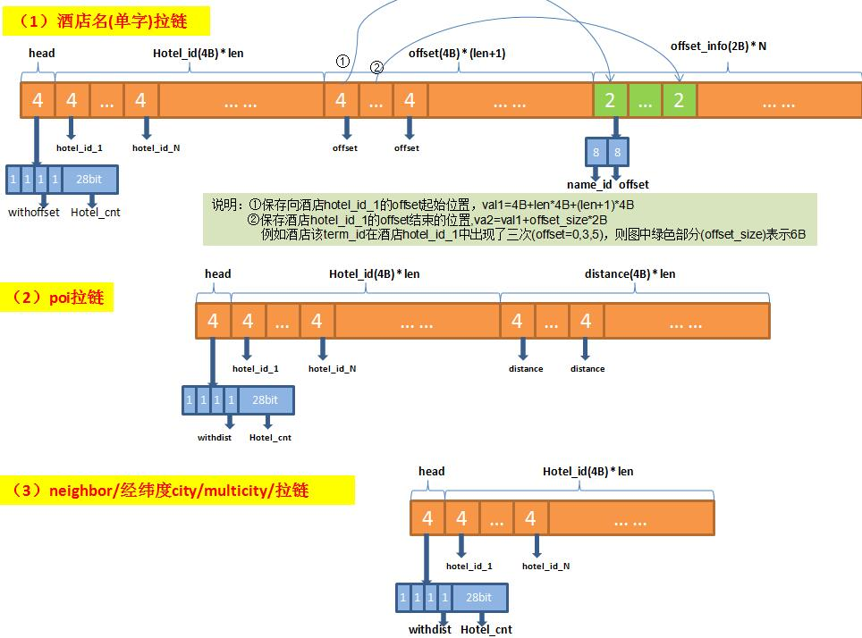

# 工程笔记

# 概述

* 搜索引擎解决的主要问题

  海量数据、高并发

* 性能优化需要考虑三方面

  内存、CPU、IO

# 服务性能

* 列表页qps 60/s
* 详情页qps 6-10/s
* 成单量：wx每天3000间夜(每天有86400s)
* 支持的渠道6个：app/h5/pc/分销/wx/cct

# 垂直搜索引擎构成

* 搜索架构

  

* 垂直搜索引擎系统的设计与开发  
  功能：艺龙国际酒店搜索架构的核心，根据用户输入的关键词为用户提供实时、准确的酒店信息。  
  业务实现：倒排索引技术、拉链和归并、排序、筛选、分页及摘要获取等，对外提供约10个服务接口。  
  技术栈：c++/python/shell、倒排索引、mmap、STL、mysql、protobuffer、rpc、epoll、makefile等。  

* 价格服务系统的设计与开发  
  功能：涉及艺龙国际酒店各种调价和促销相关的动态计算逻辑、产品优选、变价率等项目。  
  业务实现：产品模型的设计、价格和促销体系的设计、缓存压缩/调度/淘汰机制、多供应商熔断机制。  
  技术栈：c++/python/shell、redis-cluster、libcurl、LRU、STL、rpc、protobuffer等。  

* 搜索智能提示系统的设计与开发  
  功能：根据用户输入的关键词以下拉列表形式给出搜索提示。  
  业务实现：数据的抽取和建库、检索匹配，支持中文、英文、拼音、简拼、前缀、不连续词语、方言、错别字以及多种类型混合，按照自然相似度、点击率、业务权重进行排序，支持城市、商圈、地标、国家、品牌、主题、酒店的提示。  
  技术栈：c++/python/shell、倒排索引、mmap、STL、rpc、protobuffer等。  

* 自动化运维工具的开发  
  功能：基于python-flask框架的搜索自动化测试工具。  
  业务实现：搜索后台各系统的接口验证、日志回放、业务指标统计、缓存查询、索引查询等。  
  技术栈：c++/python/shell、flask、html等。  

# brpc框架介绍

* epoll

  https://github.com/cbj0304/StudyNotes/blob/master/2%E6%A1%86%E6%9E%B6%E7%B1%BB/IO%E5%A4%9A%E8%B7%AF%E5%A4%8D%E7%94%A8.md

* 线程池
https://www.jianshu.com/p/4fcc4ff8f52e

* 模块化设计
关键词：模块化、反射、依赖注入、continuation异步化。
将检索请求的每个处理逻辑抽象成一个模块（如一次列表页的参数解析、拉链和分页、排序、取摘要、拼装响应），
模块分为进程级别的模块（每个进程创建一个对象实例，保存全局数据和配置），
和线程级别的模块（每个线程创建一个对象实例，保存一次请求中的数据），
模块间通过依赖注入的方式实现数据流通（创建好的实例对象以参数的形式传递给另一个module，而不是在另一个module中去new）。
模块之间通过上下文Context关联。
每个module需要注册自己到全局注册表中，通过scheduler创建自己（反射机制），并在scheduler中配置模块的执行顺序。
模块是绑定到线程的，线程初始化的时候创建。请求到来时，调度器scheduler按照事先规定的顺序执行每个module，每个module具有独立的输入输出。
多个模块之间共享数据分为两类：
线程级别的共享数据，如请求参数，线程级数据继承IContextData, 并且每个Module都可以访问并修改该共享数据。
进程级别的共享数据，如词典、配置文件等，进程级数据继承自IModuleData，在系统启动或Reload时读取一次，只读共享。

* 异步化的思想：高级检索是一个IO密集型服务，需要不断等待上下游socket请求，采用异步请求的方式解决性能问题，程序框架基于Continuation思想，即将整个流程通过Continue的方式，在不同线程中顺序执行，这样能将异步化的过程在编程上改造为顺序执行过程。Continuation思想："续延"。用一个数据结构来表示执行到指定位置的计算过程，调用时会从它表示的控制点处恢复执行。一般的函数调用方法都是使用堆栈，用栈帧来记录从最顶层函数到当前函数的所有context，函数的调用前往往伴随着一些push来保存context信息，函数退出时则是取消当前的record/frame，恢复上一个调用者的record/frame。系统保存的就是一个后入先出的堆栈，一个函数一旦退出，它的frame就被删除了。Continuation则是另一种函数调用方式。它不采用后入先出的线性方式，所有record被组成一棵树（或者图），从一个函数调用另一个函数就等于给当前节点生成一个子节点，然后把系统寄存器移动到这个子节点。一个函数的退出等于从当前节点退回到父节点。它可以让你从任意一个节点跳到另一个节点。而不必遵循堆栈方式的一层一层的return回自己的调用者的方式。

```c++
// 程序框架中，每个业务逻辑抽象为Module，每个Module之间通过Context关联，Context的定义如下:
class AsyncContext {
	// 初始化内部数据，在context第一次创建的时候调用
	bool init();
	// 清空内部数据，一般在一个session开始时调用
	bool reset();
	// 开始调度module，按照module的顺序调度
	bool schedule();
	// 继续调度module，将剩下的module调度完毕
	bool continue();  
};

// 当异步框架接受请求时，需要从Context Pool获取一个预分配的可用Context对象，然后交给该对象负责后续的业务调度，
// 异步框架的回调函数，当一个session的请求读取完毕之后，调用该函数，样例代码如下：
void read_done_callback(Event *ev) {
	// 从context pool中获取一个新的context对象
	AsyncContext *ctx = ContextPool::instance()->pop();
	ctx->reset();
	// 将该事件传给context对象
	ctx->set_server_event(ev);
	// 开始调度context所管理的module对象
	ctx->schedule();
}

// 在一个Module中如果要发起异步请求，那么样例代码如下：
class FooAsyncModule {
	ModuleStatus run(AsyncContext *ctx) {
		// prepare request, response
		BarRequest request;
		BarResponse *response = new BarResponse();
		// async call，基于异步rpc调用，这里用到了一个Closure对象，
		// 当rpc调用结束时，则调用这个Closure对象
		_stub.rpc_method(request, response, NewCallback(
			   this，&FooAsyncModule::continue_run,response,ctx));
		// 通知ctx，本次调度暂停，不用继续执行下去了
		return PAUSE;
	}
	// 继续执行点，由rpc_method完成之后调用
	void continue_run(FooBarResponse *response, AsyncContext *ctx) {
		// handle response
		...
		// continue，继续调度剩下的module
		ctx->continue();
	}
}
```

# 索引文件设计
在搜索引擎中每个文件都对应一个ID，文件内容对应一个分词后的集合list<item>。
* 正排索引：通过ID查文档内容的过程；--- 通过酒店id查询酒店详情；
* 倒排索引：由item查询ID的过程；--- 通过酒店详情分词查询酒店id；
* 检索过程：先分词，再找每个item对应的list<id>，然后进行集合求交集的过程。

## 倒排索引
* 一级索引 和二级索引

     

  

  * 三级索引

  

## 正排索引

* brief文件和筛选项的动态联动功能
  用户预订酒店时，可以通过关键词搜索，也可以通过点击位置、价格、星级、设施、品牌、类型这些筛选项进行过滤。动态筛选项可以根据用户的搜索结果，将不合理的筛选项组合自动屏蔽，减少用户不必要的点击，降低检索的无结果率，提升酒店曝光能力。
  举例：星级动态联动功能的实现，去掉星级过滤条件，统计条件（ brand ∩ type ∩ facility ）下，召回酒店中可能的星级及其对应的酒店个数；
  数据结构的设计：
  例如：酒店设施不超过64种，用一个bit代表一种设施。筛选时，使用户输入的筛选项和酒店对应的属性按位与操作即可，计算复杂度o(1)。 
  如何节省内存：
  100w+家酒店的base_hotel_id是从0开始编号的，以酒店id为写入文件的offset，基于所设计的属性数据结构，用一个整型代表酒店对应的属性值，设计brief文件。以设施属性为例，一个brief文件占内存大小约为：100w * 8B = 8MB
  如何提高读取效率：
  将brief文件以mmap的方式加载到内存，以酒店的base_hotel_id为offset以o(1)的时间复杂度查询内存，可保证动态筛选项的处理时间为平均2ms左右。


# 多线程打印日志
* 写日志就是写文件的操作会消耗系统时间，debug用于开发时调试和定位问题，上线后会关闭。
  多线程写日志：多个线程互斥的向一个内存队列中写日志（一行格式化的字符串），在指定条件下通知回调函数刷入磁盘。
* 日志每小时准点切割，日志后缀为"年月日时"，不带后缀的日志是最近带后缀的日志的硬链接（由comlog提供支持）。

# 内存映射
倒排索引和部分正排（brief）索引 通过mmap内存映射，供多线程只读共享，通过双句柄/双指针(双buffer)实现内存数据更新。
操作系统与内存管理，多进程、多线程、mmap 参考：
https://github.com/cbj0304/StudyNotes/blob/master/3%E7%AE%97%E6%B3%95%E7%B1%BB/mmap.md

# 缓存压缩
* redis五种数据结构：
  string-字符串（最简单的key-value存储）  
  hash-字典（类似数据库表中的一条记录）  
  list-列表（双向链表实现的队列）  
  set-集合（不重复）  sadd sdiff(差集) sinter(交集) sunion(并集)
  sorted-set-有序集合（有序、不重复） zadd/zrange/zrem
  设置过期时间： expire/ttl
  
* 列表页价格缓存
```c++
struct MiniProduct {
    MiniProduct()
	: rp_code(0),
	  ota_original_price(0),
	  cost_price(0),
	  cost_total_price(0) {
    }
    uint32_t rp_code :32;               // 供应商ID, 0标识该供应商失效(或不存在)            
    uint32_t ota_original_price :24;    // 供应商原卖价  24bit可以表示的价格(2^24-1) 1600w+足够了
    uint32_t cost_price :24;            // 供应商成本价,房价
    uint32_t cost_total_price :24;      // 供应商成本价,税后价
}

struct MiniOta {
    MiniOta()
	: crawl_time(0),
	  rp_code(0) {
    }
    uint32_t crawl_time;
    uint32_t rp_code;
    std::vector<MiniProduct> mps;
	void ParseFromString(const std::string& str) { ... }
	void SerializeToString(std::string& output) { ... }
}
```

性能：
* 内存
  线上在售卖酒店100w，平均一个酒店接入8个ota，一个ota列表页缓存占104 bit=13B, 一个酒店在一年内可售卖，忽略多间夜的情况，占内存大小：  
  100w*8*104*365/8/1000/1000/1000≈38GB  
* 查询效率
  hash支持批量读写（hmset/hmget）批量查询1000条酒店原始价返回时间：< 10ms；
* 错误率
  更新接口和列表页批量接口错误率：< 0.00005；
* 定期删除
  hmset(key, field1, value1,…,field N, value N)
  hmget(key, field1, …,field N)
  以入店时间作为key，用于定期删除。


* 详情页（产品）缓存设计
- 详情页缓存特点: 
	
	1. 只需缓存一天；2.产品详情要全面；3. 单酒店多供应商查询。
	
- 设计合理的pb对象，与上下游交互,兼容性好。

- 采用redis-cluster的k-v结构，支持批量读写，支持过期时间设置。

- 缓存调度机制

  * 列表页调度机制
    计算列表页各酒店对应的ota_mapping关系。
    topk_ota：基于点击热度和供应商历史缓存状态设计算法，计算各酒店下待预取的ota个数k和ota排名，用尽可能少的抓取次数推测低价ota。
    结合前端的异步刷新逻辑，topk的ota会全部返回并参与价格pk，返回列表页最低价。

  * 详情页调度机制
    采用和列表页一致的调度算法计算topk_ota列表T（和列表页规则一致）。
    通过ota-mapping关系和详情页缓存情况计算待抓取的ota列表A。
    对于A中的ota，如果在T中，将其优先级设置为1，否则优先级设置为0，调度oa进行抓取。
    需执行不变价函数pr_nochange，确保列表页缓存中低价供应商的排位和详情页一致。
    用户从列表页点击进入详情页时，前端会通过url中source_id参数把列表页相关信息带入到详情页，用于辨别用户的真实性以及确保不变价。   

# libcurl
一次http请求只返回一个供应商的产品数据。但是详情页一个酒店id可能映射到多个供应商，不同供应商的性能差异很大，为了实现对不同供应商以异步、并发的方式进行调用，同时根据供应商的特点设置不同的超时时间、重试次数、更新参数等，实现多供应商的熔断，采用了libcurl的multi接口。

# 业务逻辑代码量
高级检索：45个cpp文件，18352行代码；

价格服务：24个cpp文件，17011行代码；


# redis-cluster

https://github.com/cbj0304/StudyNotes/blob/master/2%E6%A1%86%E6%9E%B6%E7%B1%BB/redis.md

* redis持久化有两种方法： 
  RDB（Redis DataBase）：RDB方式是一种快照式的持久化方法，将某一时刻的数据持久化到磁盘中。（可以配置save时间）
  AOF（Apend Only File）：AOF方式是将执行过的写指令记录下来，在数据恢复时按照丛前到后的顺序再将指令执行一遍。

# 缓存删除策略
* 设置过期时间。
* LRU缓存调度算法。
  基本思路：最近最不常用的key从缓存中清除。  
  实现思路（利用双向链表实现，插入删除的时间复杂度是O(1)）  
  访问某个数据时，查看数据是否在链表中：  
  如果此数据已经在链表中了，通过遍历得到这个数据节点，并将其从原来的位置删除，然后再插入到链表头部。  
  如果此数据不在缓存链表中，可以分两种情况。  
  a. 如果此时缓存未满，则将此节点直接插入到链表的头部；  
  b. 如果此时缓存已满，则链表尾部节点删除，将新的数据插入到链表头部；  
  优化：
  这时，虽然插入删除的时间复杂度是o(1),但是查找节点的时间复杂度是o(n)，可以采用哈希表记录每个数据的位置，将访问的时间复杂度降低到o(1)。

  LRU具体实现可以考虑用redis的list，它内部实现也是双向链表，不用考虑线程安全问题。redis list基本操作如下：    
  LINDEX key index            通过索引获取列表中的元素  
  LLEN key                    获取列表长度  
  LPOP key                    移出并获取列表的第一个元素（最后一个 RPOP key）  
  LPUSH key value1 [value2]   将一个或多个值插入到列表头部（最后一个 RPUSH key value1 [value2]）  
  LREM key count value        移除列表元素  
  count > 0 : 从表头开始向表尾搜索，移除与 VALUE 相等的元素，数量为 COUNT 。  
  count < 0 : 从表尾开始向表头搜索，移除与 VALUE 相等的元素，数量为 COUNT 的绝对值。  
  count = 0 : 移除表中所有与 VALUE 相等的值。  

# 价格和促销体系
  * 定价系统、调价系统（MBL调价、人工调价、马甲调价）、促销系统（红包[满减/折扣/特价]、促销、返现、手机专享价）、竞价系统。
  * 价格分类：
    纵向按阶段分：成单价、成本价、ota原卖价、e原价、促销基础价、竞价基础价、折前卖价、折后卖价。  
    横向按构成和用途分类：人民币总价、原始币种总价、房价、额外收费、价格日历、含税均价、房价均价。  
  * 价格的基本特征
    完备性：能完成目前及未来可预见的所有场景，所有环节的需要。
    单一性：所有字段有且只有一个含义，计算的过程是单向的。拒绝以任何理由进行字段含义复用、字段循环计算等。
    可执行性：所有字段均可用明确的计算工时得出。
  * 改价规则：维度 国家、城市、酒店、供应商、渠道、用户等级、订单来源等维度，按照优先级顺序找有效规则；
  * 过滤条件：入离店时间、预定时间、星级、现预付类型、保底价、加价率、加价值、返现值等。

* 产品优选：在不影响订单的情况下，过滤掉70%的非优产品，解决用户选择难的问题，提高用户体验。
  * 难点：如何淘汰非优产品不影响订单？ 如何确保供应商间的公平性？
  * 房型聚合
  * 同一房型下产品分组（支付方式、床型、早餐类型、最大入住人数、取消规则等）
  * 分值计算规则（可定检查成功率、预定成功率、确认速度超时率、佣金率、缺陷率）
  * 强出、露出、补足。

* 不变价项目
  * 列表页到详情页的变价率从10%下降到0.1%,指标优于业界水平。
  * 缓存数据结构设计
  * 供应商预取和缓存调度算法
  * 列表页和详情页信息关联
  * 识别用户真实性

# sug 功能支持
  * 支持非连续词、中文拼音混合、方言、纠错、相似度排序等功能。mmap映射，内存占用小于4G。
    支持城市、商圈、地标、国家、品牌、主题、酒店的提示。
    
  * 流程：
    开始->query标准化->切词->查倒排索引（拉链和归并）->计算权重->每种类别取top10->各类混合取top10->填充摘要信息->结束。
    
  * 索引求交：已1条最短索引(n)为基准。遍历每个元素，并判断其在其他索引中是否存在（二分查找）。n*logm

  * 排序 
    sug特点：1.可选集较大，最多为1 000 000个。2.结果集较小，10个。
    小根堆， 时间复杂度 n*log(k)
    
  * sug权重计算
    
    

# 布隆过滤器
bit向量(数组)、判断一定不存在或者可能存在。


# 搜索引擎与倒排索引

  搜索引擎：https://baijiahao.baidu.com/s?id=1613907909673723053

  * 结构化数据：如可以用sql查询；
    非结构化的数据：需要顺序扫描（如linux下的grep）。也可以通过索引查询。
  * 索引：将非结构化的数据中的一部分信息提取出来，重新组织，使其变得有一定的结构，然后对结构化数据进行检索。酒店详情是非结构化的，如果要根据酒店内容（如名称、品牌、地标等）获取酒店信息就需要创建索引。
  * 正向索引：通过文件找字符串。
    反向索引：通过字符串找文件。
  * 倒排（反向）索引的创建过程：
    * 字符串切词，每个词对应一个termid；
    * 文档编号，每个文档对应一个docid；
    * 创建倒排索引：termid -> {docid1, docid2... docidN}；
    * 拉链、归并。

  垂直搜索：https://www.jianshu.com/p/686c153a1a0d
  垂直搜索引擎是针对某一领域、人群的专业搜索引擎（专业、具体、深入）。
  * 搜索智能提示（召回率、准确率）。
  * 倒排索引和拉链（倒排索引、筛选、排序）。

# multi-curl

```c++
/*
参考：https://blog.csdn.net/myvest/article/details/82899788

libcurl是开源的网络协议库，用于发送http请求。
提供两个接口：
    1. easy接口：阻塞的方式发送单条请求；
    2. multi接口：一次性发送多条请求，多个下载请求以异步、非阻塞的方式进行；

easy接口发送http请求：
    CURL *curl = curl_easy_init();  // 返回一个easy接口的handle    
    if(curl) {
        CURLcode res;
        curl_easy_setopt(curl, CURLOPT_URL, "http://example.com");
        res = curl_easy_perform(curl);
        curl_easy_cleanup(curl);
    }

multi接口发送http请求：
    multi接口是将多个easy接口加入到一个stack中，同时发送请求。是一种异步，非阻塞的传输方式。
    用法：
    1）curl_multi_init初始化一个multi handler对象(CURLM*)；
    2）初始化多个easy handler对象(CURL*)，使用curl_easy_setopt进行相关设置；
    3）调用curl_multi_add_handle把easy handler添加到multi curl对象中；
    4）添加完毕后执行curl_multi_perform方法进行并发的访问；
    5）访问结束后curl_multi_remove_handle移除相关easy curl对象，先用curl_easy_cleanup清除easy handler对象，最后curl_multi_cleanup清除multi handler对象。

*/

#include <stdio.h> 
#include <string.h> 
#include <curl/curl.h> 
#include <unistd.h> 
 
//#define CURL_DEBUG 1 
#define CURL_WAIT_TIMEOUT_MSECS 1000 //1s 
#define CURL_MULIT_MAX_NUM 5 
 
typedef struct curl_obj{ 
    CURL* curl_handle;       // 单个easy-curl
    FILE* save_file;         // 请求结果保存到文件 
    char* fetch_url;         // 请求的url
    size_t (*recive_data_fun)( void *ptr, size_t size, size_t nmemb, void *stream); 
    size_t (*read_head_fun)( void *ptr, size_t size, size_t nmemb, void *stream); 
}curl_obj; 
 
// 回调函数 读取的网络数据保存到文件
static size_t recive_data_fun( void *ptr, size_t size, size_t nmemb, void *stream){ 
    return fwrite(ptr,size,nmemb,(FILE*)stream); 
}

// 回调函数 读取响应头并打印到标准输出
static size_t read_head_fun( void *ptr, size_t size, size_t nmemb, void *stream){ 
    char head[2048] = {0}; 
    memcpy(head,ptr,size*nmemb+1); 
    printf(" %s \n",head); 
    return size*nmemb; 
} 
 
int main(int argc, char **argv) 
{ 
    if(argc < 3){ 
        printf("ERROR----arg1 is url; arg2 is out_file\n"); 
        return -1; 
    }
    char* outfile_name[CURL_MULIT_MAX_NUM] = {0}; 
    curl_obj obj[CURL_MULIT_MAX_NUM]; 
    int mulit_h_num = ((argc -1) < CURL_MULIT_MAX_NUM)? (argc -1):CURL_MULIT_MAX_NUM; 
     
    CURLM *multi_handle = curl_multi_init();     // multi-curl handler
    for(int i=0;i<mulit_h_num;i++){ 
        obj[i].fetch_url = strdup( argv[i+1]); // need free 字符串拷贝 内部调用了malloc()为变量分配内存
        char out_filename[1024] ; 
        sprintf(out_filename,"/storage/external_storage/sda4/%s",strrchr( argv[i+1], '/')); 
        printf("----save_file[%d] [%s]\n",i,out_filename); 
        obj[i].save_file = fopen(out_filename,"w"); 
        if(!obj[i].save_file){ 
            printf("ERROR----fail!!!\n"); 
            goto release; 
        } 
         
        obj[i].curl_handle = curl_easy_init();    // curl-easy handler
        obj[i].recive_data_fun = recive_data_fun; 
        obj[i].read_head_fun = read_head_fun; 
        if(obj[i].curl_handle){ 
            curl_easy_setopt(obj[i].curl_handle, CURLOPT_NOSIGNAL, 1L);
            curl_easy_setopt(obj[i].curl_handle, CURLOPT_URL, obj[i].fetch_url);//set down load url 
            curl_easy_setopt(obj[i].curl_handle, CURLOPT_WRITEDATA, obj[i].save_file);//set download file 
            curl_easy_setopt(obj[i].curl_handle, CURLOPT_WRITEFUNCTION, obj[i].recive_data_fun);//set call back fun             
#ifdef CURL_DEBUG 
            curl_easy_setopt(obj[i].curl_handle, CURLOPT_VERBOSE, 1); 
#else 
            curl_easy_setopt(obj[i].curl_handle, CURLOPT_HEADERFUNCTION, obj[i].read_head_fun);//set call back fun 
#endif  
            if(multi_handle) curl_multi_add_handle(multi_handle, obj[i].curl_handle);//add task 
        }else{ 
            printf("fetch [%s]----ERROR!!!\n",obj[i].fetch_url ); 
            //goto release; 
        } 
    } 
     
    int still_running,repeats;
    curl_multi_perform(multi_handle, &still_running);   // still_running 当前还未结束的easy handler个数
    do { 
        int numfds = 0; 
        long timeout_ms = CURL_WAIT_TIMEOUT_MSECS; 
        // 使用curl_multi_timeout获取一个合适的超时时间
        curl_multi_timeout(multi_handle, &timeout_ms);  //get timeout ms instead 
        // curl_multi_wait会轮询multi上的所有easy句柄，一直阻塞直到至少有一个被触发或者超时。
        CURLMcode retcode = curl_multi_wait(multi_handle, NULL, 0, timeout_ms, &numfds); 
        if (retcode != CURLM_OK) { 
            printf("ERROR----curl_multi_wait  errorcode[%d]\n",retcode);           
            break; 
        } 
        /* 'numfds' being zero means either a timeout or no file descriptors to
           wait for. Try timeout on first occurrence, then assume no file
           descriptors and no file descriptors to wait for means wait for 10
           milliseconds. */
        if(!numfds) {
            if(repeats++ > 60){
                printf("ERROR----timeout break!!! \n");           
                break;
            }else{
                usleep(10*1000);  /* sleep 10 milliseconds */
                continue;
            }
        }
        else{
            repeats = 0;
        }

        retcode = curl_multi_perform(multi_handle, &still_running);   // 并发访问
        if (retcode != CURLM_OK) { 
            printf("ERROR----curl_multi_perform  errorcode[%d]\n",retcode); 
            break; 
        } 
        //printf("still_running[%d]\tnumfds[%d]\n",still_running,numfds );

        // // 调用curl_multi_info_read获取每一个执行完成的操作信息。在完成后即将其移除multi stack。
        // struct CURLMsg *m;
        // do {
        //     int msgq = 0;
        //     m = curl_multi_info_read(multi_handle, &msgq);
        //     if(m && (m->msg == CURLMSG_DONE)) {
        //         CURL *e = m->easy_handle;
        //         curl_easy_getinfo(msg->easy_handle, CURLINFO_RESPONSE_CODE, &http_response_code);
        //         still_running--;
        //         curl_multi_remove_handle(multi_handle, e);
        //         curl_easy_cleanup(e);
        //     }
        // } while(m);
        int msgs_left = 0; 
        CURLMsg *msg = NULL; 
        while ((msg = curl_multi_info_read(multi_handle, &msgs_left)) != NULL){ 
            if (msg->msg == CURLMSG_DONE) { 
                long http_response_code = -1; 
                char* http_url = NULL; 
                curl_easy_getinfo(msg->easy_handle, CURLINFO_RESPONSE_CODE, &http_response_code); 
                curl_easy_getinfo(msg->easy_handle, CURLINFO_EFFECTIVE_URL, &http_url);
                printf("[%s]fetch done, response[%d]\n",http_url,http_response_code ); 
            } 
        } 
    } while (still_running); 

release:  
     printf("release\n"); 
     for(int i=0;i<mulit_h_num;i++){ 
        if(obj[i].curl_handle){ 
            curl_multi_remove_handle(multi_handle, obj[i].curl_handle); 
            curl_easy_cleanup(obj[i].curl_handle); 
        } 
        if(obj[i].save_file){ 
            fclose(obj[i].save_file); 
            obj[i].save_file = NULL; 
        } 
        if(obj[i].fetch_url){ 
            free(obj[i].fetch_url); 
            obj[i].fetch_url = NULL; 
        } 
    } 
    if(multi_handle !=NULL){
        curl_multi_cleanup(multi_handle); 
    }
    return 0;
}
```

