[TOC]

# 学习目标

* c++标准库（c++ Standard Library）
* STL标准模板库（Standard Template Llibrary）

## 重要网站

* <https://zh.cppreference.com/>
* <http://www.cplusplus.com/>
* <https://gcc.gnu.org/> (libstdc++)

## STL六大部件

* 容器（Containers）
* 分配器（Allocators）
* 算法（Algorithms）
* 迭代器（Iterators）
* 适配器（Adapters）
* 仿函式（Functors）

## 容器分类

* 序列式容器：

```c++
#include <array>
#include <vector>
#include <list>
#include <forward_list>
#include <deque>
```

* 适配器：

```c++
#include <queue>   // 基于deque(list)的queue; 基于vector->heap的priority_queue;
#include <stack>   // 基于deque(list/vector)的stack;
```

* 关联式容器：

```c++
#include <set>                // set multiset
#include <map>                // map multimap
#include <unordered_set>      // unordered_set unordered_multiset
#include <unordered_map>      // unordered_map unordered_multimap
```

* 容器结构分析：

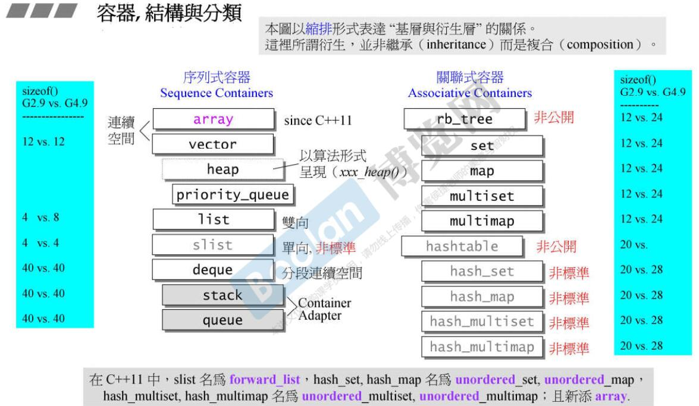

## 迭代器分类

* stl五种迭代器：

  1. 输出迭代器（Output iterator）

  2. 输入迭代器（Input iterator）

  3. 前向迭代器（Forward iterator）

  4. 双向迭代器（Bidirectional iterator）

  5. 随机存取迭代器（Random access iterator）

     **说明：** *3继承自2；4继承自3；5继承自4*

## stl使用的是堆内存还是栈内存？

1. array定长数组，占用栈内存。
2. 其他大部分容器:基础变量结构(类似一个头部信息)，会存放在栈上，大量的数据会存放在堆上(allocator调用new/delete操作符进行批量的内存分配)。
   例如：vector内部会维护三个指针类型（64位系统上每个指针占8byte），分别指向目前使用空间的头部、尾部以及可用空间的尾部，所以`sizeof(vector<int>)=8*3=24byte`，但是实际存储的大量数据是通过new在堆上创建的，sizeof只会计算类中栈空间大小，也就是定义vector这个容器需要的空间大小，所以动态增加元素时，`sizeof(vector<int>)=24byte`。
   **说明**：一个指针所占的字节数跟系统的寻址能力有关，16位系统，指针占2个字节；32位系统指针占4个字节；64位系统，指针占8个字节。

## STL各种容器、迭代器汇总

* 容器类型占栈空间大小。

* 容器的迭代器类型。

* 容器迭代器类型占栈空间的大小。

  **说明**：*占空间大小会受到平台源码实现、系统寻址能力等的影响。*

  ```c++
  #include <iostream>
  #include <cstdlib>
  #include <array>
  #include <vector>
  #include <list>
  #include <forward_list>
  #include <deque>
  #include <stack>
  #include <queue>
  #include <set>
  #include <map>
  #include <unordered_set>
  #include <unordered_map>

  using namespace std;

  int main() {
      // 测试: 64位系统上一个指针占8个字节
      cout << sizeof(int*) << endl; 

      // vector类的栈空间有三个指针（指向当前空间的头尾和可用空间的尾部 3*8=24byte）
      // sizeof计算的是实例化这个类型的对象，需要开辟多大的空间，所以是恒量24byte，解释见size_of_t.cpp
      cout << sizeof(vector<int>) << endl; 

      // 向vector灌入大量数据，由于数据是在堆上开辟空间，所以栈空间一直是24byte
      vector<int> vi = {12, 34, 5, 15, 100};
      cout << sizeof(vi) << endl;            // 24 byte
      vi.push_back(200);
      cout << sizeof(vi) << endl;            // 24 byte

      // *************测试各种容器占用的栈空间的大小*****************
      cout << "sizeof(array<int, 100>)=" << sizeof(array<int, 100>) << endl;
      cout << "sizeof(vector<int>)=" << sizeof(vector<int>) << endl;
      cout << "sizeof(list<int>)=" << sizeof(list<int>) << endl;
      cout << "sizeof(forward_list<int>)=" << sizeof(forward_list<int>) << endl;
      cout << "sizeof(deque<int>)=" << sizeof(deque<int>) << endl;
      cout << "sizeof(stack<int>)=" << sizeof(stack<int>) << endl;
      cout << "sizeof(queue<int>)=" << sizeof(queue<int>) << endl;
      cout << "sizeof(set<int>)=" << sizeof(set<int>) << endl;
      cout << "sizeof(map<int, int>)=" << sizeof(map<int, int>) << endl;
      cout << "sizeof(multiset<int>)=" << sizeof(multiset<int>) << endl;
      cout << "sizeof(multimap<int, int>)=" << sizeof(multimap<int, int>) << endl;
      cout << "sizeof(unordered_set<int>)=" << sizeof(unordered_set<int>) << endl;
      cout << "sizeof(unordered_map<int, int>)=" << sizeof(unordered_map<int, int>) << endl;
      cout << "sizeof(unordered_multiset<int>)=" << sizeof(unordered_set<int>) << endl;
      cout << "sizeof(unordered_multimap<int, int>)=" << sizeof(unordered_map<int, int>) << endl;

      // *************测试各种迭代器占用的栈空间的大小*****************
      cout << "sizeof(array<int, 100>::iterator)=" << sizeof(array<int, 100>::iterator) << endl;
      cout << "sizeof(vector<int>::iterator)=" << sizeof(vector<int>::iterator) << endl;
      cout << "sizeof(list<int>::iterator)=" << sizeof(list<int>::iterator) << endl;
      cout << "sizeof(forward_list<int>::iterator)=" << sizeof(forward_list<int>::iterator) << endl;
      cout << "sizeof(deque<int>::iterator)=" << sizeof(deque<int>::iterator) << endl;
      // cout << "sizeof(deque<int>::iterator)=" << sizeof(stack<int>::iterator) << endl;  // error stack不提供迭代器
      // cout << "sizeof(deque<int>::iterator)=" << sizeof(queue<int>::iterator) << endl;  // error queue不提供迭代器
      cout << "sizeof(set<int>::iterator)=" << sizeof(set<int>::iterator) << endl;
      cout << "sizeof(map<int, int>::iterator)=" << sizeof(map<int, int>::iterator) << endl;
      cout << "sizeof(multiset<int>::iterator)=" << sizeof(multiset<int>::iterator) << endl;
      cout << "sizeof(multimap<int, int>::iterator)=" << sizeof(multimap<int, int>::iterator) << endl;
      cout << "sizeof(unordered_set<int>::iterator)=" << sizeof(unordered_set<int>::iterator) << endl;
      cout << "sizeof(unordered_map<int, int>::iterator)=" << sizeof(unordered_map<int, int>::iterator) << endl;
      cout << "sizeof(unordered_multiset<int>::iterator)=" << sizeof(unordered_multiset<int>::iterator) << endl;
      cout << "sizeof(unordered_multimap<int, int>::iterator)=" << sizeof(unordered_multimap<int, int>::iterator) << endl;
      
      // *************测试各种容器的迭代器的类型*****************
      cout << "iterator_tag array=" << 
          typeid(iterator_traits<array<int, 100>::iterator>::iterator_category).name() << endl;
      cout << "iterator_tag vector=" << 
          typeid(iterator_traits<vector<int>::iterator>::iterator_category).name() << endl;
      cout << "iterator_tag list=" << 
          typeid(iterator_traits<list<int>::iterator>::iterator_category).name() << endl;
      cout << "iterator_tag forward_list=" << 
          typeid(iterator_traits<forward_list<int>::iterator>::iterator_category).name() << endl;
      cout << "iterator_tag deque=" << 
          typeid(iterator_traits<deque<int>::iterator>::iterator_category).name() << endl;
      // cout << "iterator_tag stack=" << 
      //     typeid(iterator_traits<stack<int>::iterator>::iterator_category).name() << endl;  // error stack不提供迭代器
      // cout << "iterator_tag queue=" << 
      //     typeid(iterator_traits<queue<int>::iterator>::iterator_category).name() << endl;  // error queue不提供迭代器
      cout << "iterator_tag set=" << 
          typeid(iterator_traits<set<int>::iterator>::iterator_category).name() << endl;
      cout << "iterator_tag map=" << 
          typeid(iterator_traits<map<int, int>::iterator>::iterator_category).name() << endl;
      cout << "iterator_tag multiset=" << 
          typeid(iterator_traits<multiset<int>::iterator>::iterator_category).name() << endl;
      cout << "iterator_tag multimap=" << 
          typeid(iterator_traits<multimap<int, int>::iterator>::iterator_category).name() << endl;
      cout << "iterator_tag unordered_set=" << 
          typeid(iterator_traits<unordered_set<int>::iterator>::iterator_category).name() << endl;
      cout << "iterator_tag unordered_map=" << 
          typeid(iterator_traits<unordered_map<int, int>::iterator>::iterator_category).name() << endl;
      cout << "iterator_tag unordered_multiset=" << 
          typeid(iterator_traits<unordered_multiset<int>::iterator>::iterator_category).name() << endl;
      cout << "iterator_tag unordered_multimap=" << 
          typeid(iterator_traits<unordered_multimap<int, int>::iterator>::iterator_category).name() << endl;

      system("pause");
      return 0;
  }

  /*
  输出结果：
  # 容器类占用栈空间大小（64位系统测试结果）：
      sizeof(array<int, 100>)=400     // 内部维护一个定长的栈数组 -> sizeof(int)*100=400 
      sizeof(vector<int>)=24          // 当前使用节点的头尾指针，可用空间的尾指针 -> 3*8=24
      sizeof(list<int>)=24            // 指向链表首节点的指针（节点包含：int类型的data，前向指针，后向指针）
      sizeof(forward_list<int>)=8     // 指向链表首节点的指针（节点包含：int类型的data，一个前向指针）
      sizeof(deque<int>)=80           // 中控节点map的首地址(8)、map的长度(8)、指向首数据段的iterator(4*8)、指向尾数据段的iterator(4*8)
      sizeof(stack<int>)=80           // deque的封装
      sizeof(queue<int>)=80           // deque的封装
      sizeof(set<int>)=48             // 内部维护一课红黑树，
      sizeof(map<int, int>)=48        // 红黑树的一个节点(4*8=32)（颜色枚举、指向父节点的指针、指向左右孩子的指针）,节点数量(8)，指向root节点的指针(8)
      sizeof(multiset<int>)=48        // 类似map
      sizeof(multimap<int, int>)=48   // 类似map
      sizeof(unordered_set<int>)=56   // 内部维护一个vector类型的buckets(24),元素个数(sizeof(size_t)=8)，用于控制什么时候rehashing，
                                      // 三个空的函数对象（获取key，key的比较，hash函数），各占一个1 byte, 3+8+24=40, 4字节对齐，调整为40
                                      // 由于不同c++库里实现方式不一样，可能还有其他的栈对象，我在64位windows下测试是56，具体的看源码。
      sizeof(unordered_map<int, int>)=56
      sizeof(unordered_multiset<int>)=56
      sizeof(unordered_multimap<int, int>)=56

  #  迭代器类占用栈空间大小（64位系统测试结果）：
      sizeof(array<int, 100>::iterator)=8
      sizeof(vector<int>::iterator)=8
      sizeof(list<int>::iterator)=8
      sizeof(forward_list<int>::iterator)=8
      sizeof(deque<int>::iterator)=32
      sizeof(set<int>::iterator)=8
      sizeof(map<int, int>::iterator)=8
      sizeof(multiset<int>::iterator)=8
      sizeof(multimap<int, int>::iterator)=8
      sizeof(unordered_set<int>::iterator)=8
      sizeof(unordered_map<int, int>::iterator)=8
      sizeof(unordered_multiset<int>::iterator)=8
      sizeof(unordered_multimap<int, int>::iterator)=8

  # 容器的迭代器类型
      iterator_category array=random_access_iterator_tag
      iterator_category vector=random_access_iterator_tag
      iterator_category deque=random_access_iterator_tag
      
      iterator_category list=bidirectional_iterator_tag
      iterator_category forward_list=forward_iterator_tag
      
      iterator_category set=bidirectional_iterator_tag
      iterator_category map=bidirectional_iterator_tag
      iterator_category multiset=bidirectional_iterator_tag
      iterator_category multimap=bidirectional_iterator_tag
      
      iterator_category unordered_set=forward_iterator_tag
      iterator_category unordered_map=forward_iterator_tag
      iterator_category unordered_multiset=forward_iterator_tag
      iterator_category unordered_multimap=forward_iterator_tag
  */
  ```

* sizeof特别说明：

  ```c++
  #include <iostream>
  #include <cstdlib>

  using namespace std;

  /*
  1. sizeof和strlen的区别：
  （1）sizeof是运算符，strlen是函数。 
  （2）strlen只能用char*做参数，且必须是以'\0'结尾的。->计算字符串首地址到\0之前的字节数。
  （3）sizeof的本质是得到某个类型的大小，也就是当创建这个类型的一个对象（或变量）的时候，需要为它分配的空间的大小。
      char str[20]="0123456789";
      int a=strlen(str);  // a=10;
      int b=sizeof(str);  // b=20;

      short f();  // sizeof(f()) == sizeof(short)

  2. 结构体计算占用字节大小：
      原则：结构体变量中每个成员的偏移量必须是成员大小的整数倍。（首元素偏移量是0）
  */

  struct A {
          char c;
          static int i;
  };

  struct B  
  {  
      float f;    //  偏移量是0，占4 byte
      char p;     //  偏移量>=4,这里取离4最近的sizeof(char)=1的整数倍->4， 占1 byte
      int adf[3]; // 偏移量>=5,这里取离5最近的sizeof(int)=4的整数倍->8，占12字节
                  // 统计结果，占20个字节
  };   

  int main() {
      // ******************** 关于sizeof ************************
      // 基础数据（64位系统的测试）
      cout << "char=" << sizeof(char) << endl;       // char=1
      cout << "short=" << sizeof(short) << endl;     // short=2
      cout << "int=" << sizeof(int) << endl;         // int=4
      cout << "long=" << sizeof(long) << endl;       // long=4
      cout << "float=" << sizeof(float) << endl;     // float=4
      cout << "double=" << sizeof(double) << endl;   // double=8
      cout << "pointer=" << sizeof(int*) << endl;    // pointer=8

      // 类/结构体中的静态变量、堆空间new的变量都不会被sizeof统计
      // 原因：sizeof的本质是得到某个类型的大小，
      // 确切的来说就是当创建这个类型的一个对象（或变量）的时候，需要为它分配的空间的大小。
      // 实际上，在类中，sizeof只计算类内部栈空间的大小，
      // static是被分配在静态区供各实例共享的，实例化类对象时不需要再对其分配空间。
      // 堆空间是各种实例创建后各自通过程序员动态开辟的，也不计算在内，如stl各种容器。
      cout << "sizeof(A)=" << sizeof(A) << endl;      // sizeof(A)=1

      // static不在类中的时候，为static类型（static int等等）定义一个变量的时候，是必须要分配空间的。
      static int a;
      cout << "static int=" << sizeof(a) << endl;     // static int=4

      // ******************** 关于关于结构体/类的对齐 ************************
      cout << "sizeof(B)=" << sizeof(B) << endl;      // sizeof(B)=20

      system("pause");
      return 0;
  }
  ```

  ​

## 容器的各种遍历方式

```c++
#include <vector>
#include <iostream>
#include <algorithm>
#include <cstdlib>
#include <iterator>  // ostream_iterator
#include "common.h"

using namespace std;

int main()
{
    // vector的那种遍历方法 ,支持随机访问迭代器的容器都可用类似的方法
    vector<int> vi = {3, 5, 7, 10};
    // 第一种: c++11的 for_loop
    for (auto v : vi) { cout << v << endl;}
    for (auto& v : vi) { v *= 10; cout << v << endl;}

    // 第二种: 迭代器访问
    vector<int>::iterator it = vi.begin();
    for (; it != vi.end(); it++) { cout << *it << endl; }
    for (auto it1 = vi.begin(); it1 != vi.end(); ++it1) { cout << *it1 << endl; }

    // 第三种: 下标访问
    for (int i = 0; i < vi.size(); i++) { cout << vi[i] << " " << vi.at(i) << endl; }

    // 第四种: stl中for_each算法，此处匿名函数可以换成仿函数、函数指针、函数模板等
    for_each(vi.begin(), vi.end(), [](const int& val)->void {cout << val << endl;});
    for_each(vi.begin(), vi.end(), show_item<int>);

    // 第五种：copy到标准输出流
    // ostream_iterator (ostream_type& s, const char_type* delimiter);
    copy(begin(vi), end(vi), ostream_iterator<int> {std::cout, " "});
    copy(vi.begin(), vi.end(), ostream_iterator<int>(cout, " "));

    system("pause");
    return 0;
}
```

# STL容器的使用和源码分析

## 总述

* array/vector -- 顺序容器、连续空间
* list/forward_list -- 顺序容器，非连续空间
* deque -- 顺序容器，分段连续空间(模拟连续空间)
* stack/queue/priority_queue -- 容器适配器
  * priority_queue底层是通过vector实现的一个大根堆；
  * stack底层是deque，支持一端插入删除，也可以用list和vector实现；
  * queue底层是deque，支持一端插入，一端删除，也可以用list实现。
* set/map/multiset/multimap -- 基于红黑树、key有序的关联容器
* unordered_set/unordered_map/unordered_multiset/unordered_multimap  -- 基于hashtable，key无序的关联容器

## array

* array的使用

  ```c++
  #include <array>
  #include <iostream>
  #include <ctime>
  #include <cstdlib>  // qsort bsearch NULL
  #include <algorithm>
  #include <cassert>
  #include "common.h"

  using namespace std;

  /*
  迭代器：
      random_access_iterator_tag（随机访问迭代器）

  赋值：
      统一初始化列表 {}；
      通过下标或者迭代器；
      fill()；

  访问：
      随机访问迭代器可以访问任意位置的元素：
      front()
      back()
      at()
      []

  方法：
      data()
      size()
      max_size()
      empty()
      swap()
  */

  const size_t ASIZE = 100;

  int main(){
      // ********** 赋值
      array<long, ASIZE> c {1, 2};    // 1.统一初始化列表，未初始化的默认为0 

      c.fill(-1);     // 2.批量赋值

      for(size_t i = 0; i < ASIZE; i++) {
          c[i] = rand();    // 3.通过下标赋值
      }

      // ********** 访问   
      cout << "array.front()=" << c.front() << endl;
      cout << "array.back()=" << c.back() << endl;        // 获取首尾元素
      assert(c.at(5) == c[5]);                            // at()有越界检查的功能，[]没有越界检查，但是效率更高
      
      cout << "array.size()=" << c.size() << endl;          // 元素个数
      cout << "array.max_size()=" << c.max_size() << endl;  // 最多能容纳的元素个数
      cout << "array.data()=" << c.data() << endl;          // 数组首地址，类似c数组的数组名
      assert(c.empty() == false);                           // 判空

      // ********** 算法
      // 快速排序
      qsort(c.data(), ASIZE, sizeof(long), compareLongs);
      for_each(c.begin(), c.end(), show_item<long>);
      cout << endl;
      
      // 二分查找
      long data = 17421;
      long* pItem = (long *)bsearch(&data, c.data(), ASIZE, sizeof(long), compareLongs);
      if (pItem != NULL) {
          cout << "found: " << *pItem << endl;
      } else {
          cout << "Not found" << endl;
      }

      // 交换
      array<long, 100> c2 {1, 2, 3};
      c.swap(c2);                      // 交换两个容器中的元素，两容器对象定义必须一致 array<long, 100>

      system("pause");
  }
  ```

* array内存结构

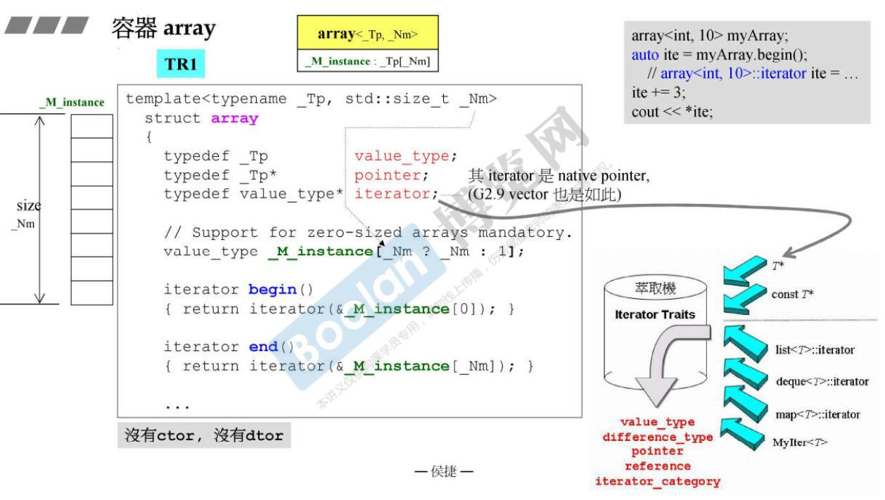


## vector

* vector使用

  ```c++
  #include <iostream>
  #include <cstdlib>
  #include <cstdio>
  #include <vector>
  #include <string>
  #include <cassert>
  #include <algorithm>
  #include "common.h"

  using namespace std;

  /*
  迭代器：
    random_access_iterator_tag（随机访问迭代器）

  赋值：
  1. 在尾部插入删除：
    push_back();
    pop_back();
  2. 修改已添加的元素值：
    通过迭代器或者下标[]
  3. 在任意位置插入删除（需要大量移动元素，不如list高效）：
    insert()
    erase()  // erase和insert配对，通过游标操作，彻底的擦除元素
    remove() // 算法库中的remove是将指定元素移动到容器的尾部并不减少vector的size,
    	       // vector需要用remove和erase配合使用彻底的擦除指定元素,
    	       // 为什么这样？因为不同元素的删除方式不一样，不能做出通用性的删除动作。

  访问：
    随机访问迭代器可以访问任意位置的元素：
    front()
    back()
    at()
    []

  方法：
    size()
    max_size()
    capacity()
    empty()
    data()
    reserve()
    resize()
    swap()
  */

  int main() {
      // ********** 赋值
      vector<string> c {"hello", "world"};         // 1.统一出初始化列表

      char buf[10];
      for (size_t i = 0; i < 100; i++) {
          snprintf(buf, 10, "%d", i);
          c.push_back(string(buf));
      }
      c.pop_back();                  // 2.插入->只能在元素尾部插入删除 push_back/pop_back
      c[2] = "inserter";             // 3.覆盖赋值->通过随机迭代器的iterator和下标[]
      
      for_each(c.begin(), c.end(), show_item<string>);
      cout << endl;

      // ********** 访问
      cout << "vector.front()=" << c.front() << endl;           
      cout << "vector.back()=" << c.back() << endl;              // front/back: 返回首尾元素的引用
      cout << "*(c.begin())=" << *(c.begin()) << endl;
      assert(*(--c.end()) == c.at(c.size() - 1));                 // begin/end: 返回首尾元素的迭代器,前闭后开

      // ********** 方法
      cout << "vector.size()=" << c.size() << endl;              // 元素个数
      cout << "vector.capacity()=" << c.capacity() << endl;      // 当前申请的空间可容纳元素的个数
      cout << "vector.max_size()=" << c.max_size() << endl;      // 最多可添加的元素个数
      assert(sizeof(c) == sizeof(vector<int>));                  // 实例化vector需要的字节数  24byte
      cout << "vector.data()=" << c.data() << endl;              // 首地址                  
      assert(c.empty() == false);                                // 判空

      // resize和reserve:
      // resize(Container::size_type n) : 
      // n小于当前容量时，尾部多余元素被截断销毁，n大于当前容量时，新默认构造元素添加到尾部，也会发生重新分配。
      // reserve(Container::size_type n) n不小于当前大小，扩容到指定大小，预先空间分配，一般定义容器时调用。

      // ********* 算法
      // 查找
      auto fit = find(c.begin(), c.end(), "45");
      if (fit != c.end()) {
          cout << "find, " << *fit << endl;
      } else {
          cout << "not find" << endl;
      }
      // 交换
      vector<string> c2 {"hello", "china"};
      c.swap(c2);
    
      // remove/erase配合彻底删除指定元素
      vector<int> vi {23, 100, 5, 100, 33, -10};          // size=6
      std::vector<int>::iterator it = remove(vi.begin(), vi.end(), 100);  
      // 此时size=6, it指向有效元素的下一个元素的位置，即指向第5个位置
      vi.erase(it, vi.end());                // 删除无效数据区间
      copy(vi.begin(), vi.end(), ostream_iterator<int>(cout, " ")); // 23 5 33 -10 size=4

      system("pause");
      return 0;
  }
  ```

* vector内存结构

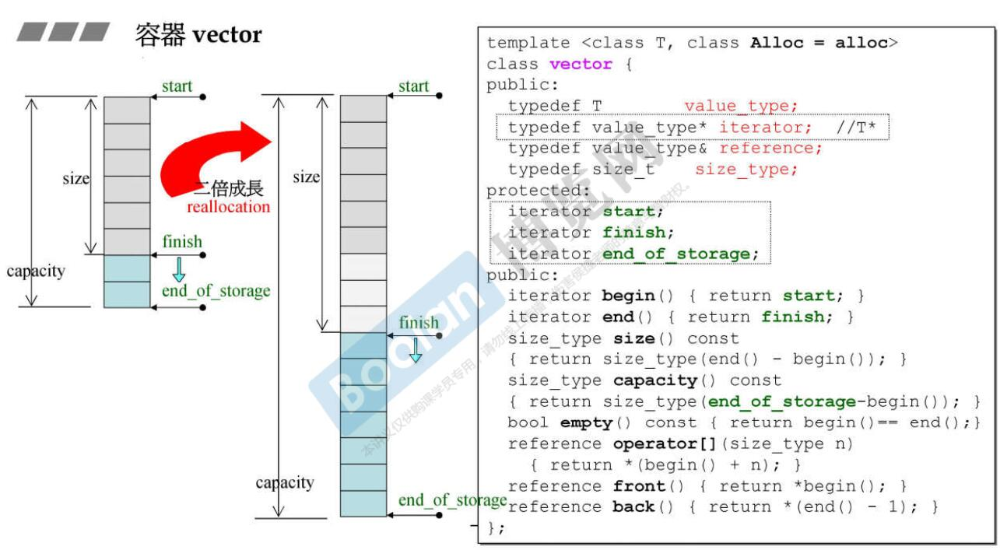

## list

*   list的使用

    ```c++
      #include <iostream>
      #include <cstdlib>
      #include <string>
      #include <list>
      #include <algorithm>
      #include "common.h"

      using namespace std;

      /*
      迭代器：
        bidirectional_iterator_tag（双向迭代器）

      赋值：
      双向链表可以在任意位置高效的插入和删除元素：
        push_back()
        push_front()
        pop_back()
        pop_front()
        insert()
        erase()  // erase和insert配对，通过游标操作，彻底的擦除元素
        remove() // list成员函数中的remove可以移除指定值的节点，并释放资源。
           // vector没有remove成员函数，调用的是算法库中的remove，不会真正删除，见vector示例代码。

      访问：
        双向迭代器只能访问收尾元素，或者双向顺序访问,不支持随机访问。
        front()
        back()

      方法：
        size()
        max_size()
        empty()
        reserve()
        resize()
        uniq()
        sort()

      vector和list的区别：
        vector是一块连续的内存，支持下标随机访问，但是插入和删除操作会导致大量内存拷贝，效率较低。
        list是双向链表，只能顺序访问，不支持随机访问，但是任何位置插入或删除非常迅速。
        结论：
    1. 如果需要高效的随机存取，不在乎插入删除效率，用vector；
    2. 如果需要大量的插入删除，而不在乎随机存取，用list；
    3. 如果既需要随机存取，又关系两端数据的插入删除，用deque；
    */
    int main() {

      // *********** 赋值
      // 1. 统一初始化列表
      list<string> c = {"you", "and", "me"};
      c.assign({"hate", "and", "and", "hate", "like",  "and", "hate", "like", "like"});

      // 2. 在任意位置插入删除元素
      c.pop_front();
      c.pop_back();
      c.push_back("you");
      c.push_front("me");       // 支持收尾插入
      c.emplace_front("hate");
      c.emplace_back("like");   // push_back/push_front的右值引用版本（高效）
      c.insert(++begin(c), "inserter");  // 在第二个位置插入
      auto iit = c.begin();
      advance(iit, 5);
      c.insert(iit, 3, "100");           // 游标向前移动5个位置，插入3个"100"

      iit = c.begin();
      c.erase(iit);
      c.remove("hate");         // erase是删除迭代器所指位置(范围)的元素，remove是删除指定取值的元素。

      for_each(c.begin(), c.end(), show_item<string>);
      cout << endl;

      // *********** 访问
      cout << "list.front()=" << c.front() << endl;
      cout << "list.back()=" << c.back() << endl;

      // *********** 容量
      cout << "list.size()=" << c.size() << endl;                 // 元素个数
      cout << "list.max_size()=" << c.max_size() << endl;         // 容器允许的最大元素数,跟平台有关
      // resize(Container::size_type n) 
      // reserve(Container::size_type n) 

      // *********** 算法
      c.sort();        // 排序
      for_each(c.begin(), c.end(), show_item<string>);
      cout << endl;

      c.unique();      // 去重
      for_each(c.begin(), c.end(), show_item<string>);
      cout << endl;
      
      c.remove("like");   // 删除
      c.remove("me");
      for_each(c.begin(), c.end(), show_item<string>);
      cout << endl;

      system("pause");
      return 0;
    }
    ```

*   list的内存结构

      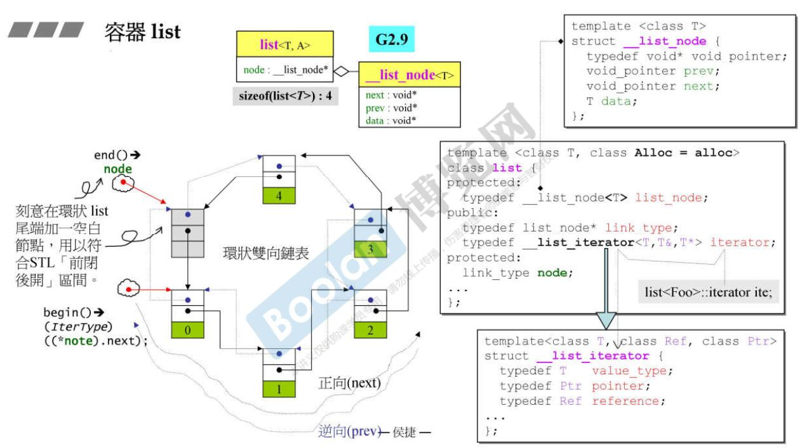

*   list的迭代器结构

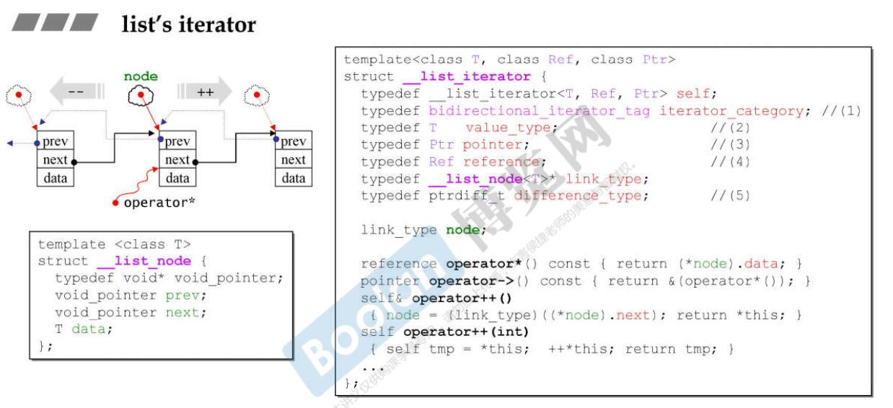

## forward_list

* forward_list的使用

  ```c++
  #include <forward_list>
  #include <iostream>
  #include <cstdlib>
  #include <cassert>
  #include <algorithm>
  #include "common.h"

  using namespace std;

  /*
  迭代器：
    forward_iterator_tag（前向迭代）

  特点：
    支持单向顺序访问；
    不支持反向迭代器rbegin()等；
    不提供size()成员函数；
    没有指向尾部元素的游标，所以没有back()/push_back()/pop_back()等操作。

  方法：
    push_front()
    pop_front()
    front()

    insert_after()
    erase_after()
    remove()
  */

  int main() {
      forward_list<int> c;

      for(size_t i = 0; i < 10; i++) {
          c.push_front(i);           // 9 8 7 6 5 4 3 2 1 0
      }
      c.pop_front();                 // 8 7 6 5 4 3 2 1 0 

      // 在迭代器it之后插入和删除操作
      forward_list<int>::iterator it = c.begin();
      advance(it, 3);
      c.insert_after(it, 888);     // 8 7 6 5 888 4 3 2 1 0
      it = c.begin();
      advance(it, 5);
      c.erase_after(it);           // 8 7 6 5 888 4 2 1 0
      c.remove(7);                 // 8 6 5 888 4 2 1 0
      
      assert(c.front() == 8);

      for_each(c.begin(), c.end(), show_item<int>);

      system("pause");
      return 0;
  }
  ```

* forward_list内存结构

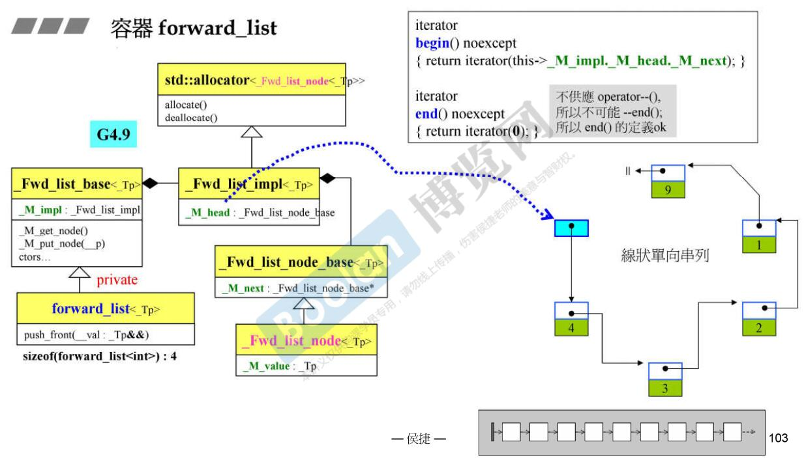

## deque

*    deque的使用

     ```c++
     #include <iostream>
     #include <cassert>
     #include <cstdlib>
     #include <deque>
     #include <algorithm>
     #include "common.h"

     using namespace std;

     /*
     迭代器：
         random_access_iterator_tag（随机访问迭代器）

     特点：
     1. 支持随机访问at/[], 性能略差于vector；
     2. 在两端插入和删除很高效，也支持在任意位置的插入和删除操作，但性能不及list；

     和vector操作上的区别：
       1. deque不提供容量操作 capacity() / reserve()；
       2. deque提供push_front() / pop_front()函数直接操作头部；
       3. 对deque的排序在性能上不高效，可以把deque中的元素移到vector进行排序，在移回来；
     */

     int main() {

       // *********** 赋值
       deque<int> c {10, 20};
       c.assign({30, 40, 50});
       c.push_front(60);
       c.push_back(70);
       c.pop_back();
       c.pop_front();                       // 1. 在收尾插入删除
       // 还有右值版本： c.emplace(), c.emplace_front(), c.emplace_back()
       c[1] = 80;                           // 2. 通过迭代器或者下标覆盖赋值
       auto it = c.begin();
       c.insert(it, {90, 100});             // 3. 在任意位置插入元素 

       it = c.end();
       it--;
       c.erase(it);                         // 4.在任意位置删除元素  

       for_each(c.begin(), c.end(), show_item<int>);               // 90 100 30 80
       cout << endl;
       
       // ********* 随机访问
       assert(c.at(1) == 100);         // 有越界检查
       assert(c[1] == 100);            // 高效，但是没有越界检查
       assert(c.front() == 90);
       assert(c.back() == 80);

       // ********* 容量 （不支持reserve和capacity）
       cout << "deque.size()=" << c.size() << endl;
       cout << "deque.max_size()=" << c.max_size() << endl;
       c.resize(3);                // 截断成3个元素 90 100 30

       // ************  算法
       deque<int> d {100, 200};
       c.swap(d);                     // 交换两个容器的内容
       for_each(c.begin(), c.end(), show_item<int>); 
       cout << endl;

       system("pause");
       return 0;
     }
     ```

*    deque内存结构

        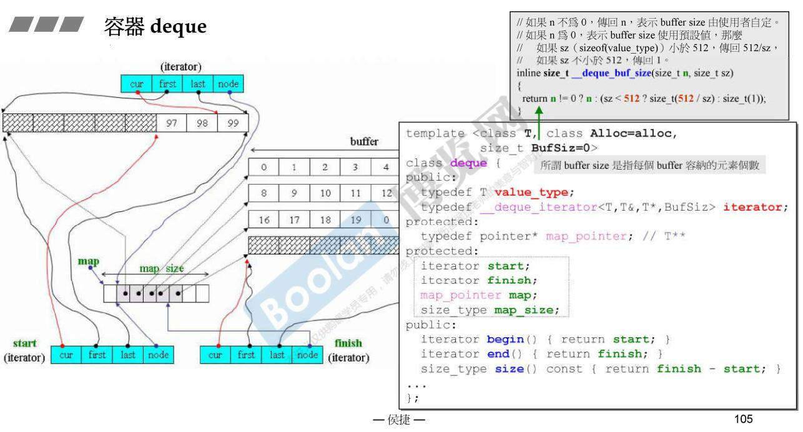

*    deque迭代器结构

        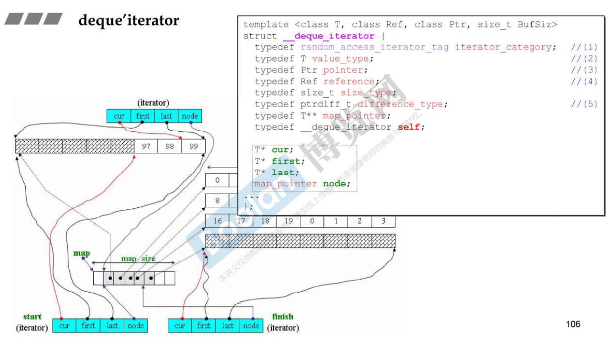

## queue/priority_queue

* queue/priority_queue的使用

  ```c++
  #include <queue>
  #include <vector>
  #include <cstdlib>
  #include <iostream>
  #include <cassert>

  using namespace std;

  /*
  queue:容器适配器-队列
      方法：
          插入删除：push() / pop()
          访问：front() / back()
          容量：empty() / size()

  priority_queue：容器适配器-优先级队列
      方法：
          插入删除：push() / pop()
          访问：top()
          容量：empty() / size()

  priority_queue和queue的区别和联系 
      (1) 二者都定义在头文件#include<queue>中，都是先进先出(FIFO)的容器适配器，不提供迭代器，不提供遍历方法，不提供clear()接口。
      (2) priority_queue支持自定义数据的优先级，让优先级高的排在前面，优先出队；
      (3) priority_queue默认底层容器是vector实现的大顶堆heap；默认比较函数是 less<int>，降序排序;
          queue默认的底层容器是deque，也可以用list。
      (4) priority_queue 通过 top() 函数来访问队首（堆顶）元素；queue可以通过front()和back()访问队首/队尾元素。
  */

  int main() {
      // 1. 适配器：先进先出，不支持迭代器，不能用统一初始化列表
      // 基本操作：入队列、出队列、访问队首、队尾、判空
      queue<int> c;
      for(int i : {100, 200, 300, 400}) {
          c.push(i);                  // 插入
      }  
      c.pop();                        // 删除

      assert(c.front() == 200);       // 访问第一个元素
      assert(c.back() == 400);        // 访问最后一个元素

      // 2. 适配器，优先级队列
      priority_queue<int, vector<int>, greater<int>> q;       // 升序队列
      for (int n : {3, 5, 7, 2, 1, 10}) {
          q.push(n);
      }
      assert(q.top() == 1);           // 访问
      q.pop();                        // 删除
      assert(q.top() == 2);

      system("pause");
      return 0;
  }
  ```

* queue内存结构

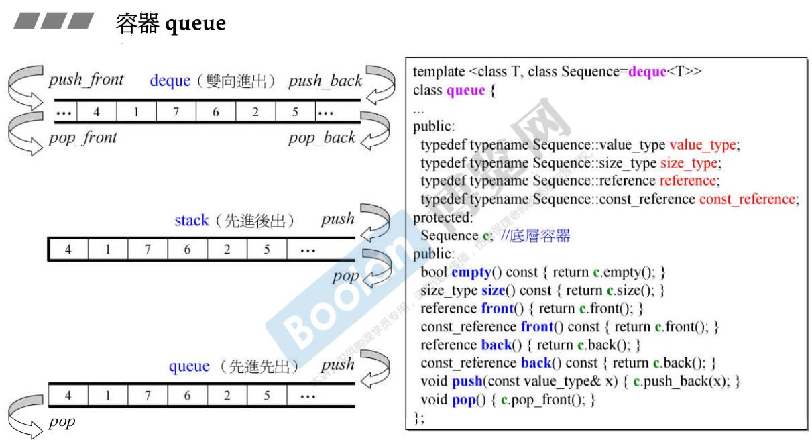

## stack

*    stack使用

     ```c++
     #include <stack>
     #include <cassert>
     #include <cstdlib>

     using namespace std;

     /*
     stack: 容器适配器 - 栈
     	 1. LIFO后进先出；
     	 2. 不支持迭代器，不提供遍历方法；
     	 3. 不是容器，不能直接用统一初始化列表进行初始化，-> 能不能用取决于源码有没有实现这个接口！！！
     	 但是在使用拷贝构造函数时，既可以用初始化列表，也可以用圆括号，如下：
     		 list<double> values {1.414, 3.14159265, 2.71828};
     		 stack<double, list<double>> my_stack(values);      // 可以用底层容器构造，注意是()
     		 stack<double, list<double>> copy_stack {my_stack};  // 可以拷贝现有的stack容器

     方法：
     	插入和删除：push() / pop()
     	访问：top()
     	容量：size() /empty()
     */

     int main() {
       // 容器适配器：LIFO后进先出，不支持迭代器，不能直接用统一初始化列表
       // 基本操作：入栈、出栈、取栈顶、判空
       stack<int> c;
       c.push(100);
       c.push(200);
       c.push(300);               // 插入
       c.pop();                   // 删除
       assert(c.top() == 200);    // 访问
       assert(c.size() == 2);
       assert(c.empty() == false); 

       system("pause");
       return 0;
     }
     ```

*    stack内存结构


## set/multiset

* set/multiset使用

  ```c++
  #include <set>
  #include <iostream>
  #include <cassert>
  #include <cstdlib>
  #include <algorithm>
  #include "common.h"

  using namespace std;

  /*
  关联容器set：
  1. 迭代器：
      bidirectional_iterator_tag（双向迭代器）

  2. 底层结构是红黑树，默认比较函数是less<int>, 升序排序。
     插入：
     insert()，只能插入具体元素，指定在特定位置处插入无效，因为内部会自动排序。 
     删除：
     只有erase()，没有remove()(这个和顺序容器有区别)，erase的作用是把符合要求的元素都删掉：
     (1) void erase (iterator position);                   // 删除指定位置
     (2) size_type erase (const value_type& val);          // 删除等于指定值，类似顺序容器的remove
     (3) void erase (iterator first, iterator last);       // 删除指定范围
     查找：
     set/map的优势是支持高效查找，时间复杂度logN:
     count() / find() / equal_range() / lower_bound() / upper_bound()
  */

  int main() {
      // 底层结构是红黑树，默认比较函数是less<int>, 升序排序
      set<int> c {11, 12, 34, 22, 1};

      c.insert(100);
      c.insert(100);              // set插入重复的元素不会生效
      c.insert({0, 200});         // 插入

      set<int> ci {1000, 2000};
      c.insert(ci.begin(), ci.end());  // 指定范围插入

      c.erase(22);                // 删除值等于22的
      auto it = c.begin(); 
      advance(it, 3);
      c.erase(c.begin(), it);     // 范围删除

      for_each(c.begin(), c.end(), show_item<int>); 
      cout << endl;                   // 12 34 100 200

      // 查找
      assert(c.count(100) == 1);
      it = c.find(34);
      if(it != c.end()) {
          cout << "find=>" << *it << endl;
      }
      
      set<int, greater<int>> c2 {2, 4, 1, 5};       // 自定义排序函数
      for_each(c2.begin(), c2.end(), show_item<int>); 
      cout << endl;                                 // 5 4 2 1

      // multiset和set的区别是：
      // multiset可以插入重复的元素。
      multiset<int> mc {1, 2, 2, 5, 5, 5, 4, 3, 2};
      assert(mc.count(2) == 3);
      assert(mc.size() == 9);
      it = mc.find(5);
      if(it != mc.end()) {
          cout << "find=>" << *it << endl;
      }
      // 范围查找
      pair<multiset<int>::iterator, multiset<int>::iterator> ret;
      ret = mc.equal_range(5);
      cout << *(ret.first) << endl;      // 第一个大于等于该元素的值
      cout << *(ret.second) << endl;     // 第一个大于该元素的值
      for (auto it = ret.first; it != ret.second; it++) {
          cout << *it << endl;           // 遍历范围查询结果
      }
      // 说明:set中由于没有重复元素，所以equal_range和find的作用是一样的，
      // 全局范围查找函数std::equal_range(forward_iter_begin, forward_iter_end, val),
      // 可以用于其他最低具备前向迭代器的容器的范围查找。
      
      system("pause");
      return 0;
  }
  ```

* set内存结构
  set的底层结构是红黑树：
  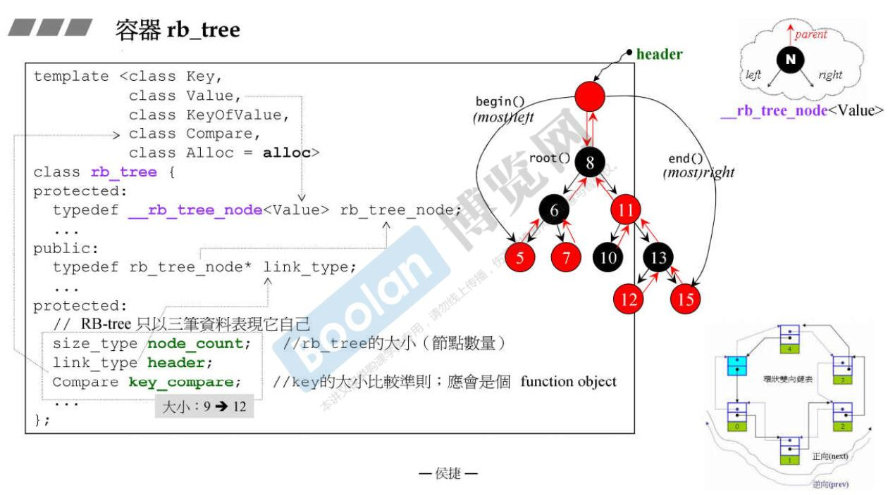

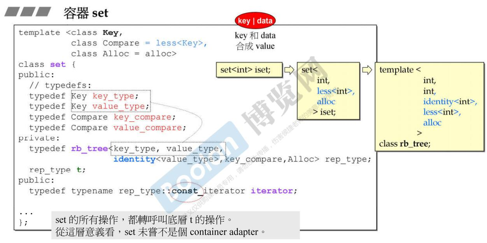

## map/multimap

* map/multimap使用

  ```c++
  #include <map>
  #include <string>
  #include <cstdlib>
  #include <cassert>
  #include <iostream>

  using namespace std;

  /*
  方法：
      插入/删除：erase() / insert() / clear() / swap()
      查找：count() / find() / equal_range() / lower_bound() / upper_bound()
      （说明：由于是排序的，所以有lower_bound()和upper_bound()方法，unordered容器无此方法。）

  1. set / map / multiset / multimap 的共同点：
      (1) 以红黑树为底层容器，所有元素都会被自动排序；
      (2) 不能通过迭代器改变键值（set/multiset的值不能改；map/multimap的键值key不能改，可以改变value的值）

  2. set 和 map 的区别：
      set只有key，没有value（或者说value就是key），map的元素是key-value的键值对；

  3. set 和 multiset 的区别：
      set/map不允许键值(key)重复；multiset/multimap允许键值重复；

  4. set 和 unordered_set 的区别：
      (1) set基于红黑树实现，有自动排序的功能，查找/插入/删除 的时间复杂度o(logN);
      (2) unordered_set基于哈希表，查找/插入/删除 的时间复杂度o(1); 而代价是消耗比较多的内存，无自动排序功能。
      底层实现上，使用一个下标范围比较大的数组来存储元素，形成很多的桶，利用hash函数对key进行映射到不同区域进行保存。
  */

  int main() {
      // map和set的区别：
      // set的key和value合而为一了。
      map<string, int> c = {{"zs", 90}, {"ls", 80}, {"ww", 100}};
      c.insert({{"cbj", 100}, {"ll", 66}});

      assert(c.count("ww") == 1);
      assert(c.at("ls") == 80);
      auto it  = c.find("zs");       // 迭代器返回的是一个pair
      if(it != c.end()) {
          cout << "find=>" << it->first << ", " << it->second << endl;
      }

      map<int, int> c2 = {{90, 90}, {80, 80}, {100, 100}};
      map<int, int>::iterator it1 = c2.lower_bound(90);  // 返回第一个大于等于val的迭代器，这里指向90
      map<int, int>::iterator it2 = c2.upper_bound(90);  // 返回第一个大于val的迭代器，这里指向100（右开区间）

      cout << "<*it1, *it2>=" << it1->first << ", " <<  it2->first << endl;

      // multimap
      multimap<string, int> mm = {{"zs", 90}, {"ls", 80}, {"ww", 100}};
      mm.insert({{"zs", 90}, {"zs", 90}});
      assert(mm.count("zs") == 3);

      system("pause");
      return 0;
  }
  ```

* map内存结构

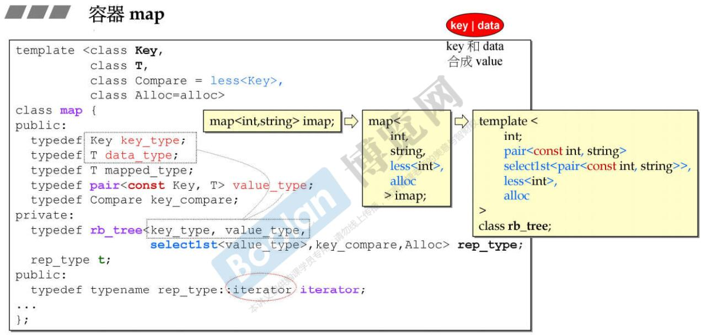

## unordered_set/unordered_multiset

* unordered_set/unordered_multiset的使用

  ```c++
  #include <unordered_set>
  #include <string>
  #include <algorithm>
  #include <cstdlib>
  #include <cassert>
  #include <iostream>
  #include <vector>
  #include "common.h"

  using namespace std;

  /*
  set 和 unordered_set：
      如果元素为非基础类型，需要自定义哈希函数，具体使用和set类似；

  方法：
      插入/删除：erase() / insert() / clear() / swap()
      查找：count() / find() / equal_range()
  */

  // 自定义hash函数（仿函数）
  struct VectorHash {
      size_t operator()(const vector<int>& v) const {
          std::hash<int> hasher;
          size_t seed = 0;
          for (int i : v) {
              seed ^= hasher(i) + 0x9e3779b9 + (seed<<6) + (seed>>2);
          }
          return seed;
      }
  };

  int main() {
      unordered_set<vector<int>, VectorHash> s;
      s.insert({1, 2});
      s.insert({1, 3});
      s.insert({1, 2});

      vector<int> i = {1, 2};
      auto it = s.find(i);
      if (it != s.end()) {
          vector<int> tmp = *it;
          for_each(tmp.begin(), tmp.end(), show_item<int>);
      }
      
      system("pause");
      return 0;
  }
  ```

* unordered_set内存结构

底层结构是hashtable：
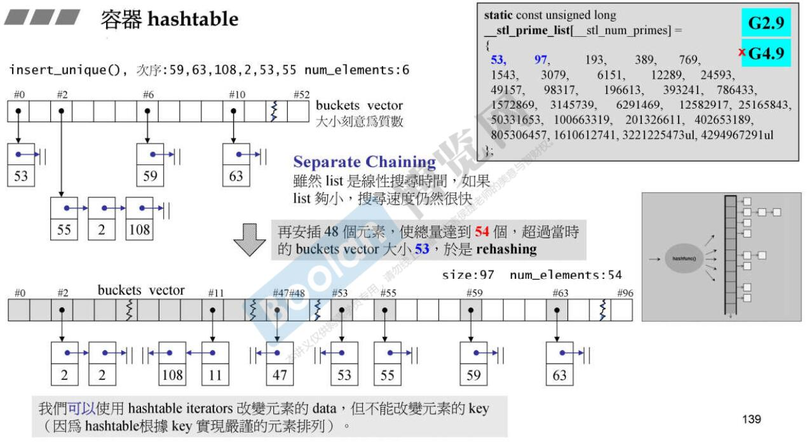

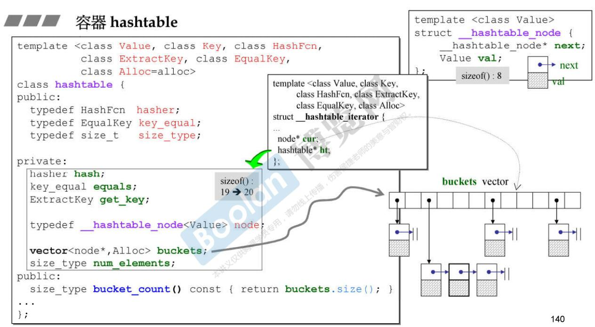

## unordered_map/unordered_multimap

* unordered_map/unordered_multimap的使用

  ```c++
  #include <unordered_map>
  #include <iostream>
  #include <cstdlib>
  #include <cassert>

  using namespace std;

  /*
  说明
      元素为非基础类型，需要自定义哈希函数。

  方法
      插入/删除：erase() / insert() / clear() / swap()
      查找：count() / find() / equal_range() / at()
  */

  int main() {
      unordered_map<string, int> m = {{"a", 80}, {"b", 100}, {"c", 90}};
      m.insert({"b", 200});       // 此条数据插入无效
      m.erase("c");
      assert(m.count("b") == 1);

      auto it = m.find("b");
      if (it != m.end()) {
          cout << it->first << ", " << it->second << endl;     // b 100
      }
      cout << "m.at(\"a\")=" << m.at("a") << endl;
      try {
          cout << m.at("c") << endl;
      } catch (exception & e) {
          cout << e.what() << endl;      // 捕获越界异常
      }

      // unordered_multimap
      // 根据key 插入/统计/删除/查找。
      unordered_multimap<string, int> um {{"a", 300}, {"a", 500}};
      um.insert({{"a", 100}, {"b", 200}, {"c", 300}});

      assert(um.count("a") == 3);
      
      auto it1 = um.find("a");
      if (it1 != um.end()) {
          cout << "find=>" << it1->first << ", " << it1->second << endl;         // a 100
      }
      
      // 范围查找
      pair<unordered_multimap<string, int>::iterator, unordered_multimap<string, int>::iterator> ret;
      ret = um.equal_range("a");
      for(auto it = ret.first; it != ret.second; it++) {
          cout << "equal_range=>" << it->first << ", " << it->second << endl;
      }

      system("pause");
      return 0;
  }
  ```

* unordered_map内存结构


## tuple

* tuple使用

  ```c++
  #include <tuple>
  #include <iostream>
  #include <cassert>
  #include <cstdlib>
  #include <cmath>

  using namespace std;

  const double EPS = 1e-6;

  int main() {
      auto c2 = make_tuple("zs", 12.34);
      // 取值和赋值
      get<1>(c2) = 88.8;
      assert(fabs(get<1>(c2) - 88.8) < EPS);
      assert(get<0>(c2) == "zs");

      tuple<string, int, char> c = {"cbj", 80, 'y'};    // 统一初始化列表
      string s;
      int i;
      tie(s, i, std::ignore) = c;          // unpack elements (with ignore) 任何类型都可以用std::ignore占位
      assert(s == get<0>(c));
      assert(i == get<1>(c));

      system("pause");
      return 0;
  }
  ```

* tuple的实现 （见c++11新特性的笔记）


# 友元、模板、运算符重载

* 友元分类（friend）

  * 友元类
  * 友元函数
  * 友元成员函数

* 模板分类（template）

  * 类模板
  * 函数模板
  * 成员模板

* 运算符重载

  ```c++
  #include <iostream>
  #include <cstdlib>

  using namespace std;

  /*
  1. 运算符重载使得用户自定义的类型以一种更简洁的方式工作。
      运算符重载只是对运算符作出了新的解释，原有基本语义基本不变，
      - 不改变运算符的优先级；
      - 不改变运算符的结合性；
      - 不改变运算符所需要的操作数；
      - 不创建新的运算符。

  2. 实现方式：
      成员函数
      全局函数
      友元函数
      1. 定义友元是为了访问类的私有成员。
      2. 友员函数没有 this 指针，所需操作数都必须在参数表显式声明。

  3. 操作符重载的结果是一个函数，重载步骤：
      函数名称：operator{运算符}
      函数参数：操作数
      函数返回值：引用/指针/值

  4. 重载++/-- 的注意事项
      后置++和后置--，增加一个伪参数int来标识

  5. 重载<< 和链式编程
    函数返回值充当左值 需要返回一个引用

  6. 案例：自己实现复数类，并重载 + /- /<< /++ /-- 运算符
  */

  class Complex {

  public:
      Complex(int re = 0, int im = 0) {
          this->real = re;
          this->imag = im;
      }
      ~Complex(){ }
    
      // 重载+运算符（成员函数）
      Complex operator+ (const Complex& other) {
          return Complex(this->real + other.real, this->imag + other.imag);
      }
    
      // 重载+运算符（友元函数）
      friend Complex operator- (Complex &c1, Complex &c2);
    
      // 重载<<运算符（友元函数）
      friend ostream& operator<< (ostream& out, Complex& c) {
          out << "< real=" << c.real << " imag=" << c.imag << " >";
          return out; 
      }
    
      // 重载前置++运算符
      Complex& operator++ () {
          this->real++;
          this->imag++;
          return *this;
      }
    
      // 重载后置++运算符 int标识
      Complex& operator++ (int) {
          Complex c(this->real, this->imag);
          this->real--;
          this->imag--;
          return c;
      }

  private:
      int real;
      int imag;
  };

  // 重载-操作符（全局函数）
  Complex operator- (Complex &c1, Complex &c2) {
      Complex c(c1.real - c2.real, c1.imag - c2.imag);
      return c;
  }

  int main()
  {
      Complex c1(2, 3), c2(2, 2);
      Complex c3 = c1 + c2;
      cout << "c3 =>" << c3 << endl;
    
      c3++;
      cout << "c3++ =>" << c3 << endl;
    
      ++c3;
      cout << "++c3 =>" << c3 << endl;
    
      system("pause");
      return 0;
  }
  ```

# 全特化与偏特化

* 类模板：全特化/偏特化

* 函数模板：只能全特化，偏特化通过函数重载实现。

* 偏特化在STL中的应用示例

  ```c++
  #include <iostream>
  #include <cstdlib>

  using namespace std;

  /*
  1. 模板与特化：
      类模板和函数模板都必须定义在.h文件中，特例化版本必须与模板定义在同一个.h头文件中；
      模板的实例化类型确定是在编译期间；
      特化/偏特化 主要的用途都是对于特定的类型，指定特定的处理方式，
      编译阶段确定如果是某个特化类型，就用特化的模板；如果都不是，就用最一般的模板。
      特例化本质上是我们顶替了编译器的工作，我们帮编译器做了类型推导，
      全特化本质上是一个实例，而偏特化本质上还是一个模板，只是原来模板的一个子集。

  2. 偏特化在STL中的应用：
      应用1：使迭代器既可以萃取出值类型，又可以包容原生指针
          (1) 在每个迭代器中都定义了value_type值类型的类型成员，
          	这样直接通过迭代器的value_type类型成员就可以知道值类型。
          (2) 但是迭代器必须兼容原生态的指针，
          	而原生指针很难被重新定义(如在原生指针的类中添加value_type的值类型的类型成员),
          	这时候，靠的就是类模板的偏特化了,新添加一层iterator_traits类，专门萃取迭代器的属性，
          	然后再对iterator_traits类设计原生指针与原生引用的偏特化版本，就解决了这个棘手的问题。
      应用2：type_traits类型萃取，对待特殊类型，特殊处理，提高效率
          举例：比如copy函数，如果传递的对象是一个复杂类型，那么可能只能采取最保守的处理方式，
          	一个一个的构造；如果是内置类型，这样显然太低效，使用memcpy()可能会好一些。

  3. typename的用法：
      1. 声明模板参数，可以替换为class。
      template <typename T>
      2. 声明后边所指是一个类型。
      template<typename C>
      void print2nd(const C& container){
          if(container.size() >= 2){
              C::const_iterator it(container.begin());
              ++it;
              int value = *it;  
              cout<<value;
          }
      }

      模板被解析时，C的类型还不确定，所以编译器不知道const_iterator是个类型，万一它是个变量呢？
      需要这样声明才可以： typename C::const_iterator it(container.begin());
  */

  // 其中一种迭代器，可以有多种，内部需定义value_type
  template <typename T>
  class myIterator {
  public:
      typedef T value_type;
  };

  // 泛化版本
  template <typename T>
  class Traits {
  public:
      typedef typename T::value_type value_type; 
  };

  // 特化版本(原生态指针会优先调用此版本)
  template <typename T>
  class Traits<T*> {
  public:
      typedef T value_type;
  };

  // 实现一个简单的算法类，既支持迭代器，又支持原生态指针
  template <typename I>   // I可以是任意定义了value_type的迭代器，或者原生态指针
  typename Traits<I>::value_type Fool(I i) {
      // TODO
  }

  int main() {
      int *p;
      int i = Fool(p);

      myIterator<char> it;
      Fool(it);

      system("pause");
      return 0;
  }
  ```

* STL中iterator_traits实现

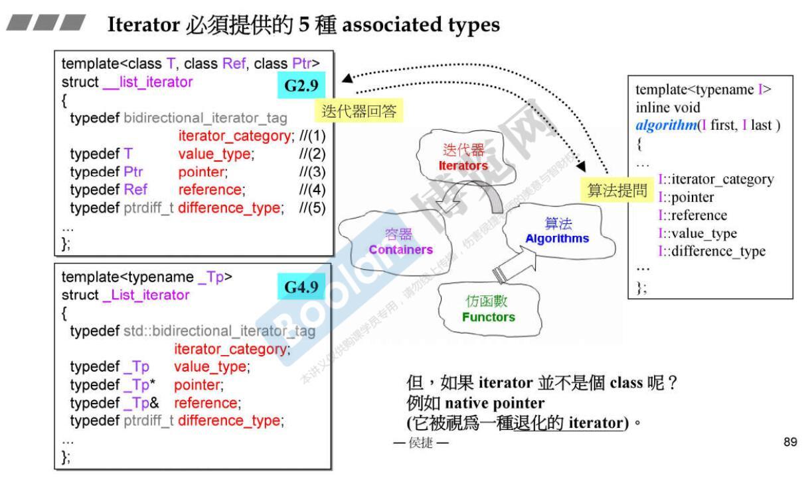


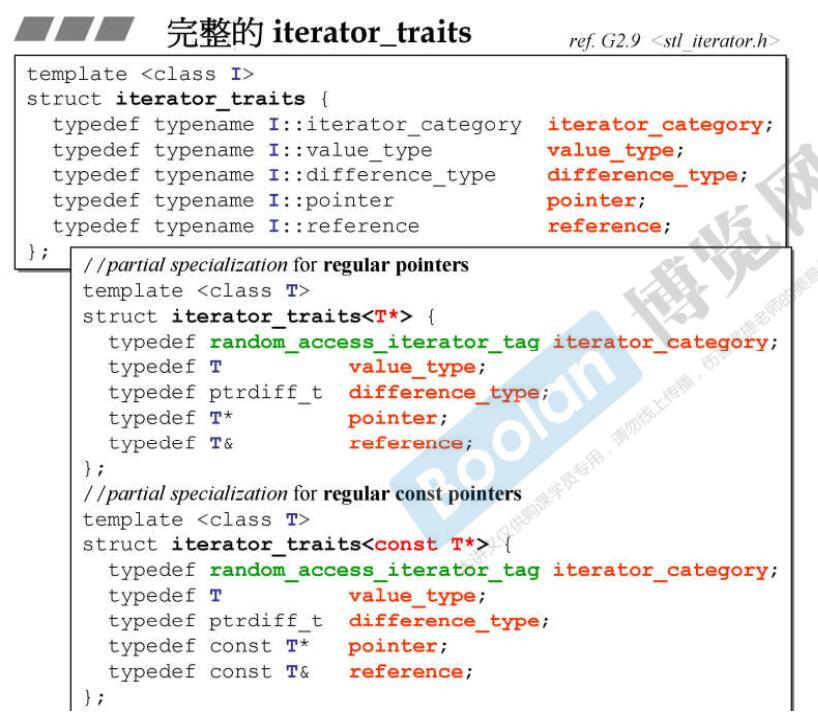


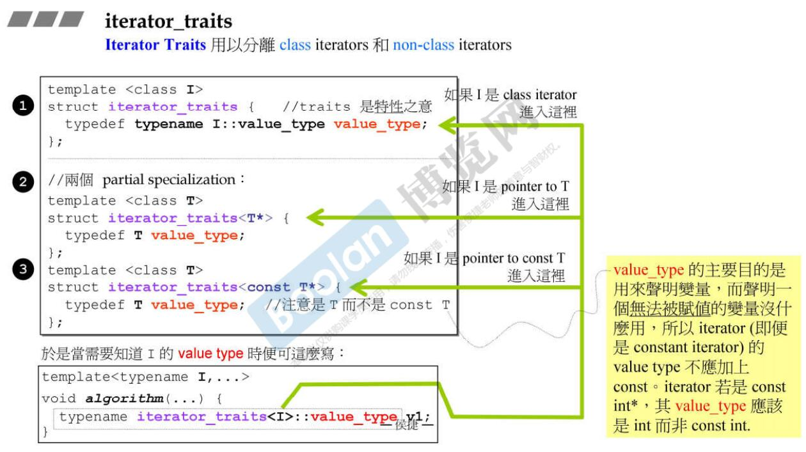

​
# 常见算法

*    STL常见算法示例

     ```c++
     #include <iostream>
     #include <vector>
     #include <functional>    // std::minus
     #include <numeric>       // std::accumulate
     #include "common.h"
     #include <algorithm>
     #include <cassert>
     #include <iterator>    // std::ostream_iterator

     using namespace std;

     /*
     STL算法部分：
         #include <algorithm>     // 大量的算法函数
         #include <numeric>       // 定义了一些数值算法
         #include <functional>    // 定义了一些模板类，用于声明函数对象

     常用算法举例：
     ** 查找[algorithm]：
         count/count_if：统计等于某个值/符合某个判断条件的元素个数。
         find/find_if: 查找，返回指向该元素的迭代器。
         equal_range: 查找，返回一对iterator（lower_bound和upper_bound）。
         search: 查找一个子序列第一次出现的位置。
         search_n: 查找val出现n次的子序列。
         binary_search: 在有序序列中查找value，找到返回true。

     ** 排序[algorithm]：
         sort: 升序排序
         stable_sort: 与sort类似，不过保留相等元素之间的顺序关系（稳定）。
         reverse: 将指定范围内元素重新反序排序。
         merge: 合并两个有序序列，存放到另一个序列。
         random_shuffle: 对指定范围内的元素随机调整次序。
         nth_element: 将范围内的序列重新排序，使所有小于第n个元素的元素都出现在它前面，而大于它的都出现在后面。

     ** 删除和替换[numeric]：
         copy: 复制序列。
         copy_backward: 与copy相同，不过元素是以相反顺序被拷贝。
         remove/remove_if: 删除范围内所有等于指定元素的元素（不是真的删除，可能是移动到尾部）。
         remove_copy/remove_copy_if: 将所有不匹配元素复制到一个指定容器。
         replace/replace_if: 将范围内指定值(满足指定条件)的元素用新值代替。
         replace_copy/replace_copy_if:同上，不过将结果拷贝到另一个容器。
         swap: 交换存储在两个容器中的元素。
         swap_range: 将指定范围内的元素与另一个序列元素值进行交换。
         unique/unique_copy: 清除序列中重复元素，和remove类似，它也不能真正删除元素。

     ** 排列组合[algorithm]：
         next_permutation:
         prev_permutation:

     ** 数值算法[numeric]:
         accumulate: 累计到某一初始值（默认是加法）。
         partial_sum: 创建一个新序列，其中每个元素值代表指定范围内该位置前所有元素之和。
         inner_product: 计算内积(对应元素相乘，再求和)。
         adjacent_difference: 创建一个新序列，新序列中每个新值代表当前元素与上一个元素的差。

     ** 生成和变异算法[algorithm]：
         fill/fill_n: 将输入值赋给标志范围内的元素。
         for_each：用指定函数依次对范围内所有元素进行迭代访问。
         generate/generate_n: 连续调用输入的函数来填充指定的范围。
         transform: 将输入的操作作用于范围内的每个元素，并产生一个新的序列。

     ** 关系算法[algorithm]：
         equal: 如果两个序列在标志范围内元素都相等，返回true。
         max: 返回两个元素中较大一个。
         min: 返回两个元素中较小一个。
         max_element: 返回一个ForwardIterator，指出序列中最大的元素。
         min_element: 返回一个ForwardIterator，指出序列中最小的元素。
         mismatch: 并行比较两个序列，指出第一个不匹配的位置，返回一对iterator，标志第一个不匹配元素位置。

     ** 集合算法[algorithm]：
         set_union: 两个升序的容器 计算并集。
         set_intersection: 两个升序的容器 计算交集。
         set_difference: 两个升序的容器 计算差集。
         set_symmetric_difference: 两个升序的容器 计算对称差集。(并集-交集)。

     ** 堆算法[algorithm]：
         make_heap: 把指定范围内的元素生成一个堆。
         pop_heap: 并不真正把最大元素从堆中弹出，而是重新排序堆。
             它把first和last-1交换，然后重新生成一个堆。
             可使用容器的back来访问被"弹出"的元素或者使用pop_back进行真正的删除。
         push_heap: 假设first到last-1是一个有效堆，要被加入到堆的元素存放在位置last-1，重新生成堆。
             要先在容器中加入数据，再调用push_heap()
         sort_heap：堆排序，时间复杂o(nlogn)

     小结：
         *_if: 自定义判定函数；
         *_copy: 将输出结果拷贝到另一个容器中； 
         *_n: 作用于iterator开始的n个元素
     *********************************************************************************

     举例说明：
         replace:
     1. 范围内等于old_value者都以new_value取代（原址替换）
     replace(ForwardIter first, ForwardIter last, const Tp& old_val, const Tp& new_val);
     2. 范围内满足Pred()为true的元素都以new_value取代（原址替换）
     replace_if(ForwardIter first, ForwardIter last, Predicate pred, const Tp& new_value);
     3. 范围内等于old_value者都以new_value放入新区间，不符合者原值放入新区间。
     replace_copy(InputIter first, InputIter last, OutputIter result, const Tp& old_val, const Tp& new_val);
     4. 范围内满足Pred()为true的元素都以new_value放入新区间，不符合者原值放入新区间。
     replace_copy_if(InputIter first, InputIter last, OutputIter result, Predicate pred, const Tp& new_val); 

      count:
          1. 统计范围内等于value的元素个数；
          count(InputIter first, InputIter last, const Tp& value);
          2. 统计范围内使得Predicate仿函数为true的元素的个数； 
          count_if(InputIter first, InputIter last, Predicate pred);

      find:
          1. 返回值等于val的第一个元素的迭代器；
          InputIter find(InputIter first, InputIter last, const Tp& val);
          2. 返回使得预测仿函数为true的第一个元素的迭代器；
          InputIter find_if(InputIte first, InputIter last, Predicate pred);

      sort:
          list、forward_list: 容器自身带sort()成员函数；
          array、vector、deque: 不带sort()成员函数；
          set、map、multiset、multimap：容器内自动排序，遍历即为排序态。
      全局sort函数：
          // 使用默认比较函数 默认按照从小到大排序。
          void sort(RandomAccessIterator first, RandomAccessIterator last);
          // 自定义比较函数  param1<param2时返回true，则按照从小到大排序。
          sort(RandomAccessIterator first, RandomAccessIterator last, Compare comp);   

      lower_bound/ upper_bound/ binary_search:
          1. 返回大于等于val的第一个元素：
          ForwardIterator lower_bound(ForwardIterator first, ForwardIterator last, const Tp& val);
          2. 返回大于val的第一个元素：
          ForwardIterator upper_bound(ForwardIterator first, ForwardIterator last, const Tp& val);
          2. 二分查找val是否存在：
          bool binary_search(ForwardIterator first, ForwardIterator last, const Tp& val);

      函数适配器：binder1st/binder2nd/not1/bind
      ** 仿函数可以被适配的条件：
      继承自unary_function或者binary_function函数模板的函数对象，并重载了()操作符。

      ** unary_function：一元函数对象的基类，可以回答argument_type、result_type的问题，可以被适配。
      template <class Arg, class Result>
      struct unary_function {
          typedef Arg argument_type;
          typedef Result result_type;
      };
      ** binary_function是二元函数的基类，可以回答first_argument_type、second_argument_type、result_type的问题，可以被适配。
      template <class Arg1, class Arg2, class Result>
      struct binary_function {
          typedef Arg1 first_argument_type;
          typedef Arg2 second_argument_type;
          typedef Result result_type;
      };

      ** 举例说明：
      template <typename T>
      struct less: public binary_function<T, T, bool> {
          bool operator() (const T& x, const T& y) const {
              return x < y;
          }
      };
      函数对象继承自binary_function，于是便有了三个typedef，于是能回答三个问题了，first_argument_type、second_argument_type、result_type，
      这三个问题需要在适配器处理的时候使用，所以就可以被类似binder2nd/not1/bind的函数适配。
      c++11(2.0)以后，bind1st/bind2nd被列为过时函数，将被bind取代。
     */

     int myfun1(int x, int y) {
     return x + 2 * y;
     }

     struct myfun2 {
     int operator() (int x, int y) {
       return x + 2 * y;
     }
     };

     struct predFun {
     bool operator() (int a) {
       return (a >= 100);
     }
     };

     // 测试bind一个函数，函数对象类似，如 std::divides<double> my_divide;
     double my_divide(double x, double y) {
     return x / y;
     }

     // 测试bind类的成员变量和成员函数
     struct MyPair {
     double a, b;
     double multiply() { return a * b; }
     };

     int main() {

     int init = 100;
     int nums[] = {10, 20, 30};
     // 累计
     cout << accumulate(nums, nums+3, init) << endl;           // 累计（默认加法）100+10+20+30=160
     cout << accumulate(nums, nums+3, init, minus<int>()) << endl;   // 累计，减法 100-10-20-30=40
     // 自定义函数对象（仿函数）、函数指针
     cout << accumulate(nums, nums+3, init, myfun1) << endl;  // init=myfun1(init, *it) 220
     cout << accumulate(nums, nums+3, init, myfun2()) << endl;  // init=myfun2(init, *it) 220

     //replace/ replace_if/ replace_copy/ replace_copy_if
     vector<int> vi {1, 120, -1, 30, -1, 35, 7};
     replace(vi.begin(), vi.end(), -1, 100);
     replace_if(vi.begin(), vi.end(), predFun(), 20);

     // count/ count_if
     cout << count(vi.begin(), vi.end(), 20) << endl;
     cout << count_if(vi.begin(), vi.end(), predFun()) << endl;

     // find/ find_if
     auto it = find_if(vi.begin(), vi.end(), predFun());
     if (it != vi.end()) {
       cout << "find it=>" << *it << endl;
     }

     // sort
     sort(vi.begin(), vi.end());        // 1 7 20 20 30 35
     for_each(vi.begin(), vi.end(), show_item<int>); cout << endl;

     // lower_bound/ upper_bound/ binary_search
     auto it_low = lower_bound(vi.begin(), vi.end(), 20);   // 指向第一个20的位置
     auto it_upper = upper_bound(vi.begin(), vi.end(), 20);   // 指向第一个大于20的位置，也就是30所在的位置
     size_t count1 = it_upper - it_low;              // 随机访问迭代器支持减法
     size_t count2 = distance(it_low, it_upper);     // 可以计算任意两个迭代器之间的元素个数，计算结果和count1相同
     cout << "counts of val=20 is: " << count1 << ", " << count2 << endl;
     assert(binary_search(vi.begin(), vi.end(), 20) == true);
     assert(binary_search(vi.begin(), vi.end(), 200) == false);

     // bind2nd
     // 允许把函数对象less<int>()的第二个参数绑定为40，
     // 本来是二元函数x<y返回true，这里绑定后x<40返回true。
     // bind2nd是一个函数适配器，是为了修饰仿函数，返回一个仿函数，且继承自unary_functon，还可以继续被适配；
     // not1也是一个函数适配器，修饰完，返回的也还是一个仿函数。
     size_t n = count_if(vi.begin(), vi.end(), not1(bind2nd(less<int>(), 20)));   // 不小于20，输出5

     // bind：可以绑定函数、函数对象、成员函数、成员变量
     // _1 _2 _3... 占位符, 占位：表示预留着，调用的时候通过参数传递。
     using namespace std::placeholders;             // _1 _2 等占位符可见

     auto b1 = bind(less<int>(), _1, _2);          // 绑定函数名，参数1，参数2预留，通过实参传递
     cout << b1(10, 12) << endl;

     auto fn_five = bind(my_divide, 10, 2);         // 绑定函数名，参数1，参数2
     cout << fn_five() << endl;

     auto fn_half = bind(my_divide, _1, 2);         // 参数1预留，通过实参传递
     cout << fn_half(10) << endl;

     auto fn_invert = bind(my_divide, _2, _1);       // 预留参数1、参数2，通过实参传递，但位置颠倒
     cout << fn_invert(2, 10) << endl;

     auto fn_toint = bind<int> (my_divide, _1, _2);  // 支持传一个模板参数，这个模板参数是函数返回值类型，
     cout << fn_toint(10, 3) << endl;                // 不传的话，直接返回函数本来的类型。

     MyPair ten_two {10, 2};        // c++11后支持以统一初始化列表给成员对象赋值

     // 绑定成员函数和成员变量时，有一个参数，就是*this，类对象。
     // 绑定类成员函数首地址，参数1(*this)预留，可通过实参传递。
     // 注意类成员函数指针的语法： &类名::函数名
     // 静态函数指针： int (*pFunA)(int, int) = &MyClass::FunA;  pFunA(1, 2);
     // 普通成员函数指针：void (MyClass::*pFunB)() = &MyClass::FunB;  (obj->*pFunB)();
     auto b_memfn = bind(&MyPair::multiply, _1);    
     cout << b_memfn(ten_two) << endl;

     auto b_memdata = bind(&MyPair::a, ten_two);    // 绑定类成员变量首地址，参数1。调用时不需要传参数了
     cout << b_memdata() << endl;

     auto b_memdata2 = bind(&MyPair::a, _1);
     cout << b_memdata2(ten_two) << endl;

     // count_if(vi.begin(), vi.end(), bind2nd(less<int>(), 20)) 改写为：
     cout << count_if(vi.begin(), vi.end(), bind(less<int>(), _1, 20)) << endl;

     // heap（调用算法实现堆排序）
     // 第一种方法：创建堆、堆排序
     make_heap(vi.begin(), vi.end()); 
     sort_heap(vi.begin(), vi.end());
     copy(vi.begin(), vi.end(), ostream_iterator<int>(cout, " ")); cout << endl;

     // 方法二：不停的创建堆，并弹出堆顶元素
     while(vi.size() > 0) {
       make_heap(vi.begin(), vi.end());   // 创建大根堆 first最大
       pop_heap(vi.begin(), vi.end());    // first和last-1交换
       cout << vi.back() << " " << endl;  // 弹出堆顶元素
       vi.pop_back();
     }

     system("pause");
     return 0;
     }
     ```

*    sort方法示例

     ```c++
        #include <iostream>
          #include <vector>
          #include <string>
          #include <algorithm>
          #include <cstdlib>

          using namespace std;

          /*
          c++标准库的sort方法：
     1. 使用：
         #include <algorithm>
         using namespace std;
     2. 使用的排序方法类似于快速排序，时间复杂度为 logN。
     3. 默认采用从小到大排序，也支持自定义排序函数（仿函数、函数指针、模板函数指针、匿名函数）。
         (1) 如果待排序元素本身支持<运算符，或者重载的<运算符，不传第三个参数的情况下，采用从小到大排序。
         (2) 自定义比较函数，控制排序：
             比较函数两个参数(a, b), 如果a < b， 则返回true；->  从小到大排序（同默认情况）
             比较函数两个参数(a, b), 如果a > b， 则返回true；->  从大到小排序
     4. 只有支持RandomAccessIterator的容器才能用此方法，所以list的排序不能使用该算法。
     */

     // 自定义类
     struct Student
     {
         Student(string n, int s):name(n), score(s) {}
         string name;
         int score;

         // 重载小于运算符
         bool operator < (Student other) const {
             return this->score < other.score;
         }

         // 重载标准输出
         friend ostream& operator<<(ostream &out, Student &s) {
             out << "name=" << s.name << " score=" << s.score;
             return out;
         }
     };

     // 自定义比较函数
     struct myCompStu
     {
         bool operator() (const Student &a, const Student &b) const {
             return a.score > b.score;
         }
     };

     int main()
     {
         cout << "TEST INNER CLASS..." << endl;
         // 容器使用sort，从小到大排序
         vector<int> vi = { 23, 45, 12, 6, 200};
         std::sort(vi.begin(), vi.end());       // 默认使用的是小于
         for (auto v : vi) { cout << v << endl; }
         // 可以直接使用内置仿函数，实现从大到小排序
         std::sort(vi.begin(), vi.end(), greater<int>());
         for (auto v : vi) { cout << v << endl; }

         cout << "TEST CUSTOMIZED CLASS..." << endl;
         // 自定义仿函数
         vector<Student> ss = {Student("zs", 80), Student("ls", 78), Student("ww", 100)};
         std::sort(begin(ss), end(ss));          // 重载了<, 就可以支持从小到大排序了。
         for(auto s : ss) { cout << s << endl; }
         // 自定义比较函数，实现从大到小排序
         std::sort(begin(ss), end(ss), myCompStu());
         for(auto s : ss) { cout << s << endl; }

         system("pause");
         return 0;
     }
     ```
     ```

     ​
# 其他

* B站学习视频  
  https://www.bilibili.com/video/av59131050  
  https://www.bilibili.com/video/av45108908（c++11新增容器）
