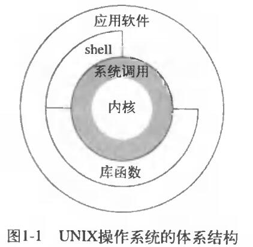
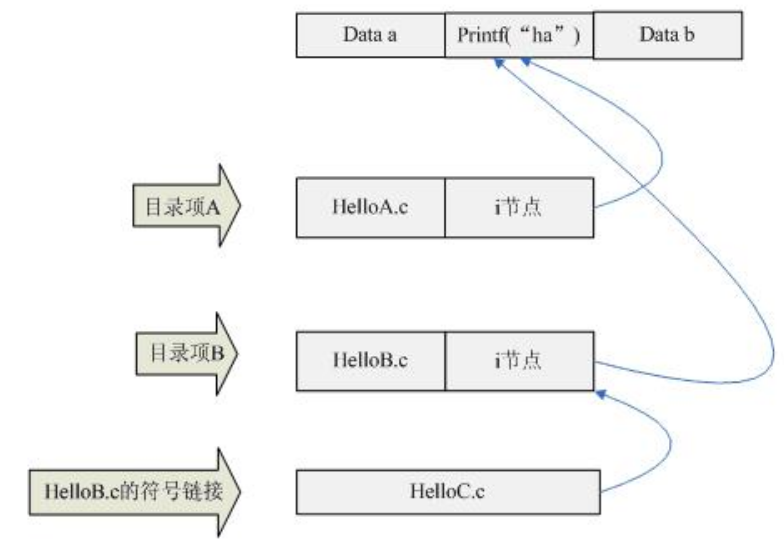

[TOC]

# 操作系统体系结构

​        Linux是一套免费使用和自由传播的类Unix操作系统，是GNU操作系统的内核。Linux和UNIX的最大的区别是，前者是开发源代码的自由软件，而后者是对源代码实行知识产权保护的传统商业软件。狭义的操作系统仅指内核，广义的操作系统如下图所示。

* 系统调用：内核的接口。
* 公共函数库：构建在系统调用接口之上。
* shell解析器：命令解释器，读取用户输入，调用内核接口执行命令。



* glibc官网：[http://www.gnu.org/software/libc/](http://www.gnu.org/software/libc/)
* glibc源码下载：git clone git://sourceware.org/git/glibc.git

# 文件操作

* 系统调用io  

  不带缓冲(每次read、write都触发一次内核调用)，函数名称中不带f(如open、read、write、lseek、close)，函数参数是文件句柄(文件描述符 int)，头文件 `#include <fcntl.h>`


* 标准io库

  带缓冲(全缓存、行缓存、不带缓存)，函数名称带f(如fopen、fread、fwrite、fgets、fclose等)，函数的参数是文件指针(文件流 FILE*)，头文件`#include <stdio.h>`


* fd和FILE*的区别

  FILE结构函数可以看作是对fd直接操作的系统调用的封装, 它的优点是带有用户态缓存的IO。FILE在"stdio.h"中有定义。

```c
struct _iobuf {
    char *_ptr;        // 缓冲区当前指针
    int _cnt;          // 当前缓冲区的相对位置
    char *_base;       // 缓冲区起始位置
    int _flag;         // 文件读写模式
    int _file;         // 文件描述符！！！
    int _charbuf;      // 缓冲区剩余字节个数
    int _bufsiz;       // 缓冲区大小
    char *_tmpfname;   // 临时文件名
};
typedef struct _iobuf FILE;
```

* 三个特殊的文件

   描述符int(POSIX名称)---STDIN_FILENO(0)/STDOUT_FILENO(1)/STDERR_FILENO(2)   

  文件指针FILE*---stdin/stdout/stderr   

  通常这三个文件都与终端联系，如fprintf(stderr,"error message")，文件输出到终端  

## 系统调用IO

```c
#include <stdlib.h>
#include <stdio.h>
#include <fcntl.h>
#include <unistd.h>
#include <assert.h>
#include <sys/stat.h>

/*
主题：系统调用文件操作。
头文件： <fcntl.h>

特殊文件描述符：
标准输入0 (POSIX符号常量- STDIN_FILENO) 
标准输出1 (STDOUT_FILENO)
标准错误输出2 (STDERR_FILENO)

系统调用文件操作：
int open(const char *pathname, int flags, mode_t mode)
openflags：
    O_RDONLY
    O_WRONLY
    O_RDWR
    O_APPEND
    O_CREAT
    O_TRUNC
int creat(const char *pathname, mode_t mode);  -- 只写方式创建并打开新文件
int close(int fd)  -- 进程终止时，内核会自动关闭所创建的文件
off_t lseek(int fd, off_t offset, int whence)  -- 为打开的文件设置偏移量（空洞文件不占存储区）
ssize_t read(int fd，void* buf, size_t count)
实际读取的数据量(ssize_t)可能小于期望读取的数据量(count),比如：
1. 普通文件督导期望字节数之前已经到了文件尾部；
2. 从网络读取时，网络的缓冲机构可能造成返回值小于所要求的字节数。
ssize_t write(int fd, const void *buf, size_t count)

原子操作：
1. 追加写文件：使用open函数的O_APPEND选项
2. pread/pwrite
#include <unistd.h>
ssize_t pread(int fd, void *buf, size_t count, off_t offset);    -- 在offset位置开始读取count字节
ssize_t pwrite(int fd, const void *buf, size_t count, off_t offset);   -- 在offset位置开始写入count字节

fsync和fflush的区别：
1. 源：fflush是C函数库(libc.a)中提供的方法，fsync是系统提供的系统调用。
2. 函数原型：fflush参数是FILE*文件指针, fsync参数是文件int描述符。
    int fflush(FILE *_File)
    int fsync(int fd);
3. 功能：
    fflush:是把C库中的缓冲（用户缓冲）调用write函数写到磁盘[其实是写到内核的缓冲区]。
    fsync：是把内核缓冲刷到磁盘上。

文件持久化到磁盘的顺序：
C库缓冲 -- fflush -- 内核缓冲区 -- fsync -- 磁盘


获取文件相关的信息：
int fstat(int fd, struct stat *buf);
int stat(const char *path, struct stat *buf);
int lstat(const char *path, struct stat *buf);
可以获取的信息如：文件的用户id、组id、文件类型、访问权限、
最后一次访问时间、修改时间、对文件io较合适的长度、为文件分配的512字节块的数量。

*/

int main() {

    const char *filename = "D:\\gcctool\\code\\libc_learn\\data\\open.txt";
    // 以读写、追加的方式打开,返回当前最小未用的文件描述符。
    int fd = open(filename, O_RDWR|O_APPEND);      

    if (fd < 0) {
        perror("open failed");
        exit(1);
    }

    // lseek用于显示的设置偏移量，成功返回新的文件偏移量，错误返回-1
    // 打开一个文件，如果未设置O_APPEND选项时，文件偏移量会被设置为0
    // SEEK_CUR->距当前值加offset, offset可正可负。SEEK_END->距文件尾加offset, offset可正可负。
    off_t start = lseek(fd, 0, SEEK_SET);              // 0
    off_t cur = lseek(fd, 12, SEEK_CUR);               // 12
    if ((start == -1 || cur == -1) && errno) {
        perror("leek error");
        exit(1);
    }

    // ssize_t write(int fd, void *buf, size_t nbytes);
    // 返回值通常与nbyte相同，否则表示出错。
    char *wbuf = "I am learning linux c";
    // strlen是字符串的真实长度，sizeof会计算出char*的长度8
    ssize_t w_cnt = write(fd, (void *)wbuf, strlen(wbuf));  
    assert(w_cnt == strlen(wbuf));

    // ssize_t read (int fd, void *buf, size_t nbytes);
    // read成功返回读到的字节数，如已到文件结尾，则返回0。
    if (lseek(fd, 0, SEEK_SET) != -1) {
        char buf[100];
        ssize_t r_cnt = read(fd, (void *)buf, 100);
        printf("count=%d, buf=%s", r_cnt, buf);
    } 

    // fstat 获取文件指针的详情
    struct stat file_stat;
    // fstat(fd, &file_stat);
    stat(".\\src\\fopen_t.c", &file_stat);
    unsigned short st_mode = file_stat.st_mode;// 文件的类型和存取的权限，按位解析
    long st_size = file_stat.st_size;          // 文件大小
    time_t st_atime = file_stat.st_atime;      // 最近一次被访问的时间(access)
    time_t st_mtime = file_stat.st_mtime;      // 文件内容上一次被修改的时间(modify)
    time_t st_ctime = file_stat.st_ctime;      // 文件属性(i节点状态)或者内容上一次被修改的时间（change)
    printf("stat=> st_mode=%d, \nst_size=%ld, \nst_atime=%ld, \nst_ctime=%ld, \nst_mtime=%ld \n",
            st_mode, st_size, st_atime, st_ctime, st_mtime);
    // 判断文件类型
    if (S_ISDIR(file_stat.st_mode)) {
        printf("it is a directory.\n");
    } else if (S_ISREG(file_stat.st_mode)) {
        printf("it is a regular file\n");
    } else {
        unsigned short mode = file_stat.st_mode;
        char s[10];
        itoa(mode, s, 2);  // 转为字符串，进制基数为2
        printf("unknown %s \n",  s);
    }

    close(fd);

    // 三个特殊的文件流指针
    // 文件句柄参数换成STDIN_FILENO、STDOUT_FILENO、STDERR_FILENO，可以对标准输入输出操作。

    system("pause");
    return 0;
}
```


## 标准IO库

```c
#include <stdio.h>
#include <stdlib.h>
#include <assert.h>
#include <string.h>
#include <math.h>
#include <sys/stat.h>

/*
主题：标准IO库文件操作。

头文件：
#include <stdio.h>
FILE *fopen(const char *path, const char *mode);

mode介绍：
"r"： 只读模式打开
"r+"： 读写模式打开
"w"： 只写模式打开，如果不存在会新建，如果有会内容清零
"w+"：读写模式打开，如果不存在会新建，如果有会内容清零
"a"： 追加模式只写
"a+"： 追加模式读写
"b"： 二进制文件打开，在Linux加不加此模式无区别

什么时候用fflush？
fflush即清空缓存，
如果给定的文件流是一个输出流（内存->磁盘文件），fflush把输出到缓冲区的内容写入文件；
如果给定的文件流是一个输入流（文件->内存），fflush会清空输入缓冲区。
几处应用：
(1) flush(stdin) 刷新标准输入缓冲区，把输入缓冲区里的东西丢弃。
    int main() {
        printf("input a char\n");
        char a = getchar();
        fflush(stdin);  // getchar之后，输入n，按下回车就会被getchar接收到并保存到a中
        char b = getchar(); // 但是回车键'\n'在缓冲区中会被b接收，fflush可以清空缓冲区中的'\n'
        fflush(stdin);
        printf("you have put a=%c, b=%c\n", a, b);
        system("pause");
    }
(2) fflush(stdout) 刷新标准输出缓冲区，把输出缓冲区里的东西打印到标准输出设备上。
    如程序在输出到屏幕前发生了错误，调用此函数可以保证任意时间把调试输出打印到屏幕。
(3) 一般fflush不应该在读取文件的时候用，而应该在写入文件时用。
    另外，fclose关闭文件时会清空缓冲区；
    exit、return退出程序时，所有打开文件都会自动关闭，文件关闭时会清空缓冲区。

流的分类：
全缓冲：在填满标准IO缓冲区后才进行实际的IO操作。
行缓冲：在输入输出中遇到换行符时，标准IO库执行IO操作。（说明：缓冲区满即使没有遇到换行符，也进行IO）
不带缓冲：直接系统调用，立即执行IO。
默认值：标准出错流默认是不带缓冲的；涉及终端设备的流默认是行缓冲的；否则是全缓冲的。
可以调用setbuf函数更改缓冲类型和缓冲区大小。
任何时候我们都可以调用fflush冲洗一个流，是未写数据都传送至内核。

多线程通过fwrite写一个文件可能会存在线程不安全的问题，解决办法：
1、 在打开文件时，加锁，fwrite之后fclose,并释放锁。
2、 修改文件打开的权限为fopen(fileName, "a+"),并在fwrite后使用fflush(fp)刷出流。

*/

int main() {
    const char *filename = "data\\fopen.txt";

    FILE *pFile;
    pFile = fopen(filename, "w+");   // 以读写方式打开，文件不存在则创建

    if (pFile == NULL) {
        printf("open failed, filename=%s\n", filename);
        exit(0);           // 打开文件错误退出程序
    }

    // ********************每次一个字符的I/O
    // fputc 成功返回写入的字符，失败返回-1(EOF)
    char ch = 'y';
    char rch1 = fputc(ch, pFile);
    if (rch1 == EOF) {
        printf("fputc failed\n");
        exit(0);
    }
    assert(rch1 == ch);

    // fgetc 成功返回读取的字符，失败返回-1(EOF)
    fseek(pFile, 0, SEEK_SET);
    char rch2 = fgetc(pFile);
    if (rch2 == EOF) {
        printf("fgetc failed\n");
        exit(0);
    }
    assert(rch2 == 'y');

    // ******************** 每次一行的I/O
    // 功能等同于 fseek(pFile, 0, SEEK_SET);
    rewind(pFile); 
  
    // fputs 一次写入一个字符串，遇到null就停止
    // 成功返回非负值，失败返回-1(EOF)
    char *buf = "I love China";
    if(fputs(buf, pFile) == EOF) {
        printf("fputs failed\n");
        exit(0);
    }

    rewind(pFile);
    // fgets 成功返回buf，失败或到达文件尾返回NULL
    char r_buf[100];
    char *r_buf2 = fgets(r_buf, 100, pFile);
    if (r_buf2 == NULL) {
        printf("fgets failed\n");
        exit(0);
    }
    assert(strcmp(r_buf2, r_buf) == 0);

    // ******************** 直接I/O（二进制IO）
    rewind(pFile);
    // fwrite/fread 返回度或者写的对象数量
    // 读写一个二进制数组
    float data[10] = {1.2, 3.4, 5.6, 6.6, 7.7, 8.8};
    size_t fw_cnt = fwrite(&data[2], sizeof(float), 3, pFile);     // 5.6, 6.6, 7.7
    assert(fw_cnt == 3);

    rewind(pFile);
    float rdata[10];
    size_t fr_cnt = fread(rdata, sizeof(float), 2, pFile);     // 读出来 5.6 6.6
    assert(fr_cnt == 2);
    assert(fabs(rdata[0] - 5.6) < 1e-6);         // 1e-6表示10的负6次幂，表示一个很小的数
    assert(fabs(rdata[1] - 6.6) < 1e-6);

    // 读写一个结构体
    rewind(pFile);
    struct Item
    {
        char name[20];
        short age;
    };
    struct Item item = {"Lily", 18};
    size_t n = fwrite(&item, sizeof(item), 1, pFile);
    assert(n == 1);      // 写入对象个数

    rewind(pFile);
    struct Item ritem;
    if (1 != fread(&ritem, sizeof(ritem), 1, pFile)) {
        printf("fread failed\n");
        // fread 读取的对象数量少于预期，如何判断是读到了文件尾部，还是出错了？
        // feof判断文件结束是通过读取函数fread/fscanf等返回错误来识别的，
        // 故而判断文件是否结束应该是在读取函数之后进行判断。
        if(feof(pFile)) {                          // 到了文件尾部
            printf("has reached end of file");
        } else if (ferror(pFile)) {                // 其他错误
            printf("fail to read file");           
        }
        exit(0);
    }
    printf("name=%s, age=%d\n", ritem.name, ritem.age);

    // 二进制IO存在的不兼容、不可跨平台的问题：
    // 对于同一个结构体，不同编译器和系统可能有不同的对齐规则
    // 对于多字节整数、浮点数，不同机器体系结构间也占不同字节数

    // 获取文件相关信息
    long fsize = ftell(pFile);
    if( -1 == fsize) {
        printf("ftell failed\n");
        exit(0);
    }
    assert(fsize == 22);                               // 22字节

    // fstat 获取文件指针的详情
    // 从文件指针FILE*中获取文件的描述符(句柄)，以文件句柄为参数进行系统调用
    int fd = fileno(pFile);
    struct stat file_stat;
    fstat(fd, &file_stat);
    unsigned short st_mode = file_stat.st_mode;// 文件的类型和存取的权限，按位解析
    long st_size = file_stat.st_size;          // 文件大小
    time_t st_atime = file_stat.st_atime;      // 访问时间
    time_t st_ctime = file_stat.st_ctime;      // 创建时间
    time_t st_mtime = file_stat.st_mtime;      // 修改时间
    printf("stat=> st_mode=%d, \nst_size=%ld, \nst_atime=%ld, \nst_ctime=%ld, \nst_mtime=%ld",
                st_mode, st_size, st_atime, st_ctime, st_mtime);

    fclose(pFile);

    system("pause");
    return 0;
}
```

c标准IO库，字符、字符串操作

```c
#include <stdio.h>
#include <stdlib.h>
#include <string.h>

/*
#include<stdio.h>

标准输入输出流--字符、字符串操作
    int getc(FILE *stream);
    int getchar(void);                     // 等价于 getc(stdin)
    int ungetc(int c, FILE *stream);       // 将字符压回流中，成功返回c，失败返回EOF
    char* gets(char *buf);

    int putc(int c, FILE *stream);
    int putchar(int c);                   // 成功返回c，失败返回EOF
    int puts(const char *s);

文件--字符、字符串操作
    int fgetc(FILE *stream);
    char* fgets(char *buf, int size, FILE *stream);      // 成功返回buf，失败返回NULL

    int fputc(int c, FILE *stream);
    int fputs(const char *s, FILE *stream);         // 成功返回非负数，失败返回EOF
*/

int main() {

    // ************************* getchar/putchar 标准输入输出，字符IO
    printf("getchar/putchar: Enter 2 char\n");

    char c1 = getchar();
    fflush(stdin);         // 冲洗掉缓冲区中的换行符
    char c2 = getchar();
    fflush(stdin);         // 冲洗掉缓冲区中的换行符

    if (c1 != EOF) { putchar(c1);  putchar('\n'); }
    if (c2 != EOF) { putchar(c2);  putchar('\n'); }

    // ************************* fgetc/fputc 文件，字符IO
    printf("\n\n\nfgetc/fputc: \n");

    FILE *fp = fopen(".\\data\\stdio.txt", "w+");
    fseek(fp, 0, SEEK_SET);
    char charset[] = "testfgetcfputc";
    for (char *p = charset; *p != '\0'; p++) {
        fputc(*p, fp);
    }

    fseek(fp, 0, SEEK_SET);
    char c;
    while((c = fgetc(fp)) != EOF) {
        printf("%c ", c);
    }

    // ************************* gets/puts 标准输入输出，行IO
    printf("\n\n\ngets/puts: \n");

    char sbuf[100];
    gets(sbuf); 

    char sbuf2[200] = "testgetsputs";
    strcat(sbuf2, sbuf);
    // sprintf(sbuf2, "%s%s", sbuf2, sbuf);
    puts(sbuf2);

    // ************************* fgets/fputs 文件，行IO
    printf("\n\n\nfgets/fputs: \n");
    fseek(fp, 0, SEEK_SET);
    char buf[100] = "testfgetsfputs";
  	// 遇到换行符、行缓冲区满、或者字符串结束标识'\0'，则写入结束
    fputs(buf, fp);           

    fseek(fp, 0, SEEK_SET);
    char buf2[100];
    fgets(buf2, 100, fp);
    // 读取的数据不超过100， 遇到换行符号或者文件结束标识EOF(-1)，则读取结束。
    puts(buf2);   
    system("pause");    
    return 0;
}
```


## c++ IO

```c++
#include <iostream>
#include <cstdlib>
#include <cstring>
#include <iomanip>
#include <bitset>
#include <fstream>
#include <string>

using namespace std;

/*
主题：c++ IO
c++的IO是围绕流对象进行的
头文件
#include <ostream>
#include <istream>
#include <iostream>
#inlcude <ifstream>
#include <ofstream>
#include <fstream>

标准输入输出流对象：
cin
cout
cerr

创建文件流对象：
fstream f("a.txt", ios::in | ios::out);
或者
ofstream fout;
fout.open("a.txt", ios::out);

定义文件流对象时，打开方式如下：
ios::in      : 以输入方式打开文件流
ios::out     ：输出
ios::app     ： 追加
ios::binary  ： 二进制

文件流对象输入输出方式：
1. 通过流插入和提取运算符： <<  >>
2. 通过成员函数： put/get/getline等
*/

class Student
{
private:
    string _name;
    int _age;
public:
    Student(string name="", int age=-1):_name(name), _age(age) {}
    void show() {
        cout << "<name=" << this->_name << ", age=" << this->_age << ">" << endl;  
    }
};

int main()
{
    // ****************cin 标准输入流对象，和终端关联
    char ch1 = cin.get();
    cout << "get a char from stdin stream: " << ch1 << endl;
    cin.putback(ch1);            // 把ch1放回到输入流
    if (cin.peek() == ch1) {     // 查看下一个输入流中的字符，不移除流
        cout << "char in stdin stream = ch1" << endl;
    }
    cin.ignore(5);               // 忽略掉5个字符
    char str[11];
    cin.getline(str, 11);       // 读取剩余的字符
    cout << "str left is: "<< str << endl;

    // ********************cout 标准输出流对象，和终端关联
    char ss[10] = "12345";
    cout.put('a');                  // 向标准输出打印一个字符
    cout.write(ss, strlen(ss));     // 向标准输出打印一个字符串
    cout.flush();                   // 清空缓冲
    
    // 宽度是10，左对齐，x补齐
    cout << setw(10) << setfill('x') << setiosflags(ios::left) << "abcd" << endl;

    // 宽度是10，定点方式表示实数，保留3位小数
    cout << setw(10) << setiosflags(ios::fixed) << setprecision(3) << setfill(' ') << "12.345215" << endl; 

    int data = 15;
    cout << hex << data << endl;                   // 十六进制大写
    cout << oct << data << endl;                   // 八进制
    cout << bitset<sizeof(int)*8>(data)  << endl;  // 二进制

    // *******************fstream
    fstream f1("src\\file1.txt", ios::in | ios::out);    // 以可读可写的方式打开文件流f1
    if (!f1) {
        perror("open f1 failed");
        system("pause");
        return -1;
    }
    if (f1) {
        f1.put('a');
        f1.put('\n');              // 写入一个字符

        f1.flush();                // 冲洗输入流

        f1 << "hello world" << endl;  // 写入字符串

        f1.close();
    }

    ifstream fin;
    fin.open("src\\filein.txt", ios::in);   // 以读的方式打开输入流
    if (fin) {
        char ch = fin.get();                // 读一个字符
        cout << "get=" << ch << endl;

        char str[100];
        fin.getline(str, sizeof(str));      // 读一行字符串
        cout << "getline" << str << endl;

        while(!fin.eof()) {                 // 环循读取各行，直到结尾
            memset(str, 0, sizeof(str));
            fin >> str;
            cout << "str=" << str << endl;    
        }
        fin.close(); 
    }

    // **********************二进制文件读写
    Student s1("zhangsan", 18);
    Student s2("lisi", 20);

    fstream fbi("src\\fbi.txt", ios::in | ios::out | ios::binary);
    if (!fbi) {
        perror("open fbi failed:");
        system("pause");
        return -1;
    }
    fbi.seekp(ios::beg);      // 设置输出文件流的指针
    fbi.write((char *)&s1, sizeof(Student));
    fbi.write((char *)&s2, sizeof(Student));
    fbi.flush();

    fbi.seekg(0, ios::beg);     // 设置输入文件流的指针
    Student *stmp = new Student();
    while (!fbi.eof()) {   
        fbi.read((char *)stmp, sizeof(Student));
        fbi.flush();
        stmp->show();
    }
    fbi.close();

    system("pause");
    return 0;
}
```


# 格式化IO

```c
#include <stdio.h>
#include <stdlib.h>
#include <string.h>
#include <assert.h>

/*
格式化I/O
头文件：<stdio.h>

int scanf(const char *format, ...);      // 从标准输入接收的字符串，格式化到指定变量中
int printf (const char *format, ...);    // 格式化打印到标准输出


int fscanf(FILE *stream, const char *format, ...)    // 从文件中读取的字符串格式化到指定变量中
int fprintf (FILE *stream, const char *format, ...)  // 格式化打印到文件   

int sscanf(const char *source, const char *format, ...)           // 字符串格式化到指定变量中
int sprintf (char *stream, const char *format, ...)               // 格式化打印到字符串
int snprintf (char *stream, size_t n, const char *format, ...)    // 格式化打印到字符串，指定截断长度

int printf(const char * format，...);                            // 格式化到标准输出
int sprintf(char *str, const char *format，...); 
int snprintf(char *str, size_t size, const char *format, ...);   // 格式化到字符串
int fprintf(FILE *fptr, const char *format, ...);                // 格式化到文件

说明：
*printf版本：成功返回存入字符串的字符数，失败则返回负数。
*scanf版本：成功返回指定的输入项数，失败返回EOF

int i=43;    
printf("%d\n", printf("%d\n", printf("%d\n",i)));
        2\n            3\n    43\n -- 3个字符
输出：
43
3
2 

*/

void test_scanf_printf() {
    char name[10];
    char ch;
    int age;

    // scanf 通过标准输入(键盘)格式化到指定变量
    // 键盘输入> name=zs age=18 flag=y
    scanf("name=%s age=%d flag=%c", name, &age, &ch);
    //printf 格式化打印到标准输出(终端)
    printf("you have input=>name=%s, age=%d, flag=%c\n", name, age, ch);
}

void test_fscanf_fprintf() {

    FILE *fp;
    char* fileName="D:\\gcctool\\code\\libc_learn\\data\\scanf.txt"; 
    fp = fopen(fileName, "w+");
    if (fp == NULL) {
        perror("fopen failed");       // 打印errno报错详情
        exit(0);
    }

    // fprintf 格式化打印到文件中
    int size1 = fprintf(fp, "%s %d\n", "zs", 100);
    int size2 = fprintf(fp, "%s %d\n", "ls", 200);
    int size3 = fprintf(fp, "%s %d\n", "ww", 300);
    assert(size1 == 7 && size2 == 7 && size3 == 7);   // 返回写入的字节数

    // fscanf 从文件中读取的字符串格式化到n个变量
    fseek(fp, 0, SEEK_SET);
    char name[10];
    int age;
    while(!feof(fp)) {
        fscanf(fp, "%s %d", name, &age);   // 格式化到变量
        printf("<%s %d>\n", name, age);    // 输出到终端
    }

    fclose(fp);
}

void test_sscanf_sprintf() {
    char name1[20] = "Lily";
    char name2[20] = "Lucy";
    int  age = 18;

    // sprintf 格式化打印到字符串
    char res[100];
    int cnt1 = sprintf(res, "name=%s age=%d", name1, age);        // 应用1：格式化数据
    // name=Lily age=18
    assert(cnt1==16);
    assert(strcmp(res, "name=Lily age=18") == 0);

    int cnt2 = sprintf(res, "%s%s", name1, name2);                 // 应用2：字符串拼接
    // LilyLucy
    assert(cnt2 == 8);
    assert(strcmp(res, "LilyLucy") == 0);

    // snprintf 格式化打印到字符串，并指定截断长度
    char nres[100];
    int n1 = snprintf(nres, 5, "%s", "hello12345678");
    printf("cnt=%d res=%s\n", n1, nres);        // cnt=-1, hello
    int n2 = snprintf(nres, 50, "%s", "hello12345678");
    printf("cnt=%d res=%s\n", n2, nres);        // cnt=13, hello

    // sscanf 字符串格式化到n个变量
    int y, m, d, H, M;
    sscanf("2019-10-10 12:45", "%d-%d-%d %d:%d", &y, &m, &d, &H, &M);
    assert(y == 2019 && m == 10 && d == 10 && H == 12 && M == 45);
}


int main() {

    printf("************ test scanf/printf *************\n");
    test_scanf_printf();

    printf("************ test fscanf/fprintf *************\n");
    test_fscanf_fprintf();

    printf("************ test sscanf/snprintf/sprintf *************\n");
    test_sscanf_sprintf();

    system("pause");
    return 0;
}
```


# 时间日期操作

```c
#include <stdlib.h>
#include <stdio.h>
#include <time.h>

/*
whatis time
man 2 time
(1) time：返回1970-1-1, 00:00:00以来经过的秒数（时间戳）。
#include <time.h>
time_t time(time_t *t);      // 成功返回秒数，失败返回-1
举例：结果可以通过参数或者返回值得到
time_t now;
time(&now);// 等同于now = time(NULL)
(2) localtime：将时间数值变换成本地时间，考虑到本地时区和夏令时标志;
#include <time.h>
struct tm *localtime(const time_t * calptr);
struct tm {
        int tm_sec;       // 秒 – 取值区间为[0,59]
        int tm_min;       // 分 - 取值区间为[0,59]
        int tm_hour;      // 时 - 取值区间为[0,23]
        int tm_mday;      // 一个月中的日期 - 取值区间为[1,31]
        int tm_mon;       // 月份（从一月开始，0代表一月） - 取值区间为[0,11]
        int tm_year;      // 年份，其值等于实际年份减去1900
        int tm_wday;      // 星期 – 取值区间为[0,6]，其中0代表星期天，1代表星期一
        int tm_yday;      // 从每年1月1日开始的天数– 取值区间[0,365]，其中0代表1月1日
        int tm_isdst;     // 夏令时标识符，夏令时tm_isdst为正；不实行夏令时tm_isdst为0
};
(3) 时间戳转格林威治标准时间，即未经时区转换的UTC时间。
struct tm *gmtime(long *clock);

(4) 结构体时间转时间戳
time_t mktime(strcut tm * timeptr);

(5) 将tm结构类型时间日期转换为ASCII码。
char *asctime(const struct tm *tblock);

(6) times: 获取进程及其子进程的时钟时间、用户cpu时间、系统cpu时间
#include <sys/times.h>
clock_t times(struct tms *buf);
struct tms {
    clock_t tms_utime;      // user time
    clock_t tms_stime;      // system time
    clock_t tms_cutime;     // user time of children
    clock_t tms_cstime;     // system time of children
};
int sc_clk_tck = sysconf(_SC_CLK_TCK); // 每秒时钟滴答数
返回的clock_t除以时钟滴答数，得到秒数。
*/

int main() {

    time_t t;
    struct tm *gmt, *area;
    t = time(NULL);              // 时间戳
    area = localtime(&t);        // 本地时间
    printf("Local time is: %s", asctime(area));         // Mon Nov 18 18:00:39 2019
    gmt = gmtime(&t);            // 格林威治时间（UTC时间）
    printf("GMT is: %s", asctime(gmt));                 // Mon Nov 18 10:00:39 2019

    // 转时间戳
    // 从公元1970年1月1日0时0分0 秒算起至今的UTC时间所经过的秒数。
    time_t t1 = mktime(area);
    time_t t2 = mktime(gmt);
    printf("t1=%ld t2=%ld", t1, t2);

    system("pause");
    return 0;
}
```


# 字符串操作

```c
#include <string.h>
#include <stdlib.h>
#include <stdio.h>
#include <assert.h>

/*
strcpy_s是strcpy的安全版本：
举例说明：
char buf[2];
strcpy(buf, "1234567"):
以buf为起点的*(buf+3)也就是buf[3]被写入值, 
但是, 此时也许这个buf+3这个位置被其它的程序或变量使用时, 则会改变其它变量的值。

strcpy_s(buf,2,"1234567")：
告诉程序它只有两个字节, 此时, 程序不会将数据写入到 buf+3的地址中, 所以它更安全。

字符串基本操作：
拷贝
strcpy_s
strncpy
strncpy_s
memcpy
memmove

拼接
strcat

比较
strcmp(memcmp)
stricmp
strncmp

查找
strchr(memchr)
strrchr
strstr

赋值(初始化)
memset

计算长度
strlen(不包括\0在内)

类型转换
atoi
atof
atol
*/

int main() {

    {
        char str1[] = "123456789";
        char str2[] = "hello";
        // 字符串拷贝，先清空 str1，再拷贝
        // 注意：strlen(s)计算的长度不包括\0， 这里需要+1
        strcpy_s(str1, strlen(str2)+1, str2);       // assert(strcmp(str1, "hello") == 0);
        
    }
    {
        char str1[] = "123456789";
        char str2[] = "hello";
        // 拷贝前n个
        strncpy(str1, str2, 2);   // assert(strcmp(str1, "he3456789") == 0);
        memcpy(str1, str2, 4);    // *** mem版本  assert(strcmp(str1, "hell56789") == 0);
        // 目标区域和源区域有重叠的话memmove比以上版本更安全，
        // 它能够保证源串在被覆盖之前将重叠区域的字节拷贝到目标区域中。
        memmove(str1, str2, 5);   // *** mem版本  assert(strcmp(str1, "hello6789") == 0);
        
    }   
    {
        char str1[] = "123456789";
        char str2[] = "hello";
        // 先清空再拷贝
        // 第二个参数是目标缓冲区的大小，防止dest中空间不够
        strncpy_s(str1, strlen(str1)+1, str2, 4);       // assert(strcmp(str1, "hell") == 0);    
    } 
    {
        char str1[20] = "123456789";
        char str2[] = "hello";
        // 字符串拼接 
        // 拼接后的长度不大于str1的长度
        strcat(str1, str2);    //  assert(strcmp(str1, "123456789hello") == 0);
    }
    {
        char str1[20] = "123456789";
        char str2[] = "hello";
        // 字符串拼接，拼接前n个
        strncat(str1, str2, 2);     // assert(strcmp(str1, "123456789he") == 0);   
    }
    {
        char str1[] = "heLLO";
        char str2[] = "hello";
        // 字符串比较
        int ret = strcmp(str1, str2);
        if (ret == 0) {
            printf("str1=str2");
        } else if (ret > 0) {
            printf("str1 > str2");
        } else {
            printf("str1 < str2");
        }

        // 比较前n个
        assert(strncmp(str1, str2, 2) == 0);
        assert(memcmp(str1, str2, 2) == 0);    //  *** mem版本

        // 忽略大小写
        assert(stricmp(str1, str2) == 0);
    }
    {
        char str[] = "Lucy like china";
        // 查找首次出现字符i的位置
        char *p = strchr(str, 'i');       // assert(strcmp(p, "ike china") == 0);
        //  *** mem版本 在前10个字符中找字符首次出现的位置
        char *mp = memchr(str, 'i', 10);   // assert(strcmp(mp, "ike china") == 0);
        
        // 反向查找
        char *rp = strrchr(str, 'i');      // assert(strcmp(rp, "ina") == 0);
        
        // 查找子串"chi"出现的位置
        char *ps = strstr(str, "chi");     // assert(strcmp(ps, "china") == 0);
    }
    {
        char str[10];
        // 赋值n个字符c到str指向的位置 mem版本不仅限于字符串处理
        // void *memset(void *str, int c, size_t n) 
        memset(str, 0, sizeof(str));  // 初始化
    }
    {
        // 类型转换
        char str[] = "12.34";
        int i = atoi(str);          // 12
        double d = atof(str);       // 12.340000
        long l = atol(str);         // 12
    }

    system("pause");
    return 0;
}
```


# 多线程

## c多线程

```c
#include <stdlib.h>
#include <stdio.h>
#include <unistd.h>
#include <pthread.h>

/*
1. 创建并启动一个线程：
    int pthread_create(pthread_t *th, const pthread_attr_t *attr, 
                       void *(* func)(void *), void *arg);
    参数说明：
    线程id；
    线程属性指针，缺省为NULL;
    线程函数；
    线程函数的参数；

2. 结束线程
    void  pthread_exit(void *res);   // res存放线程结束时的退出状态

3. 等待指定线程结束
    说明：假设 A 线程调用 pthread_join 试图去操作B线程，
    该函数将A线程阻塞，直到B线程退出，当B线程退出以后，A线程会收集B线程的返回码。
    int pthread_join(pthread_t t, void **res);
    参数说明：
    t 要等待结束的线程id。
    res指向的位置存放的是终止线程的返回状态，缺省为NULL。
    
// TODO
线程同步

*/

int *threadFun(void* args) {
    int *index = (int *)args;
    for (int i = 0; i < 5; i++) {
        printf("tread=%d, put=%d\n", *index, i);
    }
    return NULL;
}

int main() {
    pthread_t pid1, pid2;
    printf("mian thread id = %d\n", pthread_self());

    int thread_1 = 100;
    int ret1 = pthread_create(&pid1, NULL, (void *)threadFun, (void *)&thread_1);
    int thread_2 = 200;
    int ret2 = pthread_create(&pid2, NULL, (void *)threadFun, (void *)&thread_2);

    if (ret1 != 0 || ret2 != 0) {
        printf("thread create failed\n");
        exit(0);
    }

    pthread_join(pid1, NULL);
    pthread_join(pid2, NULL);

    system("pause");
    return 0;
}
```


## c++多线程

# 内存分配

```c
#include <string.h>
#include <stdlib.h>
#include <stdio.h>

/*
预备知识：
c/c++程序的内存分配：
    栈区： 由编译器自动分配释放，存放函数的参数值，局部变量的值等。
    堆区： 由程序员分配释放。malloc/free、new/delete
    静态存储区（全局区）：初始化全局变量和静态变量。
    初始化的全局变量和静态变量在一块区域，未初始化的全局变量和未初始化的静态变量在相邻的另一块区域。
    程序结束后由系统释放。
    文字常量区：如常量字符串就是放在这里的，程序结束后由系统释放。
    程序代码区

char*和char[]的区别:
    char *a1="hello world";
    char a2[]="123456789";

    a1是字符指针，指向的字符串存放在文字常量区，无法修改；赋值在编译时就确定了（常量区）。
    a2是字符数组，数组存放在栈中，可以被修改；赋值是在运行时确定的（栈区）。

*/

void test_memory() {
    int b;            // 栈
    char s[]="abc";   // 栈
    char *p2;         // 栈
    char *p3="123456";   // 123456\0在常量区，p3在栈上。
    static int c = 0;    // 全局（静态）初始化区
    p2 = (char*)malloc(20); //分配得来得20字节的区域就在堆区。
    strcpy(p2,"123456");   //123456\0放在常量区，编译器可能会将它与p3所向"123456"优化成一个地方。
}

int main() {

    char *a1="000456789";
    char a2[20]="111456789";
    printf("a1=%s \na2=%s \n", a1, a2);
    // 8 20 这个类型需要开辟的空间
    printf("sizeof(a1)=%d  sizeof(a2)=%d \n", sizeof(a1), sizeof(a2)); 
    // 9 9  字符串长度
    printf("strlen(a1)=%d  strlen(a2)=%d \n", strlen(a1), strlen(a2));   

    // a1[3] = 'm';        // Error 静态存储区(常量区) 不可更改
    a2[3] = 'm';
    printf("a1=%s \na2=%s \n", a1, a2);

    strcat(a2, a1);
    printf("a1=%s \na2=%s \n", a1, a2);  // a2 => 111m56789000456789

    // strcat(a1, a2);    // Error 静态存储区(常量区) 不可更改
    printf("a1=%s \na2=%s \n", a1, a2);      

    system("pause");
    return 0;
}
```

# 目录操作

```c
#include <stdlib.h>
#include <stdio.h>
#include <unistd.h>
#include <sys/stat.h>
#include <dirent.h>

int main() {

    // DIR* opendir (const char*);
    DIR * dir = opendir(".");         // 打开目录文件，成功返回指针，出错返回NULL
    // struct dirent* readdir (DIR*);   
    struct dirent* ptr;
    // 循环读取目录中所有子目录和文件，成功返回指针，到目录结尾或者出错返回NULL
    while ((ptr = readdir(dir)) != NULL) {
        printf("dirname: %s\n", ptr->d_name);  
    }
    closedir(dir);
    
    system("pause");
}
```

# errno

c语言没有try...catch

通过errno监控代码异常。

```c
#include <stdlib.h>
#include <stdio.h>
#include <math.h>
#include <error.h>
#include <string.h>

/*
errno: 保留最后一次调用c方法的错误代码。

#include <stdio.h>
void perror(const char *s);
参数s是用户提供的字符串，输出这个字符串，后面跟着一个冒号和空格，
然后是基于当前errno的值进行的错误类型描述。

#include <string.h>
char * strerror(int errnum);
这个函数将errno的值作为参数，并返回一个描述错误的字符串

*/

int main() {

    errno = 0;       // 任何一个函数都不会将error置为0
    int s = sqrt(-1);
    if(errno) {
        printf("error num=%d\n", errno);                // error num=33
        perror("sqrt failed");                          // sqrt failed: Domain error
        printf("stderr(errno)=%s\n", strerror(errno));  // stderr(errno)=Domain error
    }

    system("pause");
    return 0;
}
```

# 其他系统调用

```c
// 测试文件的某种权限或者文件是否存在：
// mode：F_OK(存在)  W_OK/R_OK/X_OK(可以使用)
// 返回值：0-成功；1-失败；
#include<unistd.h>
int access(const char* pathname, int mode);

// 更改访问权限：
// 条件：进程有效用户id必须等于文件的所有者id，或者进程具有超级用户权限；操作对象必须是打开的文件。
// 返回值：若成功则返回0，若出错则返回-1。
#include <sys/stat.h>
int chmod( const char *pathname, mode_t mode );
int fchmod( int fd, mode_t mode );

// 修改文件的用户id和组id
// 返回值：若成功则返回0，若出错则返回-1
// 说明：更改文件的用户ID和组ID，参数owner或group中的任意一个是-1，则对应的ID不变。
#include <unistd.h>
int chown( const char *pathname, uid_t owner, gid_t group );
int fchown( int filedes, uid_t owner, gid_t group );
int lchown( const char *pathname, uid_t owner, gid_t group );

// 修改文件的长度为length字节，长则截断，短则产生空洞。
// 返回值：成功则返回0，失败返回-1，错误原因存于errno
#include <unistd.h>
int truncate(const char *path, off_t length);
int ftruncate(int fd,off_t length);


// 创建指向现有文件的硬链接
// 硬链接的限制：1.不能跨文件系统。 2. 只有超级用户才能创建指向一个目录的硬链接。
#include <unistd.h>  
int link(const char* oldpath, const char* newpath);

// 创建一个符号链接
int symlink(const char *actualpath, const char *sympath);

// 不跟随符号链接，打开链接文件本身，并读取该链接中的名字。
// 返回值 ：成功返回字符串的字符数，失败返回-1，错误存于errno
ssize_t readlink(const char *path, char *buf, size_t bufsiz);

// 原子性的删除一个现有的目录项并将由参数 pathname所引用文件的链接计数减1。
int unlink(const char* pathname);

#include<stdio.h>
int remove(const char * pathname);    // 解除连接，相当于文件的unlink，目录的rmdir
int rename(const char *oldname, const char *newname);    // 文件或目录更名

#include<unistd.h>
int rmdir(const char *pathname);

// 说明：更改文件的访问时间和内容修改时间。
// 返回值：若成功则返回0，若出错则返回-1
#include <utime.h>
int utime( const char *pathname, const struct utimbuf *times );

struct utimbuf {
    time_t actime;    /* access time */
    time_t modtime;    /* modification time */
}

// 说明：更改进程当前工作目录。
// 返回值：若成功则返回0，若出错则返回-1
#include <unistd.h>
int chdir( const char *pathname );
int fchdir( int fd );            // fd指向一个目录文件

// 返回值：若成功则返回buf，若出错则返回NULL
char *getcwd( char *buf, szie_t size );

// 流重定向
// 决定所读写的字符是单字节还是多字节，
// 在流上使用单字节IO函数，则流被设置为字节定向，若宽字节则被设置为多字节定向。
#include <stdio.h>
FILE *freopen( const char *path, const char *mode, FILE *stream );
// 功能：实现重定向，把预定义的标准流文件(stdin/stdout/stderr)定向到由path指定的文件中。
// 默认值：stdin键盘；stdout屏幕；stderr屏幕。
// 通过调用freopen，就可以修改标准流文件的默认值，实现重定向。
int main() 
{ 
    int a,b; 
    freopen("debug\\in.txt","r",stdin); // 输入重定向，输入数据将从in.txt文件中读取 
    freopen("debug\\out.txt","w",stdout); // 输出重定向，输出数据将保存在out.txt文件中 
    while(scanf("%d %d",&a,&b)!=EOF) 
    printf("%d\n",a+b); 
    fclose(stdin);//关闭文件 
    fclose(stdout);//关闭文件 
    return 0; 
} 

// 设置流定向
#include <wchar.h>
int fwide(FILE *fp, int mode);
// 功能：mode负数->字节定向；mode正值->宽定向(多字节定向)；mode为0->不定向，但返回标识流定向的值。

FILE *fopen(char *filename, char *mode);    // 打开一个流
void setbuf(FILE *steam, char *buf);        // 打开和关闭（buf设置为NULL）缓冲机制
int setvbuf(FILE *stream, char *buf, int type, unsigned size);  // 设置缓冲类型和缓冲区大小
int fflush(FILE *stream);                   // 强制冲洗一个流，未写数据传送至内核
FILE *freopen(const char *path, const char *mode, FILE *stream);  // 将一个指定文件打开为一个预定义的流（stdin/stdout/stderr）
FILE *fdopen(int fd, const char *mode); // 是一个标准io流与一个现有的文件描述符结合，常用于管道操作
int fclose(FILE *fp);       // 关闭一个流，释放流缓冲区，冲洗缓冲区数据

// 打开流后，开始进行读写操作...

// 每次一个字符的IO
// getc/fgetc/getchar 从流缓冲区一次读取一个字符，成功返回下一个字符，
// 出错返回EOF，通过ferror和feof判断是出错还是到达文件尾端。

// 每次一行的IO
// 每次读写一行，使用fgets/fputs，每行都以一个换行符终止。

// 直接IO
// 每次读或写一若干个结构(对象)，使用fread/fwrite。

int feof(FILE *stream);         // 到达文件结尾
int ferror(FILE *stream);       // 流出错
int fileno(FILE *stream);       // 获取文件流对应的文件指针
void clearerr(FILE *stream);    // 清除FILE对象中 出错标志和文件结束标志。

int fseek(FILE *stream, long offset, int whence);     // 成功返回0，失败返回非0
long ftell(FILE *stream);      // 得到当前位置相对于文件首的字节偏移量，成功返回偏移量，失败返回-1
void rewind(FILE *stream);     // 指向文件首，相当于fseek(fp, 0, SEEK_SET)，
int fgetpos(FILE *stream, fpos_t *pos);  // c标准，将文件位置存入pos指向的对象中
int fsetpos(FILE *stream, fpos_t *pos);  // c标准，将流重新定位至pos保存的位置，要移植到非UNIX系统上运行的应用程序应当使用这两个函数

// 创建临时文件
char *tmpnam(char *s);          // 返回指向唯一路径名的指针
FILE *tmpfile(void);            // 成功返回文件指针，失败返回NULL
int mkstemp(char *template);    // template must be "XXXXXX" 成功返回文件描述符，失败返回-1
char *tempnam(const char *dir, const char *pfx);         // 返回指向唯一路径名的指针

#include <unistd.h>
#include <fcntl.h>
int fcntl(int fd, int cmd, ... /* arg */ );
cmd：F_DUPFD ---- 复制文件描述符，调用成功后返回新的文件描述符，与旧的文件描述符共同指向同一个文件。
     F_GETFD/F_SETFD  --- 获取/设置文件描述符的close-on-exec标志
     F_GETFL/F_SETF   --- 获取/设置文件的打开方式
     F_SETLK/F_SETLKW/F_GETLK --- 设置文件记录锁：读写、阻塞方式，第3个参数指向struct flock *lock的结构体, 中间三个参数（whence、start、len）都设置为0，会锁整个文件。
struct flock
{  
    short_l_type;    // 锁的类型 F_RDLCK（共享锁,读锁） F_WDLCK（互斥锁,写锁） 
    short_l_whence;  // 偏移量的起始位置：SEEK_SET,SEEK_CUR,SEEK_END  
    off_t_l_start;   // 加锁的起始偏移
    off_t_l_len;     // 上锁字节
    pid_t_l_pid;     // 锁的属主进程ID
};
```


# 其他知识点

## ssize_t/size_t/off_t

目的：增加代码的可移植性。

* size_t：表达不同平台下较大可能的数据尺寸。

  在32位架构上：typedef unsigned int size_t;

  在64位架构上：typedef unsigned long size_t;

  类似的，ssize_t有符号，size_t无符号。

* off_t：表达不同平台下文件偏移量：

  32位架构上：typedef long off_t;

  64位架构上：typedef long long off_t;

* 格式化打印：

  off_t---- "%jd"

  size_t ----- "%uz"

  ssize_t ---- "%zd"

## linux 文件i节点

linux中，是通过i节点实现文件的查找定位的。i节点可以认为是一个指向磁盘上该文件的存储区的地址，除了存地址，还会保存数据量大小等等文件信息。每一个目录项中都包含了文件名和i节点。如下图：



* 硬链接和软链接(ln source_file dest_file)

  ```shell
  # fileB是fileA的硬链接：fileA和fileB是对等的关系，删掉源文件fileA，磁盘数据不会删除；
  # 只有硬链接数为0的时候，删除文件名时，数据才会在磁盘上删除。
  ln -d fileA fileB

  # fileB是fileA的软链接：符号链接其实是文件索引的索引，从属关系;
  # 当源文件fileA删除之后，其实链接文件还存在，但是无法使用。
  ln -s  fileA fileB
  ```

## exit和return的区别

* exit

  `void exit(int Code)   // Code是程序退出时的状态码 0表示正常退出。`

  exit()其实就是直接退出程序，它在执行完一些清理工作（终止处理程序，刷新输出流并关闭所有打开的流）后就调用_exit直接退出。

* exit和return的区别：

  return是c语言中的关键字，而exit是linux中的系统调用。exit表示终止当前进程，return表示从当前函数返回。在main函数中，exit和return作用是一样的，就是终止进程；如果return出现在子程序中表示返回（例如递归函数的实现），而exit出现在子进程中表示终止子进程。

## linux文件类型

可用通过stat中的st_mode判断。

* 普通文件：文本文件和二进制文件，对于linux内核没有区别，对其内容的解释由处理该文件的应用程序进行。（文本文件以字节为最小存储单元，又叫ascii文件；二进制文件以01比特为最小存储单元）
* 目录文件
* 块设备文件：提供对设备带缓冲的访问，每次以固定的长度为单位（通常是512B的倍数）进行访问，支持随机访问，如硬盘、u盘。
* 字符设备文件：提供不带缓冲的访问，每次访问长度可变，顺序访问。如键盘、鼠标。
* FIFO(命名管道)：用于进程间通信。
* 套接字文件：进程间网络通信。

## extern和restrict关键字

* extern关键字：置于变量或者函数前，以表示变量或者函数的定义在别的文件中。提示编译器遇到此变量或函数时，在其它模块中寻找其定义。

* restrict限定符：用于限定和约束指针，表明这个指针是访问一个数据对象的唯一方式。 

  如：int *restrict ptr, ptr 指向的内存单元只能被 ptr 访问到，任何同样指向这个内存单元的其他指针都是未定义的。能帮助编译器进行更好的优化代码,生成更有效率的汇编代码。

## exec和system的区别

* exec()

  进程调用此函数执行一个新程序，新程序从main函数开始执行，进程ID不变，全新程序替换了当前进程的正文、数据、堆和栈段，新进程代替原进程执行。

* system()

  相当于fork()出一个子进程，并等待此子进程执行完毕。

```c
#include <unistd.h>
int execl(const char *path, const char *arg, ...);
int execlp(const char *file, const char *arg, ...);
int execle(const char *path, const char *arg, ..., char *const envp[]);
int execv(const char *path, char *const argv[]);
int execvp(const char *file, char *const argv[]);

#include <stdlib.h>
int system(const char *command);
```


## 线程安全函数和可重入函数的区别

* 所有函数可以分为：线程安全函数、线程不安全函数；

* 可重入函数是线程安全函数的一个子集；

  可重入，即可重复进入，可被中断，被多个任务调用时不必担心数据出错，这样的函数除了使用自己栈上的变量外不依赖于任何环境，若使用全局变量，需用互斥手段对其加以保护。

  标准io库很多实现都以不可重入的方式使用全局数据结构。

## 进程间通信

* 匿名管道
* 命名管道(FIFO)
* 消息队列
* 信号量
* 共享内存
* 套接字

通常管道有两种局限性：

1. 是半双工的（即数据只能在一个方向上流动）。

2. 只能在具有公共祖先的进程之间使用，比如父子进程之间通信。

半双工管道——有上述两种局限性； 

命名管道(FIFO)——没有第二种局限性； 

UNIX域套接字和命名流管道——两种局限性都没有。

```c
#include <stdio.h>
FILE *popen(const char *command, const char *type);
int pclose(FILE *stream);

// 管道操作：
#include <sys/types.h>
#include <sys/stat.h>

int mkfifo(const char *pathname, mode_t mode);
// mode---访问权限
// 创建完后，可以通过open/read/write/close/stat等函数调用。

// 内存映射
void *mmap(void *addr, size_t length, int prot, int flags,int fd, off_t offset);
int munmap(void *addr, size_t length);
```


## readv和writev

高级IO包括非阻塞I/O、记录锁、系统V流机制、 I/O多路转接(select和poll函数)、 readv和writev函数以及存储映像I/O(mmap)。

readv和writev函数是Linux中的两个系统调用，类似于read和write函数，不同的是，readv和writev在一次执行过程中可以原子地作用于多个缓冲区，这些缓冲区常常是非连续的。函数调用成功时返回读、写的总字节数，失败时返回-1并设置相应的errno。

```c
#include <sys/uio.h>
ssize_t readv(int fd, const struct iovec *iov, int iovcnt);
ssize_t writev(int fd, const struct iovec *iov, int iovcnt);
ssize_t preadv(int fd, const struct iovec *iov, int iovcnt,off_t offset);
ssize_t pwritev(int fd, const struct iovec *iov, int iovcnt,off_t offset);
用于多元素数组：
struct iovec {
    ptr_t iov_base;   // 起始地址
    size_t iov_len;   // 字节数
};

#include <stdio.h>
#include <stdlib.h>
#include <unistd.h>
#include <string.h>
#include <sys/uio.h>

int main()
{
    char *str0 = "hello ";
    char *str1 = "world\n";
    struct iovec iov[2];
    ssize_t nwritten;

    iov[0].iov_base = str0;
    iov[0].iov_len = strlen(str0);
    iov[1].iov_base = str1;
    iov[1].iov_len = strlen(str1);

    nwritten = writev(STDOUT_FILENO, iov, 2);
    printf("%ld bytes written.\n", nwritten);

    exit(0);
}
```

## 强制性锁

举例：有几个进程(不一定有亲缘关系)都先通过fctnl锁机制来判断再操作文件，这个就叫一致的方法。 

但是，如果同时，又有个流氓进程，管它3721，冲上去，直接open, write一堆操作。 

这时候那几个先fcntl 再操作的进程对这种方式无能为力，这样就叫不一致。文件最后的状态就不定了。 

正因为这种锁约束不了其它的访问方式，所以叫建议性锁。强制性锁需要内核支持的,对read, write, open都会检查锁。

为对某个特定文件施行强制性上锁，应满足： 

（1）组成员执行位必须关掉    chmod g-x test.txt  

（2）SGID位必须打开         chmod g+s test.txt  

## signal 信号

```c
// 指定当某个信号发生时内核的处理方式。

#include <signal.h>
typedef void (*sighandler_t)(int);
sighandler_t signal(int signum, sighandler_t handler);  // 信号处理函数返回函数指针。

#include <sys/types.h>
#include <signal.h>  
int kill(pid_t pid, int sig);    // 将信号发送给指定进程或进程组
int raise(int sig);              // 使进程向自身发送信号

#include <unistd.h>
unsigned int alarm(unsigned int seconds);  // 时间到达时发送SIGALARM信号
int pause(void);  // 进程进入休眠，直到被信号中断。

// fork---子进程复制父进程的存储映像，所以，子进程继承父进程的信号处理方式；
// exec---子进程会覆盖从父进程继承来的存储映像，所以，原来的信号处理函数会被设置为默认动作；
```


// TODO

C/C++ 多线程及线程同步

进程间通信如何实现