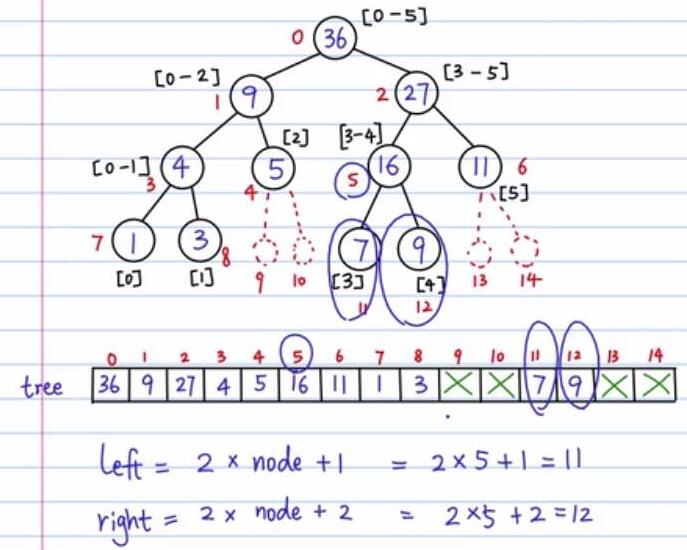

[TOC]

# 二叉树

**基本思想**：递归

# 二叉树遍历

* 先序：根-左子树-右子树

* 后序：左子树-右子树-根

* 中序：左子树-根-右子树

* 树节点结构：

  ```c++
  #include <stdio.h>
  #include <stdlib.h>

  typedef struct BINode
  {
      char ch;
      struct BINode * lchild;
      struct BINode * rchild;
  }BiNode;
  ```

* 递归遍历：

  ```c++
  #include <stdio.h>
  #include <stdlib.h>

  typedef struct BINode
  {

      char ch;
      struct BINode * lchild;
      struct BINode * rchild;

  }BiNode;

  // 递归 - 后序遍历二叉树(先序遍历和中序遍历类似的)
  void postRecursion(BiNode *root) {
      if(root == NULL) {
          return;
      }
      // 先遍历左节点
      postRecursion(root->lchild);
      // 再遍历右节点
      postRecursion(root->rchild);
      // 再遍历根节点
      printf("%c ", root->ch);

  }

  void creatTree() {

    	 // 说明：这里创建树用的是静态内存分配，实际应用中可能更常见的是用动态内存分配malloc、new
       BiNode nodeA = {'A', NULL, NULL};
       BiNode nodeB = {'B', NULL, NULL};
       BiNode nodeC = {'C', NULL, NULL};
       BiNode nodeD = {'D', NULL, NULL};
       BiNode nodeE = {'E', NULL, NULL};
       BiNode nodeF = {'F', NULL, NULL};
       BiNode nodeG = {'G', NULL, NULL};
       BiNode nodeH = {'H', NULL, NULL};

       nodeA.lchild = &nodeB;
       nodeA.rchild = &nodeF;
       nodeB.rchild = &nodeC;
       nodeC.lchild = &nodeD;
       nodeC.rchild = &nodeE;
       nodeF.rchild = &nodeG;
       nodeG.lchild = &nodeH;

       postRecursion(&nodeA);  

  }

  int main(){

      creatTree();
      system("pause");
      return 0;

  }
  ```

# 计算叶子节点个数

```c++
  int num=0;
  void CaculateLeafNum(BiNode *root) {
      if (root == NULL) {
          return;
      }
      if(root->lchild == NULL && root->rchild == NULL) {
          num++;
      }
      // 计算左子树的叶子节点
      CaculateLeafNum(root->lchild);
      // 计算右子树的叶子节点
      CaculateLeafNum(root->rchild);
  }
```

# 计算二叉树的高度

```c++
int Height(BiNode *root) {

    if(root == NULL) {
        return 0;
    }

    int rheight = Height(root->lchild);
    int lheight = Height(root->rchild);

    return lheight > rheight ? lheight + 1 : rheight + 1;
}
```

# 二叉树的拷贝和释放

```c++
BiNode *CopyBiTree(BiNode *root) {

    if(root == NULL) {
        return NULL;
    }
    // 拷贝左子树
    BiNode *newlchild = CopyBiTree(root->lchild);
    // 拷贝右子树
    BiNode *newrchild = CopyBiTree(root->rchild);
    // 拷贝当前节点
    BiNode *newroot = (BiNode *)malloc(sizeof(BiNode));
    newroot->lchild = newlchild;
    newroot->rchild = newrchild;
    newroot->ch = root->ch;
    return newroot;

}

void DestroyBiTree(BiNode *root) {

    if(root == NULL) {
        return;
    }
    // 释放左子树
    DestroyBiTree(root->lchild);
    // 释放右子树
    DestroyBiTree(root->rchild);
    // 释放根节点
    free(root);

}
```

# 二叉树的非递归遍历

* 广度优先遍历BFS（队列实现）

  广度优先遍历，也可以称为层次优先遍历，从上到下，先把每一层遍历完之后再遍历一下一层。

* 深度优先遍历DFS（栈实现）

  按照一条路径走到底，再回溯，找到一个未遍历的邻节点，继续一直走到底。

  **特别说明：**由于c++ STL中实现了队列和栈，所以这里用c++实现，以下代码思路适用于普通树。

  **二叉树的遍历方式分为**：先序，后序，中序。

  **普通树遍历方式分为**：深度优先、广度优先。

  二叉树是普通树的特例，也可以用BFS/DFS非递归方式遍历。深度遍历和二叉树的先根遍历基本上是一样的，只是先根遍历有左右之分（针对二叉树的术语）。

  （图的BFS/DFS更复杂些，需要定义一个访问数组，标识当前哪些元素被访问过，见相关笔记。）

  ```c++
  #include <iostream>
  #include <cstdlib>
  #include <queue>
  #include <stack>

  using namespace std;

  // 二叉树节点结构
  struct BiNode
  {
      char ch;
      BiNode* lchild;
      BiNode* rchild;
  };

  // 创建一个节点
  BiNode* createNode(char data) {
      BiNode* node = new BiNode;
      node->ch = data;
      node->lchild = NULL;
      node->rchild = NULL;
      return node;
  }

  // 创建一棵树
  BiNode *creatTree() {

       BiNode *nodeA = createNode('A');
       BiNode *nodeB = createNode('B');
       BiNode *nodeC = createNode('C');
       BiNode *nodeD = createNode('D');
       BiNode *nodeE = createNode('E');
       BiNode *nodeF = createNode('F');
       BiNode *nodeG = createNode('G');
       BiNode *nodeH = createNode('H');

       nodeA->lchild = nodeB;
       nodeA->rchild = nodeF;
       nodeB->rchild = nodeC;
       nodeC->lchild = nodeD;
       nodeC->rchild = nodeE;
       nodeF->rchild = nodeG;
       nodeG->lchild = nodeH;

       return nodeA;
  }

  // 广度优先遍历(Breadth-FirstSearch)
  /*
  基本思路：
  父节点入队列，
  父节点（队首）出队列，同时将其子节点（队尾）入队列，
  依次循环直到队列为空。
  */
  void BFS(BiNode *root) {
      queue<BiNode *> myQueue;

      if (root != NULL) {
          myQueue.push(root);
      }
      while (!myQueue.empty()) {
          BiNode *node = myQueue.front();
          myQueue.pop();
          cout << node->ch << " ";
          if (node->lchild) { myQueue.push(node->lchild); }
          if (node->rchild) { myQueue.push(node->rchild); }
      } 
  }

  // 深度优先遍历
  /*
  基本思路：
  父节点压栈，
  父节点出栈，同时将其子节点压栈，（下次再弹出栈的一定是相邻的子节点, 一条路走到黑）
  依次循环直到栈为空。
  */
  void DFS(BiNode *root) {
      stack<BiNode *> myStack;

      if (root != NULL) {
          myStack.push(root);
      }
      while (!myStack.empty()) {
          BiNode *node = myStack.top();
          myStack.pop();
          cout << node->ch << " ";
          if (node->lchild) { myStack.push(node->lchild); }
          if (node->rchild) { myStack.push(node->rchild); }
      }
  }

  int main(){
      BiNode *root = creatTree();
    	BFS(root); cout << endl;
      DFS(root); cout << endl;
      system("pause");
      return 0;
  }
  ```

# 如何确定一棵树

* 如何确定一棵树

  * 中序+先序 可以确定一棵树
  * 中序+后序 可以确定一棵树

  技巧：必须带中序遍历！！！

* 根据先序遍历和中序遍历确定一棵树？
  先序：ADEBCF
  中序：DEACFB
  思路：
  根据先序遍历可知根节点A,根据中序结果，可知根的左子树DE，右子树CFB；
  左子树：先序是DE,中序是DE =>E是D的右子树；
  右子树：先序BCF，中序CFB =>B是根节点，F是C的右边节点
  ==> 后序：EDFCBA

# 如何创建一棵树

```c++
// 先序创建一棵树，ABD##E##C##，#代表空节点
Bitree CreateBitree(Bitree T)//先序创建一颗二叉树
{
  char  e;
  scanf_s("%c", &e);
  fflush(stdin);

  if (e != '#'){
    //判断当前输入的字符
    T = (Bitree)malloc(sizeof(Tree)); //分配存贮空间
    T->data = e;
    T->lchild = NULL;
    T->rchild = NULL;
    T->lchild = CreateBitree(T->lchild); //递归创建左孩子节点值
    T->rchild = CreateBitree(T->rchild);   //递归创建右孩子节点值
 }

 return T;
}
```

# 线段树

【题目】给定一个数组arr，数组可能非常大。在程序运行过程中，你可能要频繁的做query和update操作： query(arr, L, R) 表示计算数组arr中，从下标L到下标R之间的所有数字的和。 update(arr, i, val) 表示要把arr[i]中的数字改成val。

一般，树的操作方式：递归；树的时间复杂度：o(logN)。

定义数组：arr[5] = [1, 3, 5, 7, 9, 11]   



```c
#include <stdio.h>
#include <stdlib.h>
#include <assert.h>

// 创建线段树
// tree[] 线段树，除部分叶子节点外，可认为是满二叉树，可以用数组表示
// node 线段树的节点index
// arr[] start/end  线段树节点node对应的统计区间
void build_tree(int arr[], int tree[], int node, int start, int end) {
    if (start == end) {                  // 递归出口
        tree[node] = arr[start];
    } else {
        int mid = (start + end) / 2;
        int left_node = 2 * node + 1;
        int right_node = 2 * node + 2; // 满二叉树用数组表示，计算节点node的左右节点

        // 根据数组区间，递归创建左右子树
        build_tree(arr, tree, left_node, start, mid);
        build_tree(arr, tree, right_node, mid+1, end);
        tree[node] = tree[left_node] + tree[right_node];
    }
}

// 计算任意区间之和
// arr[start, end]  ==> tree[node]
int query_tree(int arr[], int tree[], int node, int start, int end, int L, int R) {
    if (R < start || L > end) {   // 不在区间内
        return 0;
    } else if (L <= start &&  R >= end) {    // 区间覆盖了[L, R]
        return tree[node];
    } else {
        // 递归计算左右子树在[L, R]区间上的累计和
        int mid = (start + end) / 2;
        int left_node = 2 * node + 1;
        int right_node = 2 * node + 2;
        int sum_left = query_tree(arr, tree, left_node, start, mid, L, R);
        int sum_right = query_tree(arr, tree, right_node, mid+1, end, L, R);
        return sum_left + sum_right;
    }
}

// 修改数组中下标为index的值
void update_tree(int arr[], int tree[], int node, int start, int end, int idx, int val) {
    assert(idx >= start && idx <= end);
    if (start == end && start == idx) {    // 聚焦到了指定点 
        arr[idx] = val;
        tree[node] = val;
    } else {
        int mid = (start + end) / 2;
        int left_node = 2 * node + 1;
        int right_node = 2 * node + 2;
        // 递归修改左子树或者右子树，然后当前根节点=左和+右和
        if (idx >= start && idx <= mid) {
            update_tree(arr, tree, left_node, start, mid, idx, val);
        } else {
            update_tree(arr, tree, right_node, mid+1, end, idx, val);
        }
        tree[node] = tree[left_node] + tree[right_node];
    }
}

int main() 
{
    int arr[] = {1, 3, 5, 7, 9, 11};
    int size = 6;
    int tree[1000] = {0};
    build_tree(arr, tree, 0, 0, size-1); 

    int sum = query_tree(arr, tree, 0, 0, size-1, 2, 4);
    printf("sum = %d\n", sum);

    update_tree(arr, tree, 0, 0, size-1, 4, 6);
    for(int i = 0; i < 15; i++) {
        printf("tree[%d]=%d\n", i, tree[i]);
    }

    system("pause");
    return 0;
}
```

