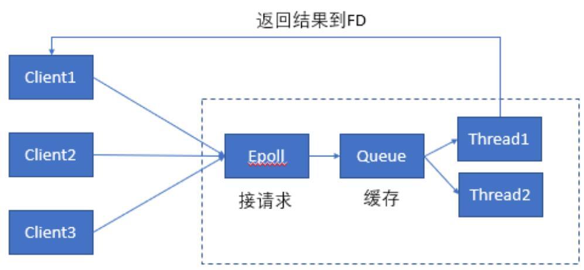
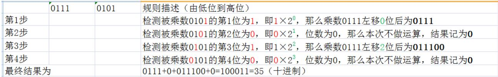

# static和extern

static修饰全局变量、全局函数：无法被同一工程其他源文件访问。
extern修饰全局变量、全局函数：可被同一工程其他源文件访问。

# gflags使用

```c++
#include <iostream>
#include <gflags/gflags.h>

DEFINE_bool(isvip, false, "If Is VIP");
DEFINE_string(ip, "127.0.0.1", "connect ip");
DECLARE_int32(port);
DEFINE_int32(port, 80, "listen port");

int main(int argc, char** argv)
{
  google::ParseCommandLineFlags(&argc, &argv, true);
  std::cout<<"ip:"<<FLAGS_ip<<std::endl;
  std::cout<<"port:"<<FLAGS_port<<std::endl;
  if (FLAGS_isvip)
  {
      std::cout<<"isvip:"<<FLAGS_isvip<<std::endl;
  }
  google::ShutDownCommandLineFlags();
  return 0;
}
```

编译：g++ gflags.cpp -o gflags_test -lgflags -lpthread

# 静态库与动态库

静态库：即静态链接库(libxxx.a， xxx为自定义的库名)。在程序编译时会被链接到目标代码中，程序运行时将不再需要该静态库。  

动态库：即动态链接库(libxxx.so， xxx为自定义的库名)。在程序编译时并不会被链接到目标代码中，而是在程序运行是才被载入，因此在程序运行时还需要动态库存在。  

区别：静态库代码装载的速度快，执行速度略比动态库快。但是动态库更加节省内存，可执行文件体积比静态库小很多。静态库是在编译时加载，动态库是在运行时加载。  

* 测试程序

```c++
// ================== staticMath.h   -- 头文件，用于编译库文件
#pragma once

class StaticMath {
public:
    StaticMath(void) {};
    ~StaticMath(void) {};

    static double add(double a, double b);//加法
    static double sub(double a, double b);//减法
};

// ==================  staticMath.cpp  -- 源文件，用于编译库文件
#include "staticMath.h"

double StaticMath::add(double a, double b) {   // 实现的时候去掉static
    return a + b;
}

double StaticMath::sub(double a, double b) {
    return a - b;
}

//=================  test.cpp 测试文件
#include "staticMath.h"
#include <iostream>

using namespace std;

int main() {
    double a = 10.2, b = 3.1;
    cout << "a+b=" << StaticMath::add(a, b) << endl;
    cout << "a-b=" << StaticMath::sub(a, b) << endl;
    return 0;
}
```

* 生成静态库

```shell
#!/bin/bash

# 生成目标文件
g++ -c staticMath.cpp -o staticMath.o

# 使用ar工具打包成.a静态库文件
ar -crv libstaticMath.a staticMath.o

# 引用静态库 -L指明路径， -l指明静态库名称（不包含前缀lib和后缀.a）
g++ test.cpp -L. -lstaticMath
```

* 生成动态库

```shell
#!/bin/bash

# 生成动态库(-fPIC 创建与地址无关的编译程序（pic，position independent code）)
g++ -fPIC -c staticMath.cpp -o staticMath.o

# 生成动态库（-shared）
g++ -shared -o libstaticMath.so staticMath.o

# 以上两个命令合二为一：
g++ -fPIC -shared -o libdynmath.so DynamicMath.cpp

# 应用动态库
g++ test.cpp -L. -lstaticMath
# !!!编译报错，原因是定位不到共享库文件
# 解决办法：
# 如果安装在/lib或者/usr/lib下，那么ld默认能够找到，无需其他操作。
# 如果安装在其他目录，需要将其添加到/etc/ld.so.cache文件中，步骤如下：
# 编辑/etc/ld.so.conf文件，加入库文件所在目录的路径
# 运行ldconfig ，该命令会重建/etc/ld.so.cache文件
```

# 防止头文件被include多次

```c++
// 第一种：#ifndef方式
#ifndef __SOMEFILE_H__
#define __SOMEFILE_H__
... ... // 一些声明语句
#endif

// 第二种：#pragma once方式
#pragma once
... ... // 一些声明语句

// 推荐使用1，原因是可以保证同一个文件不会被包含多次，也能保证内容完全相同的两个文件不会被不小心同时包含。
```

# c语言预定义宏

```c++
#include <iostream>
using namespace std;

int main() 
{
    cout << __LINE__ << endl;    // 该行代码所在的行号 -> 7
    cout << __FILE__ << endl;    // 源文件文件名 -> macro_demo.cpp
    cout << __DATE__ << endl;    // 编译日期 -> Dec 3 2019
    cout << __TIME__ << endl;    // 编译时间 -> 16:36:40
    cout << __STDC__ << endl;    // 标准C语言实现该值为 -> 1

    return 0;
}
```

# tcmalloc

​        tcmalloc(Thread-Caching Malloc)与标准glibc库的malloc实现一样的功能，但是tcmalloc在效率和速度效率都比标准malloc高很多。tcmalloc是google-perftools工具中的一个，这个工具都是开源的，以源码形式发布。可以把tcmalloc的动态库或者静态库连接进你的程序中，你就可以获得一个高效，快速，安全的内存分配器。

* 安装

  ```shell
  # 参考连接： https://www.jianshu.com/p/a8c3601bdba6
  wget http://google-perftools.googlecode.com/files/google-perftools-1.4.tar.gz
  tar zxvf google-perftools-1.4.tar.gz
  cd google-perftools-1.4
  # ./configure 可安装全部google-perftools的组件，
  # 包括tcmalloc、heap-checker、heap-profiler和cpu-profiler共4个组件。
  # heap-checker： 分析内存泄露
  # heap-profiler：分析内存占用
  # cpu-profiler：分析cpu使用率(耗时百分比)
  # 这里只安装tcmalloc
  ./configure --prefix=/usr/local --disable-cpu-profiler --disable-heap-profiler --disable-heap-checker --disable-debugalloc --enable-minimal
  make && make install
  ```

# c变长参数表

* 格式

  `int printf(char *fmt, ...)`

  ... 表示参数类型和数量是可变的。  

  注意：1. 省略号只能出现在尾部，函数声明中必须有一个显示声明的参数。  

* 头文件

  `#include <stdarg.h>`

* 实现原理

  函数的**所有参数是存储在线性连续的栈空间**中的，因此可以从第一个普通参数来寻址后续的所有可变参数的类型及其值。

  * 引申1：为啥c语言参数入栈顺序是从右向左的？

    为了支持可变参数，因为栈顶元素很容易定位，这样就**很容易从栈顶找到最左侧的固定参数**format，根据format中的%信息就可以知道可变参数的个数和类型了，如下例。

  * 引申2：c语言中默认参数的赋值要**从右向左**，且连续？

    原因：这样可以保证传进来的值可以正确的赋值给所想的参数，也不会覆盖掉预先设置好的默认值。由于**栈顶元素很容易定位到**，所以从a开始依次给非默认参数赋值即可。

    fun(a , b , c=2, d=3)  ， 参数压栈顺序 =>

    | a     |
    | ----- |
    | b     |
    | c = 2 |
    | d = 3 |

* 使用步骤

  * va_list类型：定义可变参数列表。
  * va_start宏：用第一个固定参数 初始化参数列表。
  * va_arg宏：返回可变参数。
  * va_end宏：结束可变参数获取。

代码示例

```c
#include <stdarg.h>

void va_printf1(char* var1, ...) {
	// (1) 定义参数列表
	va_list ap;
	// (2) 初始化参数列表
	va_start(ap, var1);

	char *p, *sval;
	int ival;
	double dval;

	for (p = var1; *p; p++) {
		if (*p != '%') {
			putchar(*p);
			continue;
		}

		switch (*++p) {
            case 'd':
                // (3) 返回可变参数，第二个参数是可变参数的类型
                ival = va_arg(ap, int);
                printf("%d", ival);
                break;
            case 'f':
                dval = va_arg(ap, double);
                printf("%f", dval);
                break;
            case 's':
                sval = va_arg(ap, char *);
                printf("%s", sval);
                break;
            default:
                putchar(*p);
                break;
		}
	}
	// (4) va_end 结束可变参数获取
	va_end(ap);
}

int main()
{
	va_printf1("%d  %f %s %s", 1, 2.0, "you ", "how do you do ");
	system("pause");
    return 0;
}
```

# c++反射的实现

* 概念：根据一个字符串(类的名称)，创建出一个对象，并可以获取这个对象的成员信息。

* 实现思路：

  1. 用一个`map`来存储**类名-构造函数**这样的键值对，每新增一个类，就在这个`map`“注册”一个键值对。
  2. 因为这个`map`是一个全局都会用到的，所以可以使用单例模式。
  3. 在进入`main`函数之前，这个`map`就应该生成好，即每一个类在实例化之前就执行了“注册”的代码。

  ```c++
  #include <iostream>
  #include <map>
  #include <memory>
  #include <functional>
  #include <cstdlib>
  
  using namespace std;
  
  #define FUNC std::function<void*(void)>     // 定义一个函数对象
  
  class Reflector
  {
  private:
      map<std::string, FUNC> objectMap;       // 类名字符串，构造函数指针
      static shared_ptr<Reflector> ptr;       // 单例对象
  
  public:
      void* CreateObject(const string &str) {
          for (auto & x : objectMap) {
              if(x.first == str)
                  return x.second(); // 利用构造函数构造对象实例并返回
          }
          return nullptr;
      }
  
      void Register(const string &class_name, FUNC && generator) {
          objectMap[class_name] = generator;
      }
  
  
      // 单例的get方法
      static shared_ptr<Reflector> Instance() {
          if(ptr == nullptr) {
              ptr.reset(new Reflector());
          }
  
          return ptr;
      }
  
  };
  
  shared_ptr<Reflector> Reflector::ptr = nullptr;    // 全局、单例
  
  class RegisterAction
  {
  public:
      RegisterAction(const string &class_name, FUNC && generator) {
          Reflector::Instance()->Register(class_name, forward<FUNC>(generator));
      }
  };
  
  // lambda表达式返回一个对象指针
  // 通过类名和对象指针构造一个RegisterAction对象实例，
  // 同时在RegisterAction对象构造函数中完成了"注册"(即在main函数前完成了注册)
  // 宏定义中的##表示把字符串连接起来。#表示将其变为字符串。
  #define REGISTER(CLASS_NAME) \
  RegisterAction g_register_action_##CLASS_NAME( #CLASS_NAME, [](){return new CLASS_NAME();} );\
  
  class Base
  {
  public:
      explicit Base() = default;
      virtual void Print() {
          cout << "Base" << endl;
      }
  };
  REGISTER(Base);
  
  class DeriveA : public Base
  {
  public:
      void Print() override {
          cout << "DeriveA" << endl;
      }
  };
  REGISTER(DeriveA);
  
  class DeriveB : public Base
  {
  public:
      void Print() override {
          cout << "DeriveB" << endl;
      }
  };
  REGISTER(DeriveB);
  
  int main()
  {
      shared_ptr<Base> p1((Base*)Reflector::Instance()->CreateObject("Base"));
      p1->Print();
  
      shared_ptr<Base> p2((Base*)Reflector::Instance()->CreateObject("DeriveA"));
      p2->Print();
  
      shared_ptr<Base> p3((Base*)Reflector::Instance()->CreateObject("DeriveB"));
      p3->Print();
  
      system("pause");
      return 0;
  }
  ```

# 依赖注入

```c++
public class Human {
    ...
    Father father;
    ...
    public Human() {
        father = new Father();
    }
}
```

* 以上代码有个问题，Human类依赖Father类，如果Father类的初始化方式发生变化，需要修改Human类。这是一种Hard init 方式，两个类之间存在耦合关系。

* 通过下边的方式，将father对象作为Human类构造函数的一个参数，在调用Human构造函数之前外部就已经初始化好了Father实例，可以使两个类解耦。这种非自己初始化依赖，而是通过外部传入依赖的方式，我们称为依赖注入。

* 控制反转是一种思想，依赖注入是一种设计模式，是控制反转的一种实现方式。

```c++
public class Human {
    ...
    Father father;
    ...
    public Human(Father father) {
        this.father = father;
    }
}
```

# volatile关键字

volatile：易变的，不稳定的。编译器在用到这个变量时必须每次都小心地重新读取这个变量的在内存中的值，而不是使用保存在[寄存器](https://baike.baidu.com/item/寄存器)里的备份。（如果不使用valatile，则编译器将对所声明的语句进行优化）。

```c
int square(volatile int *ptr) {
    return ((*ptr) * (*ptr));
}
// 上边代码的目的是计算*ptr指向值的平方；
// 但是由于设置为volatile， 每次使用该值都会去内存中重新读取，在两次取值的间隙，ptr的值可能被改变，
// 所以编译器可以生成以下类似代码
int square(volatile int* &ptr) {
    int a,b;
    a = *ptr;
    b = *ptr;   // 读了两次，两次取值可能不同
    return a*b;
}

// 正确的写法：
int square(volatile int* &ptr) {
    int a;
    a = *ptr;
    return a*a;        // 只读一次
}
```

# reactor + epoll

* epoll

  IO多路复用，基于事件通知机制（epoll_wait）。由一个非阻塞的线程来接收所有的IO请求，然后派发这些请求至相关的工作线程进行处理。

* reactor

  将请求放到**无锁队列**中，处理线程循环来请求任务。

  

参考：https://blog.csdn.net/pistolove/article/details/53152708


# 智能指针

智能指针：离开作用域后，他所管理的对象能自动释放。

* boost::scoped_ptr  

  1. **拷贝构造函数**和**赋值构造函数**是私有的。（指针不可拷贝）

     ```c++
     vector<boost::scoped_ptr<Book>> vecScoped;
     boost::scoped_ptr<Book> myBook(new Book("shell"));
     // vecScoped.push_back(myBook);   // Error: push_back操作内部调用了scoped_ptr的=运算符重载函数
     ```

     

  2. 不能将一个对象交给多个scoped_ptr管理。（不可转交控制权）

     ```c++
     Book * book = new Book();
     boost::scoped_ptr<Book> myBook1(book);
     // boost::scoped_ptr<Book> myBook2(book);  // Error: 因为myBook1离开作用域时会delete book
     ```

  3. 可以交换控制权。

     ```c++
     boost::scoped_ptr<Book> myBook1(new Book("c++"));
     boost::scoped_ptr<Book> myBook2(new Book("python"));
     myBook1.swap(myBook2);   // 这样可以
     ```

     

总结：

1.auto_ptr 被复制后，将失去原来指致资源的所有权；

2.scoped_ptr永远不能被复制或被赋值！独享并永远不会放弃所指资源的所有权；

3.shared_ptr 是可以共享所有权的智能指针；

# 计算机乘除法

计算机在计算乘法、除法、以及求余运算时都是利用二进制的加法来实现的，也就是计算机中最繁忙的累加器（包括减法运算也是将被减数转换为补码的形式再利用加法的法则运算的）。

* 乘法

  规则：按照被乘数的低位到高位依次计算，如果第n位不为0，那么乘数就左移n位，如果第n为为0 ，那么这步运算结果记为0，最后将每一步的结果相加就是最终的计算结果。

  7×5=0111×0101

  

* 除法

  规则：按照除数的高位到低位的数字依次和被除数进行比对，如果大于等于被除数，则此步结果记为1，并求得余数，如果小于被除数则将上一步的余数左移一步加上一位的数字再次比较，以此类推，最终将依次计算的结果相连组成二进制就是商，最后一次的余数就是求余的结果。

  123/4=1111011/0100

  

# 定时器线程

定时器线程是为了完成一些周期性的检测工作，比如每隔几秒检测下数据是否需要重新load。

* 实现1：通过sleep挂起线程。

  ```c
  #include <stdlib.h>
  #include <stdio.h>
  #include <unistd.h>
  #include <errno.h>
  #include <pthread.h>
  
  bool flag = true;
  // 线程函数：每隔10s，检测数据是否需要加载
  void * thread_fun(void * arg) {
      while (flag) {
          printf("do something: ex. check if load...\n");
          sleep(10);
      }
      printf("thread exit\n");
  }
  
  int main()
  {
      pthread_t thread;
      if (0 != pthread_create(&thread, NULL, thread_fun, NULL))
      {
          printf("error when create pthread, %d \n", errno);
          return 1;
      }
  
      char c;
      while ((c = getchar()) != 'q');
     
      // 输入q后，虽然flag立即设置为false，
      // 但是需要等待线程从sleep中醒来（由挂起变为运行状态），最坏的情况下需要等待10s，线程才会被join。
      // 采用sleep的缺点：不能及时唤醒线程。
      printf("Now terminate the thread!\n");
      flag = false;
      printf("Wait for thread to exit\n");
      pthread_join(thread, NULL);
      printf("Bye\n");
      return 0;
  }
  ```

  

* 实现2：采用pthread_cond_timedwait函数。

  * pthread_cond_timedwait(pthread_cond_t * _cond,pthread_mutex_t * _mutex,_const struct timespec * _abstime);  比函数pthread_cond_wait()多了一个时间参数，达到时间abstime，即使条件变量不满足，阻塞也被解除。
  * 条件变量是**利用线程间共享的全局变量进行同步**的一种机制，主要包括两个动作：一个线程等待”条件变量的条件成立”而挂起；另一个线程使”条件成立”（给出条件成立信号）。为了防止多线程竞争，条件变量的使用总是和一个互斥锁结合在一起。
  * pthread_cond_wait() 用于阻塞当前线程，等待别的线程使用 pthread_cond_signal() 或pthread_cond_broadcast来唤醒它 。 pthread_cond_wait()  必须与pthread_mutex 配套使用。pthread_cond_wait() 函数一进入wait状态就会自动release  mutex。当其他线程通过 pthread_cond_signal() 或pthread_cond_broadcast ，把该线程唤醒，使 pthread_cond_wait()通过（返回）时，该线程又自动获得该mutex 。

  ```c
  #include <stdio.h>
  #include <sys/time.h>
  #include <unistd.h>
  #include <pthread.h>
  #include <errno.h>
  
  pthread_t thread;          // 线程标识符
  pthread_cond_t cond;       // 条件变量
  pthread_mutex_t mutex;     // 互斥量（互斥锁）
  bool flag = true;
  
  void * thread_fun(void * arg)  // 线程函数
  {
      struct timeval now;
      struct timespec outtime;
      pthread_mutex_lock(&mutex);   // 拿到互斥锁
      while (flag)
      {
          printf("do something: ex. check if load... \n");
          gettimeofday(&now, NULL);  // 得到微妙精度的时间
          outtime.tv_sec = now.tv_sec + 5;
          outtime.tv_nsec = now.tv_usec * 1000;
          // pthread_cond_timedwait 说明：
          // 1. 阻塞住调用该函数的线程(当前这个线程)，等待 [cond条件被触发] 或者 [超时]
          // 2. 进入wait函数：释放互斥锁 + 等待cond条件或超时
          // 3. 离开wait函数(cond条件满足被唤醒、超时、线程被取消)：自动获得mutex, 执行临界区访问
          // 4. while循环保证临界区只有一个线程在处理，其他同时被唤醒的线程继续wait
          pthread_cond_timedwait(&cond, &mutex, &outtime);
      }
      pthread_mutex_unlock(&mutex);   // 释放互斥锁
      printf("thread exit\n");
  }
  
  int main()
  {
      pthread_mutex_init(&mutex, NULL);
      pthread_cond_init(&cond, NULL);      // 初始化互斥锁和条件变量
  
      if (0 != pthread_create(&thread, NULL, thread_fun, NULL)) {
          printf("error when create pthread,%d \n", errno);
          return 1;
      }
  
      char c ;
      while ((c = getchar()) != 'q');   // 直到终端收到字符q，才执行下边的操作
  
      printf("Now terminate the thread!\n");
      flag = false;
  
      // pthread_cond_signal()可能唤醒多个线程，而如果你同时只允许一个线程访问的话，
      // 就必须要使用while来进行条件判断，以保证临界区内只有一个线程在处理。
      pthread_mutex_lock(&mutex);
      pthread_cond_signal(&cond);
      pthread_mutex_unlock(&mutex);
  
      printf("Wait for thread to exit\n");
      pthread_join(thread, NULL);
      printf("Bye\n");
      return 0;
  }
  ```

  